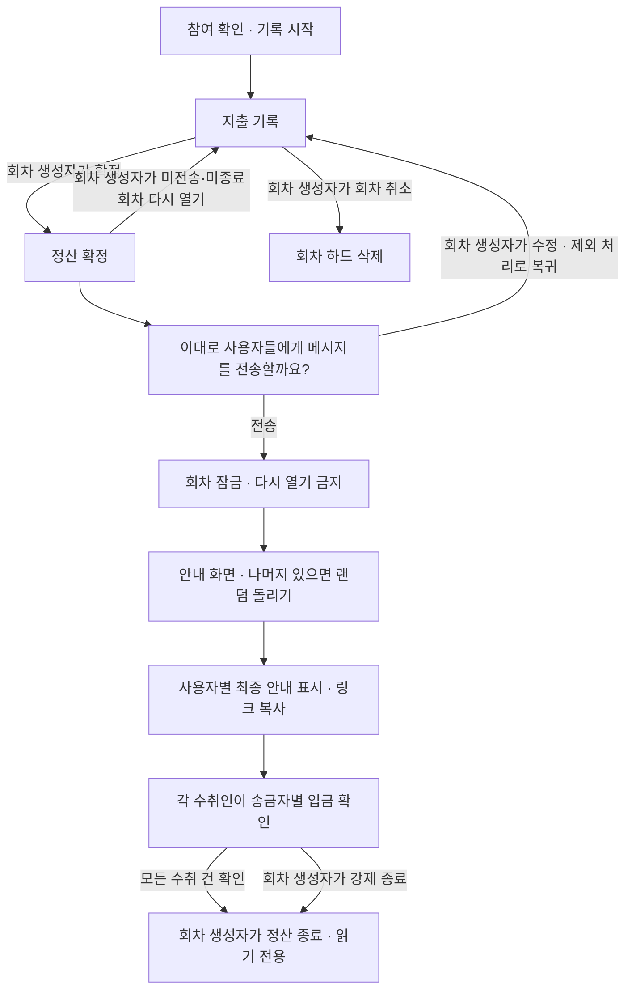

# 모임·정산 로직 구현 의도

이 문서는 사용자와 확정한 모임·회차·지출·정산·회원 정책을 정리한다. **기획 명세이며 구현 완료를 의미하지 않는다.** 기존 ‘남은 결정’ 항목은 아래 확정 정책에 반영했다.

## 1. 목적과 구현 범위

같은 모임에서 멤버가 다른 여러 회차를 운영하고, 회차별 결제액과 부담액을 비교해 **누가 누구에게 얼마를 보내야 하는지** 안내한다.

- 로그인, 가입 시 계좌 등록, 모임 생성·초대·참여·나가기·조건부 모임 닫기, 회차 생성·취소, 지출 기록, 정산 확정·종료를 제공한다.
- 금액은 직접 입력하고 영수증은 증거용 이미지만 업로드·저장한다. JPEG·PNG·WebP 입력은 AVIF로 변환해 저장·응답하며, 기존에 저장한 JPEG·PNG·WebP 자료는 원래 형식으로 계속 조회한다. 영수증 없이 기록할 수도 있다.
- 앱 자체의 영수증 파일 바이트 제한은 두지 않는다. 이미지 변환기의 픽셀 수 안전장치는 압축 해제 시 메모리 고갈을 막기 위해 유지하며, Vercel Function의 요청·응답별 4.5 MB 상한은 별도의 배포 인프라 제약으로 적용된다.
- 지출 한 건당 실제 결제자는 한 명이다. 전체 사용자 1/N 또는 특정 사용자끼리 1/N만 지원한다.
- 최종 안내 문구는 앱 안에서 사용자별로 표시한다. **복사 대상은 링크뿐**이며, 안내 문구나 계좌번호를 포함한 메시지 복사 기능은 제공하지 않는다.
- ‘전송’ 버튼은 회차를 잠그고 안내 화면으로 진행하는 동작이다. 실제 외부 메시지 전송·송금은 제공하지 않으며, 입금·송금 완료 여부는 참여자의 수동 확인만 저장한다.
- 실제 이체는 사용자가 수행한다. 앱은 확정한 금액과 필요한 최신 수취 계좌를 표시한다.
- OCR 자동 금액 입력, 계좌 실재 여부·예금주 검증 API, 카카오톡 직접 전송은 후속 범위다. 환불 기록은 제공하지 않는다.

## 2. 모임·회차·권한

모임은 계속 유지하고, 지출과 정산은 회차별로 분리한다. 예를 들어 `대학 친구들`은 모임이고 `9월 저녁 모임`, `10월 여행`은 각각의 회차다.

### 모임과 참여자

- 로그인한 사용자가 모임을 생성하거나 초대 링크로 참여한다. 모임 생성자는 자동으로 모임 참여자에 포함한다.
- 모임 화면의 현재 멤버는 모임 생성자, 일반 참여자 순으로 표시한다. 4명까지 바로 보여 주고 전체 인원이 5명 이상이면 ‘더보기’에서 전체 목록을 모달로 표시한다.
- 한 모임의 활성 멤버는 생성자를 포함해 최대 10명이다. 10명인 모임은 새 참여와 이탈자의 재참여를 거부하며, 기존 활성 멤버의 중복 수락은 인원을 늘리지 않는다. 멤버가 나가면 빈자리에 다시 참여할 수 있다.
- 초대 발송은 참여 완료가 아니다. 로그인 후 참여를 수락해야 하며, 초대 진입 중 로그인하더라도 해당 모임으로 복귀해야 한다.
- 모든 활성 모임 참여자는 회차를 시작할 수 있다. 회차 시작자가 해당 **회차 생성자**가 되며 자신을 필수 참여자로 포함해 최소 2명을 선택한다. 회차 멤버 선택 목록은 회차 생성자를 첫 번째로 표시하고 모임 생성자를 포함한 나머지는 일반 참여자로 그 뒤에 표시한다. 모임 생성자를 회차에 반드시 포함할 필요는 없다.
- 일반 멤버 변경은 다음 회차부터 반영한다. 신규 멤버를 과거 지출에 자동 포함하지 않는다.
- 회차 생성자가 안내 준비 단계에서 수행하는 사용자 제외는 해당 회차의 분배만 바꾸는 명시적인 예외다. 모임 멤버십과 다음 회차 후보에는 영향을 주지 않는다.
- 회차 생성자는 본인을 제외한 모든 회차 참여자를 제외 대상으로 검토할 수 있으며 모임 생성자도 예외가 아니다. 모임 관리 권한 이전과 회차 관리 권한 이전은 제공하지 않는다.
- 모임 생성자에게만 주는 고유 권한은 초대와 모임 관리다. 모임 생성자도 다른 사람이 만든 회차에서는 회차 생성자나 지출 작성자 자격이 없으면 그 회차를 관리하거나 다른 사람의 지출을 수정할 수 없다.
- 일반 참여자는 자신이 제외되지 않은 미종료 회차에 참여 중이면 모임에서 나갈 수 없다. 그런 회차가 없으면 현재 모임 멤버십의 `group_members.left_at`을 설정해 다음 회차 후보에서 빠진다.
- 모임 생성자에게는 일반 나가기를 제공하지 않는다. 모임 생성자의 본인 회차 참여 여부와 관계없이, 모임 전체에 `COMPLETED`가 아닌 회차가 하나라도 있으면 모임 없애기를 거부한다. 회차가 없거나 모든 회차가 `COMPLETED`이면 허용한다.
- 모임 없애기는 과거 자료를 물리 삭제하지 않고 현재 모임을 닫는 동작이다. 모임 행과 모든 회차를 유지하고, 같은 트랜잭션에서 모든 활성 멤버십의 `group_members.left_at`과 모든 활성 초대의 `group_invites.revoked_at`을 설정한다.
- 닫힌 모임에서는 새 회차 생성·초대 발급·초대 수락을 허용하지 않는다. 과거 참여자는 기존 `round_members`를 근거로 완료 회차와 정산을 계속 조회할 수 있다.
- 회원탈퇴 등으로 이탈한 사용자는 다음 회차의 기존 멤버 후보에서 제외한다. 과거 회차 참여 이력은 유지한다.
- 모임에서 나간 사람도 본인이 참여했던 과거 정산을 조회할 수 있다. 현재 모임 멤버 여부만으로 과거 조회를 차단하지 않는다.

### 권한

‘진행 중’은 아직 정산 종료되지 않은 회차를 뜻한다. 진행 중이어도 정산 확정 상태에서는 먼저 다시 열어야 기록을 수정할 수 있고, ‘전송’으로 잠근 회차는 다시 열 수 없다.

| 작업 | 권한·조건 |
|---|---|
| 기록 시작 | 모든 활성 모임 참여자가 수행할 수 있다. 시작자가 회차 생성자가 되며 자신을 필수 참여자로 포함한다. |
| 정산 확정·전송 | 해당 회차 생성자가 수행한다. |
| 받은 정산 확인 | 최종 금액이 저장된 잠금 회차에서 수취인이 ‘이 사람에게 받아요’의 송금자별 행을 눌러 해당 입금의 확인 여부를 설정하거나 해제한다. 같은 카드의 ‘모두 정산 확인’ 체크박스로 본인의 수취 건 전체를 함께 변경할 수 있다. |
| 정산 종료 | 회차 생성자가 모든 수취 건의 확인 후 종료한다. 미확인 건이 있으면 별도 경고를 거쳐 강제 종료할 수 있다. |
| 지출 작성 | 해당 회차 참여자가 기록 단계에서 작성한다. |
| 지출 수정·삭제 | 기록 단계에서 **해당 지출 작성자 또는 회차 생성자**가 수행한다. 다른 참여자와 모임 생성자라는 이유만으로는 수정·삭제할 수 없다. |
| 기록 단계로 다시 열기 | 회차 생성자만 가능하다. **미전송·미종료 회차**에 한한다. |
| 회차 전체 취소 | 회차 생성자만 가능하다. 미전송·미종료이며 현재 기록 단계인 회차에 한한다. |
| 회차 사용자 제외 | 회차 생성자가 전송 전에 본인을 제외한 참여자에게 수행한다. 모임 생성자도 제외할 수 있지만 결제자·부담자 유지·특정 분배·최소 인원 제한은 동일하게 확인한다. 성공해도 모임 멤버십은 유지한다. |
| 모임 나가기 | 일반 참여자만 가능하다. 본인이 제외되지 않은 미종료 회차에 참여 중이면 거부하고, 그 외에는 현재 멤버십만 이탈 처리한다. |
| 모임 없애기 | 모임 생성자만 가능하다. 모임 전체에 미종료 회차가 있으면 거부하고, 회차가 없거나 모두 완료됐으면 모든 활성 멤버십과 초대를 종료해 모임을 닫는다. 모임 행과 완료 회차는 보존하며 모임 생성자에게 일반 나가기는 제공하지 않는다. |
| 완료 회차 변경 | **누구도 불가능하다.** 회차 생성자도 재오픈·수정·삭제·취소할 수 없다. |
| 과거 정산 조회 | 인증한 사용자의 해당 회차 참여 이력을 확인한다. 모임 이탈 후에도 본인 참여 회차를 조회할 수 있다. |

작성자와 결제자는 다를 수 있다. A가 기록을 작성하고 B가 실제 결제했으며 B·C가 부담한다면, 기록 수정 권한은 A와 회차 생성자에게 있고 결제액은 B에게, 부담액은 B·C에게 반영한다. 회차 생성자가 수정했다고 작성자·결제자를 회차 생성자로 바꾸지 않는다.

## 3. 회차 진행·확정·취소·완료

### 회차 생성과 병행

- 모임 상세의 ‘내가 참여한 회차’는 최신순으로 처음 3개만 표시하고, 4개 이상이면 ‘더보기’를 눌러 전체 회차를 별도 모달에서 확인한다. 모달을 드래그하거나 스크롤하는 동안 뒤 페이지는 움직이지 않는다.
- 정산 기록의 안내 문구 아래와 모임 상세 ‘내가 참여한 회차’의 더보기 모달에는 돋보기를 입력 영역 안에 둔 검색창을 표시하고, 그 아래에 전체·진행 중·정산 종료 상태 버튼을 나열한다. 모임 상세 제목 옆에는 검색 버튼을 두지 않으며 검색·상태 조건은 모달 목록에만 적용해 본문의 최신 3개는 유지한다. 두 화면 모두 모임명 또는 회차명의 일부로 본인이 참여한 회차를 검색하며 최신순 정렬을 유지한다.
- 회차는 본인을 포함해 최소 2명으로 만든다.
- 지출 없는 회차를 생성하고 기록 중 상태로 유지할 수 있다. 마지막 지출을 삭제했다고 회차를 자동 삭제하지 않는다.
- 기존 회차가 전송 전이어도 다른 멤버로 새 회차를 생성할 수 있다. 모임당 기록 중 회차를 하나로 제한하지 않는다.
- 각 회차의 참여자·지출·통화·정산 결과는 독립적으로 유지한다.
- 날짜가 과거여도 **미종료·미전송**이면 회차 생성자가 다시 열 수 있다. 정산 종료된 과거 회차는 영구적으로 읽기 전용이다.
- 이전 회차의 금액은 별도로 유지하며 새 회차에 자동 이월·합산·상계하지 않는다. 실제 입금을 추적하지 않으므로 앱이 정확한 미입금 잔액을 자동 판정하지는 않는다.

### 진행 흐름



- 정산 확정 요청 시 지출이 0건이면 **‘지출 내역이 없습니다’**를 표시하고 확정을 거부한다.
- 정산 확정은 지출과 분배 대상을 확정하는 단계다. 나머지가 있으면 개인별 최종 금액은 잠금 후 추첨으로 완성한다.
- 별도 미리보기를 필수 단계로 두지 않는다. 확정 후 기본 계산과 ‘이대로 사용자들에게 메시지를 전송할까요?’를 표시한다.
- 수정이 필요하면 회차 생성자가 기록 단계로 다시 열고, 작성자 또는 회차 생성자가 수정한 뒤 회차 생성자가 재확정한다.
- 다시 여는 즉시 기존 결과는 안내 가능한 확정 상태에서 해제한다. 수정 중인 회차의 최종 안내 링크를 제공하지 않는다.
- 안내 확인만 취소했다면 확정 상태를 유지한다. 기록 단계로 돌아갔다면 재확정해야 한다.

### 잠금과 완료

- ‘전송’ 시 서버에서 상태를 확인하고 지출·분배 대상을 잠근다. 이후 회차 생성자도 재오픈하거나 기록을 바꿀 수 없다.
- 잠금 후 미배분 나머지를 한 번 추첨해 최종 금액을 완성하는 것은 예정된 후속 단계다. 원본을 수정하거나 완료한 추첨을 다시 실행하는 것은 허용하지 않는다.
- 최종 금액이 저장되면 각 수취인은 ‘이 사람에게 받아요’ 카드에서 송금자별 행을 눌러 해당 금액을 받았는지 확인한다. 송금자나 송금 관계가 없는 참여자는 별도로 확인하지 않는다. 제외됐더라도 최종 송금의 수취인 또는 송금자로 남은 관계는 같은 기준으로 유지한다.
- 확인한 송금자 행의 이름과 금액에는 취소선을 표시하고, 카드의 ‘내가 받을 금액’에서 해당 금액을 차감한다. 해당 송금자의 ‘이 사람에게 보내 주세요’ 목록에서도 확인된 송금 카드를 숨긴다. 다시 누르면 확인을 해제해 취소선·금액·송금 카드를 복원한다. ‘모두 정산 확인’ 체크박스는 로그인한 수취인의 모든 미확인 건을 확인하거나 모든 건을 해제한다.
- 확인 여부는 회차가 종료되기 전까지 해당 수취인만 변경할 수 있다. 다른 사용자의 수취 건을 대신 변경할 수 없고, 완료된 회차에서는 읽기 전용이다.
- 모든 수취 건의 확인 진행률을 실시간 게이지로 표시하고, 별도 카드에서 돈을 받을 사용자별 프로필·이름과 완료·대기 상태를 보여 준다. 한 수취인의 모든 수취 건이 확인돼야 그 사용자를 완료로 표시한다. 강제 종료된 회차도 당시 미확인 상태를 보존해 표시한다.
- 회차 생성자는 모든 수취 건이 확인된 뒤 **‘정산 종료’**를 수행한다. 미확인 건이 있으면 일반 종료를 거부하고, 별도의 경고 확인을 거친 **‘강제 정산 종료’**만 허용한다. 수취 건이 없는 회차는 확인 대상이 없으므로 바로 일반 종료할 수 있다. ‘전송’이나 링크 복사만으로 자동 종료하지 않는다.
- 정산 종료는 참여자가 직접 표시한 상태를 기준으로 한 업무상 완료이며 금융기관의 실제 입금 검증을 의미하지 않는다. 해당 회차로 인한 회원탈퇴 제한은 종료 시 해제한다.
- 종료된 회차는 전송 여부와 관계없이 누구도 다시 열거나 변경할 수 없다. 지출·참여 내역·분담액·최종 송금액을 유지한다.
- 완료 회차의 정산 데이터는 고정하지만, 안내 화면의 수취 계좌는 별도의 현재 회원 계좌 정보에서 최신 값을 조회한다.

### 회차 취소

- 회차 생성자만 미전송·미종료 회차를 기록 단계에서 취소할 수 있다.
- 한 번 확정했다가 다시 연 회차도 현재 기록 단계라면 취소할 수 있다. ‘최초 확정 전’으로 제한하지 않는다.
- 확정 상태라면 먼저 회차 생성자가 다시 열어야 한다. 전송했거나 정산 종료한 회차는 취소할 수 없다.
- 회차 취소는 **하드 삭제**다. 해당 회차와 연결된 지출·분담·영수증 참조를 함께 삭제하고, 다른 곳에서 사용하지 않는 증빙 파일도 정리한다.
- 회차 전체 취소는 다른 참여자가 작성한 지출까지 삭제하는 별도 권한이다. 취소 시 삭제 범위를 명확히 안내한다.
- 취소 완료된 회차는 미정산 회차 판정에서 제외한다. 취소와 확정이 동시에 성공하지 않도록 상태 확인과 삭제를 함께 처리한다.

## 4. 지출·통화·결제자·부담자

### 입력과 통화

- 지출 한 건에 실제 결제자는 **한 명만** 지정한다. 복수 결제자 입력은 현재 지원하지 않는다.
- 금액은 직접 입력한다. 영수증은 선택적인 증빙 이미지이며 현재는 항목·금액 인식이나 자동 분배를 하지 않는다.
- 환불 항목이나 음수 지출은 기록하지 않는다. OCR은 후속 기획이다.
- 지원 통화는 **USD·KRW·JPY**다. 회차를 생성할 때 통화를 반드시 선택한다. 같은 모임에서도 회차마다 다른 통화를 선택할 수 있으며, 이미 생성한 회차의 통화는 변경할 수 없다. 과거 회차의 통화는 그대로 보존한다.
- KRW·JPY는 최소 단위 1, USD는 최소 단위 0.01로 계산한다. 한 회차에서 통화를 섞거나 자동 환전하지 않는다.
- KRW는 사용자에게 필요한 최신 수취 계좌와 지급 금액을 안내한다. USD·JPY는 해당 통화의 사용자별 지급 금액만 표시한다.
- 통화의 주 단위를 기준으로 지출 한 건은 **100,000,000 이하**, 한 회차의 전체 지출 합계는 **1,000,000,000 이하**만 허용한다. USD는 센트로 바꾼 뒤 같은 한도를 정확히 비교한다. 입력 화면에서도 현재 회차 합계를 반영해 허용 최대값을 넘는 입력을 즉시 최대값으로 조정하고, 서버에서 다시 검증한다.
- 지출 변경으로 전체 지출이나 로그인 사용자의 송금 관계 금액이 바뀌면 정산 안내의 금액과 같은 자릿수별 증감 애니메이션으로 표시한다. 새로고침·실시간 재조회에도 동일하게 적용하고 모션 감소 설정에서는 즉시 최종 금액을 표시한다.
- 정확한 십진수 또는 최소 단위 정수로 계산하며, 현재 `number` 기반 계산을 그대로 적용하지 않는다.

### 분배 방식과 역할

- 분배는 **전체 사용자 1/N**과 **특정 사용자끼리 1/N** 두 방식이다. 비율 분배나 개인별 부담액 직접 지정은 제공하지 않는다.
- 각 지출에 분배 방식과 실제 부담자 목록을 함께 저장한다. 두 방식이 우연히 같은 사람들을 포함하더라도 사용자 제외 처리 방식이 다르므로 구분해야 한다.
- 부담자 수는 중복 없는 사용자 목록에서 계산한다. 일반 멤버 변경으로 과거 지출의 부담자를 자동 변경하지 않는다.
- **작성자**는 기록한 사람, **결제자**는 실제로 돈을 먼저 낸 사람, **부담자**는 해당 지출을 나눠 낼 사람이다.
- 실제 결제자가 부담자에도 포함돼 있으면 제외하지 않고 양쪽 역할을 유지한다. 결제했다는 이유로 부담자 목록에서 자동 제외하지 않는다.
- 부담자가 아닌 결제자도 결제 내역·수취인으로 유지한다. 부담자 목록에 강제로 추가하지 않는다.
- 결제자 본인에게 송금하는 항목은 만들지 않는다. 실제 결제액에서 본인 부담액을 차감해 받을 금액을 계산한다.

B가 6,000원을 결제한 예시:

| 부담자 | 개인별 부담액 | 실제 지급 안내 |
|---|---|---|
| A·B·C | 각각 2,000원 | A → B 2,000원, C → B 2,000원. B가 받을 금액은 4,000원이다. |
| A·C | A·C 각각 3,000원, B는 0원 | A → B 3,000원, C → B 3,000원. B가 받을 금액은 6,000원이다. |

결제자를 잘못 입력했다면 기록 수정 권한자가 사실대로 고칠 수 있다. 제외 제한을 피하려고 실제 결제자를 다른 사람으로 바꾸지 않는다.

## 5. 회차 사용자 제외와 모임 이탈

회차 생성자는 ‘전송’ 전 안내 준비 과정에서 제외 가능한 사용자를 제외할 수 있다. 이는 메시지 수신자만 빼는 동작이 아니라 **이번 회차의 부담 대상을 변경하는 동작**이다.

1. 회차 생성자 권한, 대상자의 회차 참여 여부, 미전송·미종료 상태를 확인한다.
2. 대상자가 해당 회차 생성자 본인이면 제외를 거부한다. 모임 생성자는 다른 참여자와 같은 조건으로 제외할 수 있다.
3. 대상자가 실제 결제자이면서 해당 지출의 부담자에도 포함돼 있으면 제외하지 않고 결제·부담 관계를 유지한다. 관련 지출을 안내한다.
4. 대상자가 특정 사용자 분배의 부담자에 포함돼 있으면 제외를 차단하고 **‘해당 사용자와 연관된 정산이 있습니다.’**를 표시한다.
5. 관련된 모든 정산 내역을 하이라이트하고 지출·금액·작성자와 **‘제외 전 수정 필요’** 문구를 함께 표시한다.
6. 회차 생성자가 기록 단계로 다시 연 뒤 **해당 작성자 또는 회차 생성자**가 관련 기록을 수정하고, 회차 생성자가 제외를 다시 시도한다.
7. 제외가 가능하면 기록 단계에서 전체 사용자 분배의 대상자를 빼고 남은 부담자로 재계산한다. 특정 사용자 분배는 자동 변경하지 않는다. 부담자가 아닌 실제 결제자의 결제 내역·수취 관계는 유지한다.
8. 변경한 기록·분배 대상을 재확정하고 **안내 확인 → 전송·잠금 → 나머지 1회 추첨 → 앱 내 사용자별 안내·링크 복사**로 진행한다.

- 제외 후 회차 인원이 2명 미만이면 제외할 수 없다. 검증 실패 시 일부 지출만 변경된 상태를 남기지 않는다.
- 회차 제외가 성공하면 해당 `round_members.excluded_at`만 설정한다. `group_members.left_at`은 변경하지 않으며, 모임 생성자를 제외해도 초대·모임 관리 권한은 유지된다.
- 회차에서 제외된 사용자는 활성 모임 멤버이므로 다음 회차의 기존 멤버 후보에 계속 포함된다. 해당 모임에서 나가거나 향후 관리자 제거 흐름으로 멤버십을 끝낸 경우에만 다음 회차 후보에서 빠진다.
- 잠금되거나 종료된 회차의 지출·분배는 이탈을 이유로 변경하지 않는다.
- 본인이 참여했던 과거 정산의 조회 권한은 유지한다. 현재 모임 멤버 여부와 과거 조회 권한을 분리한다.

회차 제외와 모임 나가기·멤버 제거는 서로 다른 동작이다. 현재는 일반 참여자의 자진 나가기와 모임 생성자의 모임 닫기만 제공한다. 관리자가 특정 모임 멤버를 강제로 제거하는 정책·UI·API는 아직 정하지 않았으므로 이번 범위에 추가하지 않는다.

### 자진 나가기와 모임 닫기

- 일반 참여자의 자진 나가기는 현재 모임 멤버십만 종료하는 동작이다. 서버는 같은 트랜잭션에서 해당 모임에 사용자의 `round_members.excluded_at IS NULL`인 미종료 회차가 있는지 검사한다.
- 위 회차가 하나라도 있으면 나가기를 거부한다. 완료 회차만 있거나 미종료 회차에서 이미 제외된 경우에는 나갈 수 있다.
- 나가기 성공 시 `group_members.left_at`을 설정한다. 기존 `round_members`, 지출·증빙·분담·정산 결과는 변경하거나 삭제하지 않으므로 본인이 참여한 과거 회차 조회를 계속 허용한다.
- 모임 생성자는 자진 나가기를 사용할 수 없고 관리 권한도 이전하지 않는다. 모임 생성자는 모임 없애기만 요청할 수 있다.
- 모임 없애기 차단 조건은 모임 생성자의 회차 참여 여부가 아니라 모임 전체의 상태다. `status != COMPLETED`인 회차가 하나라도 있으면 거부하고, 회차가 없거나 모든 회차가 `COMPLETED`이면 허용한다.
- 허용 시 모임 행과 회차·정산 이력을 남긴다. 같은 트랜잭션에서 모든 활성 `group_members.left_at`과 모든 활성 `group_invites.revoked_at`을 설정하여 현재 모임을 닫으며, 완료 회차를 삭제하거나 변경하지 않는다.
- 모임 닫기와 회차 생성·초대 발급·초대 수락은 같은 쓰기 잠금에서 직렬화한다. 미종료 회차 생성이 먼저 커밋되면 닫기를 거부하고, 닫기가 먼저 커밋되면 활성 모임·멤버십·초대 조건을 잃은 뒤의 생성·발급·수락을 거부한다.
- 이 규칙은 회원탈퇴와 별개다. 회원탈퇴는 제외 여부와 관계없이 모든 미종료 참여 회차가 끝날 때까지 계속 차단한다.

## 6. 정산 계산과 랜덤 나머지 배분

```text
개인 정산 잔액 = 실제 결제한 금액 합계 − 본인이 부담할 금액 합계

양수: 받을 돈
음수: 보낼 돈
0: 송금할 필요 없음
```

예를 들어 A가 식비 60,000원을 결제해 A·B·C가 나누고, B가 택시비 30,000원을 결제해 A·B가 나누면 다음과 같다.

| 사람 | 실제 결제액 | 부담액 | 최종 정산 |
|---|---:|---:|---:|
| A | 60,000원 | 35,000원 | 25,000원 받음 |
| B | 30,000원 | 35,000원 | 5,000원 보냄 |
| C | 0원 | 20,000원 | 20,000원 보냄 |

송금 안내는 **B → A 5,000원, C → A 20,000원**이다. 1인 부담액을 그대로 송금액으로 표시하거나 생성자를 항상 수취인으로 가정하지 않는다.

### 추첨 시점과 처리

1. 기록·정산 확정 단계에서는 지출을 최소 금액 단위로 변환하고 부담자 수로 나눈 몫과 나머지만 계산한다. 추가 부담자를 미리 추첨하지 않는다.
2. ‘전송’으로 회차를 잠근 뒤 안내 화면에서 **‘랜덤 돌리기’ 버튼**을 제공한다. 나머지가 없으면 추첨 없이 최종 결과를 완성한다.
3. 버튼을 누르면 각 지출의 나머지 r개에 대해 해당 부담자 중 서로 다른 r명을 랜덤으로 선택해 최소 단위를 하나씩 추가 배분한다. 한 번의 실행으로 회차 전체의 나머지 배분을 완료한다.
4. 배분 결과와 개인별 최종 잔액·송금 목록을 함께 저장한다. 완료 후 사용자별 안내와 링크 복사를 제공한다.
5. 완료된 추첨은 다시 실행하지 않는다. 새로고침·다른 기기·중복 요청·링크 재복사에서도 같은 결과를 사용한다.

KRW 회차에서 10,000원을 3명이 나누면 3,334원·3,333원·3,333원이며 추가 1원을 부담하는 사람이 랜덤이다. USD·JPY는 각 통화의 최소 단위로 같은 규칙을 적용한다.

### 계산 불변식

- 추첨 전에는 **기본 부담액 합계 + 미배분 나머지 = 지출 금액**이어야 한다. 회차 화면에서는 기본 부담액만 상계한 관계를 **현재 예상**으로 표시하고 나머지는 누구에게도 배정하지 않는다.
- 추첨 완료 후 각 지출의 부담액 합계는 지출 금액과 같아야 한다.
- 개인 정산 잔액 전체 합계는 0이며, 전체 받을 금액과 전체 보낼 금액은 같아야 한다.
- 송금 목록은 각자의 정산 잔액을 충족한다. 0원 송금이나 본인에게 보내는 항목은 만들지 않는다.
- 계산과 추첨 결과는 보존한다. 금액 재계산 없이 계좌만 최신 조회하는 것은 정산 결과 변경이 아니다.
- 송금 횟수의 최소화를 보장하는 최적화는 현재 요구사항이 아니다.

## 7. 사용자별 안내·링크·최신 계좌

### 사용자별 최종 안내

- 최종 안내 문구는 앱에서만 표시한다. 공유 시 **링크만 복사**한다.
- 링크로 접속한 사용자를 인증하고 해당 회차 참여 이력을 확인한 뒤, **접속한 사용자 본인의** 송금 목록을 표시한다.
- 링크를 복사한 사람이나 URL에 지정한 사용자 ID를 기준으로 다른 사람의 개인 안내를 노출하지 않는다.
- B가 A·C에게만 지급해야 한다면 B에게는 A·C의 수취 계좌와 각각의 금액만 표시한다. D·E의 계좌정보는 표시하지 않는다.
- 이 계좌 공개 범위는 모임 생성자와 회차 생성자에게도 동일하게 적용한다. 생성자라는 이유로 다른 사람의 모든 수취 계좌를 조회하지 않는다.
- 다른 참여자의 불필요한 계좌정보는 화면에서 숨기는 데 그치지 않고 서버 응답에서도 제외한다.
- 회차 지출 화면은 참여자 이름과 활성 회원의 최신 카카오 프로필 이미지를 보여 주고, 탈퇴했거나 이미지가 없는 사용자는 기본 프로필로 표시한다. 송금 관계·금액은 접속한 사용자가 직접 보내거나 받는 관계만 그림으로 보여 준다. 모임 생성자와 회차 생성자도 같은 기준이며, 다른 참여자끼리의 관계는 서버 응답과 화면에서 제외한다. 지출이 추가·수정·삭제될 때마다 회차 전체를 다시 상계해 본인의 예상 관계를 갱신하고, 추첨 뒤에는 저장된 본인의 최종 관계로 교체한다. 계좌정보는 포함하지 않는다.
- KRW는 본인이 지급할 대상의 최신 계좌와 금액을, USD·JPY는 해당 통화의 지급 금액만 표시한다.
- 송금할 금액이 없으면 그 상태를 안내한다. 안내 링크를 통해 자동으로 모임에 가입시키지 않는다. **정산 조회 링크와 모임 초대 링크는 별개**다.

### 최신 계좌 조회

- 가입 시 은행·계좌번호·예금주를 등록한다. 현재는 저장만 하며 검증된 실계좌·본인 계좌라고 표시하지 않는다.
- 수취인은 자신의 계좌정보를 갱신할 수 있다. 링크 재접속·새로고침 시 해당 수취인의 최신 계좌정보를 불러온다.
- 정산 금액·참여 내역·추첨 결과는 고정하고, 계좌만 현재 회원 계좌 정보에서 조회한다. 종료된 회차도 동일하다.
- 계좌정보를 링크 URL이나 복사 문구에 담아 고정하지 않는다. 다른 사용자 계좌나 이전 조회 결과가 섞이지 않게 처리한다.
- 계좌 조회에 실패하면 다시 조회·새로고침할 수 있게 한다. 사용자에게 이체 실패가 발생해도 앱이 송금 상태를 변경하거나 자동 이체하지 않는다.
- 추후 계좌 실재 여부·예금주 비교 API를 추가한다. 현재 금융기관을 통한 실제 송금·입금 자동 검증과 외부 메시지 전송은 범위에 포함하지 않는다.

## 8. 회원탈퇴·소프트 삭제·재가입

### 회원탈퇴

- 사용자에게 진행 중인 관련 회차가 있으면 탈퇴를 막고 해당 모임·회차를 안내한다. 관련된 모든 회차가 종료됐거나 취소돼야 제한이 해제된다.
- 회원탈퇴는 **소프트 삭제**로 처리한다. 사용자 행을 지우지 않고 `deletedAt`에 탈퇴 시점을 기록한다.
- 탈퇴 시 로그인 세션을 폐기하고 기존 모임의 활성 멤버십을 이탈 처리한다. 과거 회차의 참여·작성·결제·부담 관계와 정산 결과는 유지한다.
- `deletedAt`이 설정된 계정은 일반 로그인 세션으로 보호된 기능을 사용할 수 없고 새 회차에도 추가할 수 없다.
- 계정이 탈퇴했다고 과거 사용자 목록에서 즉시 제거하거나 기존 금액을 다시 계산하지 않는다. 완료 회차는 읽기 전용으로 유지한다.

### 같은 카카오 계정으로 재가입

- 사용자가 말한 **‘카카오 UUID’는 카카오 인증으로 검증한 회원 식별자**를 뜻한다. 현재 코드에서는 OIDC `sub`를 `provider_subject`에 저장하고 있으며, 서비스가 생성한 `users.id`와 구분한다.
- 재가입 시 검증한 카카오 식별자가 같으면 새 내부 회원을 만들지 않고 기존 회원으로 처리한다. 재가입 완료 시 `deletedAt`을 해제하고 같은 내부 사용자 ID와 과거 참여 이력을 유지한다.
- 클라이언트가 임의로 제출한 UUID·이름·이메일·계좌번호만으로 기존 회원을 복구하지 않는다.
- 재가입은 새 인증과 새 세션으로 처리한다. 탈퇴 시 폐기한 세션을 다시 유효하게 만들지 않는다.
- 재가입한 회원에게 본인이 참여했던 과거 정산을 읽기 전용으로 보여준다.
- **예전 모임의 활성 멤버십·관리 권한은 자동 복구하지 않는다.** 같은 내부 회원이라는 사실과 현재 모임 참여 자격을 분리한다.
- 기존 모임에 다시 참여하려면 모임 생성자가 제공한 유효한 초대 링크를 통해 새로 참여를 수락해야 한다. 과거 조회 링크나 과거 참여 이력만으로 모임 재참여를 승인하지 않는다.
- 다시 가입했다는 이유만으로 다음 회차의 기존 멤버 후보에 자동 포함하지 않는다. 초대 수락 후 현재 멤버로 참여할 수 있다.
- 모임 관리 작업은 과거 모임 생성자 ID 일치만으로 허용하지 않고, 현재 활성 계정·멤버십과 모임 생성자 권한을 확인한다.

회차 취소의 하드 삭제와 회원탈퇴의 소프트 삭제는 서로 다른 정책이다.

## 9. 실시간 반영

- 모임 나가기·닫기를 포함한 모임·회차·지출·증빙·정산 상태와 필요한 최신 계좌 변경은 같은 자료를 보고 있는 사용자에게 WebSocket으로 반영한다.
- PostgreSQL 저장과 권한 검사는 기존 REST API가 담당한다. WebSocket은 DB 커밋 후 재조회가 필요한 리소스 키만 전달하며 금액·계좌번호·지출 내용·영수증·초대 토큰을 싣지 않는다.
- 사용자는 서버가 인증한 본인 전용 채널만 구독할 수 있다. 이벤트를 받은 화면은 기존 조회 API의 참여 이력·계좌 공개 범위 검사를 다시 거친다.
- 실시간 발행 실패가 이미 커밋된 지출·정산을 실패로 바꾸지 않는다. 재연결 시 현재 화면을 다시 읽고 수동 새로고침도 유지한다.
- 지출 작성 중 다른 변경을 수신해도 첫 제출은 작성 시작 시점의 `expectedVersion`으로 충돌을 검출한다. `stale_round`이면 최신 회차를 자동 조회하고 캡처한 입력을 최신 버전으로 한 번만 재저장하며 첫 충돌 카드는 표시하지 않는다. 재저장도 충돌하거나 회차 상태가 바뀌면 입력을 유지하고 오류를 표시한다.

## 10. 필요한 데이터와 구현 연결점

아래는 필요한 개념이며 최종 DB 스키마는 아니다.

| 개념 | 필요한 정보 |
|---|---|
| 회원 | 내부 ID, 검증된 카카오 식별자, 계좌정보, `deletedAt`, 가입 상태 |
| 모임·멤버십 | 모임 생성자, 활성·이탈 멤버 관계, 초대 정보 |
| 회차 | 소속 모임, 회차 생성자, 이름, 생성 시 선택한 통화, 참여자, 기록·확정·잠금·종료 상태 |
| 지출 | 작성자, 결제자 한 명, 금액, 분배 방식, 부담자 목록, 증빙 이미지 |
| 정산·추첨 | 기본 부담액·나머지, 1회 추첨 결과, 최종 잔액·송금 목록, 송금 건별 수취 확인 시각 |
| 과거 참여 이력 | 현재 멤버십과 독립된 본인 회차 조회 근거 |

2026-09-07 코드 검토 기준:

- [인증 저장소](src/lib/auth-store.ts)와 [로그인 콜백](src/app/auth/v1/kakao/route.ts)은 사용자·세션 및 카카오 식별자 저장을 제공한다. 현재 회원탈퇴는 사용자 행을 삭제하므로 `deletedAt`·세션 차단·재가입 복구로 변경해야 한다.
- 동일 회원 복구 시 기존 카카오 식별자 매핑을 활용하되, 모임 멤버십을 자동 복구하지 않도록 분리해야 한다.
- 로그인 성공 시 `/home`으로 이동한다. 초대 링크와 정산 조회 링크로 진입한 경우 각각의 목적지로 복귀해야 한다.
- [모임 화면](src/app/home/home-client.tsx)은 로컬 상태 계산기이고 영수증은 파일명만 표시한다. 실제 이미지 보관과 모임·회차·지출·정산 저장이 필요하다.
- [균등 분할 함수](src/lib/split.ts)의 몫·나머지 개념은 활용할 수 있지만, 큰 금액·3개 통화·잠금 후 1회 랜덤 배분에 맞게 변경해야 한다.
- 정산 안내의 ‘내가 받을 금액’은 개인 최종 잔액에서 본인이 확인한 수취 건만 차감하고, 확인을 해제하면 같은 금액을 복원한다.

## 11. 예외 상황과 검증

| 상황 | 처리 |
|---|---|
| 중복·만료·취소된 초대 | 유효성을 확인하고 같은 사용자의 중복 참여를 만들지 않는다. |
| 10명인 모임의 초대 수락 | 기존 활성 멤버의 중복 수락만 허용한다. 새 참여와 이탈자의 재참여는 `group_member_limit_exceeded`로 거부하며 동시 수락 후에도 활성 멤버가 10명을 넘지 않게 한다. |
| 회차 외 사용자·부담자 중복·0명 | 서버에서 결제자와 부담자의 참여 자격을 검증하고 잘못된 입력을 거부한다. |
| 회차 통화 변경·비지원 통화·잘못된 금액 | 생성 후 통화 변경과 USD·KRW·JPY 외 통화를 거부한다. 양의 금액·자릿수·정밀도를 검증한다. |
| 복수 결제자·환불 입력 | 지원하지 않는다. 지출은 결제자 한 명과 양의 금액으로 기록한다. |
| 회차 생성자 본인 제외 또는 결제자 겸 부담자 제외 | 제외를 거부하고 필요한 회차 관리·결제·부담 관계를 유지한다. 모임 생성자는 다른 조건을 통과하면 해당 회차에서 제외할 수 있으며 모임 관리 권한은 유지한다. |
| 특정 분배 관련 사용자 제외 | 제외를 막고 관련 내역을 팝업으로 안내한다. 내역을 선택하면 해당 기록을 펼쳐 하이라이트하며, 작성자 또는 회차 생성자가 수정한 뒤 재시도한다. |
| 제외 후 2명 미만 | 제외를 거부한다. |
| 지출 0건 확정 | ‘지출 내역이 없습니다’를 표시하고 확정을 거부한다. |
| 다른 작성자의 기록 수정 | 기록 단계에서 작성자 또는 회차 생성자만 허용한다. 모임 생성자라는 이유만으로는 허용하지 않으며 완료·전송 후에는 모두 거부한다. |
| 재오픈 회차 취소 | 회차 생성자가 미전송·미종료 기록 단계에서 하드 삭제할 수 있다. |
| 완료 회차 재오픈·수정·삭제 | 누구에게도 허용하지 않는다. |
| 기록 수정·취소·확정·잠금·종료 동시 요청 | 서버에서 상태 확인과 변경을 함께 제어한다. 서로 충돌하는 작업을 모두 성공시키지 않는다. |
| 저장 응답 유실·중복 요청 | 같은 요청으로 지출·확정·취소·추첨을 중복 처리하지 않는다. |
| 잠금 저장 실패 | 추첨·최종 안내·공유 링크를 제공하지 않고 재시도하도록 한다. |
| 추첨 실패·응답 유실 | 잠금을 유지한다. 미저장이면 재시도하고 저장된 결과가 있으면 그대로 반환한다. |
| 추첨 전 링크 복사·추첨 재실행 | 최종 배분 완료 전 안내 링크 제공을 막고 완료된 추첨은 재실행하지 않는다. |
| 링크 복사 실패 | 잠금과 계산 결과를 유지하며 같은 링크를 다시 복사할 수 있게 한다. |
| 계좌 변경·조회 실패 | 금액은 유지하고 접속·새로고침 시 필요한 최신 계좌를 조회한다. 실패 시 재조회한다. |
| 타인이 정산 링크로 접속 | 인증한 본인의 참여 이력과 송금 목록으로 안내한다. 다른 사람의 불필요한 계좌정보를 반환하지 않는다. |
| 세션 만료·탈퇴 계정 접근 | 재인증과 활성 계정 여부를 확인한다. 탈퇴된 세션은 거부하며 재가입에 재사용하지 않는다. |
| 진행 중 회차가 있는 회원탈퇴 | 거부하고 관련 회차를 안내한다. 탈퇴와 회차 참여·생성의 동시 요청도 검증한다. |
| 일반 참여자의 모임 나가기 | 제외되지 않은 미종료 참여 회차가 있으면 거부한다. 그 외에는 멤버십만 이탈 처리하고 과거 `round_members` 조회를 유지한다. |
| 모임 생성자의 모임 나가기·없애기 | 일반 나가기는 거부한다. 모임 생성자의 회차 참여 여부와 관계없이 모임 전체에 미종료 회차가 있으면 없애기를 거부한다. 회차가 없거나 모두 완료됐으면 모임·회차는 보존하고 모든 활성 멤버십·초대를 종료해 모임을 닫는다. |
| 동일 카카오 식별자로 재가입 | 검증된 인증에 근거해 기존 회원을 복구한다. 과거 조회는 허용하고 모임 참여는 새 초대 수락을 요구한다. |
| 모든 개인 잔액이 0 | ‘송금할 금액 없음’을 표시한다. 확인할 수취 건이 없으므로 회차 생성자가 바로 일반 종료할 수 있지만 자동 종료하지 않는다. |
| 일부 수취 건만 정산 확인 | 확인한 행만 취소선과 차감 금액을 반영하고 일반 정산 종료를 거부한다. 회차 생성자는 미확인 건 경고 후 강제 종료할 수 있다. |
| 수취 확인과 종료 동시 요청 | 서버 트랜잭션에서 순차 처리한다. 마지막 수취 확인이 먼저 저장되면 일반 종료가 가능하고, 확인 해제가 먼저 저장되면 일반 종료를 거부한다. 강제 종료 후 확인 변경은 거부한다. |

## 12. 결정 상태

기존에 남아 있던 회차 취소 권한·시점, 모임·회차 생성자 역할 분리, 회차 제외와 모임 멤버십 변경의 분리, 관리 권한 이전, 진행·완료 회차 수정 권한, 사용자별 계좌 공개·최신 조회, 단일 결제자 제한, 회원 소프트 삭제·동일 카카오 식별자 재가입, 일반 참여자의 조건부 모임 나가기와 모임 생성자의 조건부 모임 닫기 정책은 모두 확정해 본문에 반영했다.

OCR, 계좌 검증 API, 카카오톡 직접 전송은 후속 기획으로 유지한다. 현재 구현의 전제 조건으로 추가하지 않는다.
