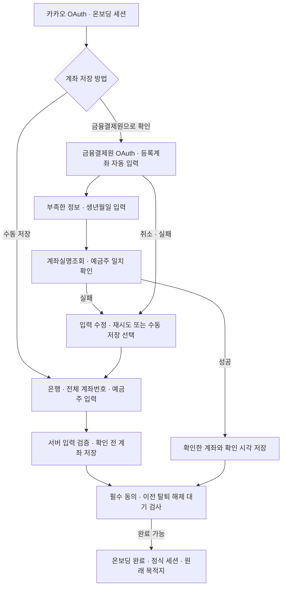

# 계좌 연동 구현 의도

이 문서는 온보딩과 ‘내 계정과 설정’의 수동 계좌 저장 및 선택적인 금융결제원 계좌 확인 흐름을 정리한다. **기획 명세이며 구현 완료를 의미하지 않는다.** 계좌를 확인하기 전에도 가입·정산에 사용할 수 있으며 확인 상태를 정확히 표시한다.

## 1. 목적과 구현 범위

카카오 OAuth로 서비스 계정을 식별한 뒤 은행·전체 계좌번호·예금주명을 직접 입력해 대표 계좌를 저장하고 온보딩을 완료할 수 있다. 금융결제원 연결과 계좌실명조회는 사용자가 선택하는 추가 확인 절차다.

- 기본 가입 순서는 **카카오 OAuth → 은행·전체 계좌번호·예금주 입력 → 확인 전 계좌 저장·온보딩 완료**다. 생년월일과 금융결제원 동의는 필요하지 않다.
- 원하는 사용자는 온보딩 또는 설정에서 **금융결제원 OAuth → 등록계좌 조회·선택 → 부족한 정보와 생년월일 입력 → 계좌실명조회 → 확인한 계좌 저장**을 진행한다.
- 등록계좌가 하나면 자동 선택하고 여러 개일 때만 고른다. 은행·예금주와 제공된 전체 계좌번호는 자동으로 채운다. 마스킹 번호를 전체 번호로 복원하지 않는다.
- **계좌번호를 안내할 때 `verifiedAt`이 없으면 ‘확인되지 않은 계좌입니다.’를 표시한다.** OAuth 성공이나 목록 선택만으로 이 문구를 지우지 않는다. 해당 저장 계좌의 실명조회·예금주 비교가 성공해야 제거한다.
- 대표 계좌 교체는 기존 금융결제원 연결을 유지한다. 다른 계좌 정보를 수동 저장하면 확인 이력을 초기화하며, 동일한 은행·정규화 계좌번호·예금주 재저장은 기존 확인 이력을 보존할 수 있다.
- 이번 범위는 수동 저장, 선택적 인증·계좌 확인, 인증 정보 관리다. 잔액·거래내역 화면, 실제 송금·출금, 입금 자동 확인은 포함하지 않는다.

[정산기능 구현 의도](./정산기능-intent.md)의 수동 계좌 저장을 유지하면서 선택적인 실명조회와 확인 상태 안내를 추가한다. 정산 계산, 수취 계좌 공개 범위, 실제 이체는 사용자가 수행한다는 정책은 유지한다.

## 2. 인증과 계좌 확인의 역할

| 구분 | 역할 | 결과 |
|---|---|---|
| 카카오 OAuth | 서비스 회원을 식별하고 계정 정보를 저장한다. | 내부 회원 ID, 검증된 카카오 식별자, 프로필, 서비스 세션 |
| 금융결제원 사용자 OAuth | 금융결제원 화면에서 사용자 인증·동의와 해당 절차의 계좌 등록을 진행한다. | 사용자 접근 권한과 인증 정보 |
| 금융결제원 이용기관 인증 | 다모아 서버가 Client Credentials 방식으로 계좌실명조회용 토큰을 확보한다. | 이용기관 토큰, `scope=oob` |
| 등록계좌조회 | 사용자 토큰으로 등록계좌를 가져와 선택과 자동 입력에 사용한다. | 은행·예금주·마스킹 번호, 제공 가능한 경우 전체 번호 |
| 계좌실명조회 | 서버가 저장할 계좌번호·인증정보로 예금주 성명을 확인한다. | API·참가기관 처리 결과, 계좌·은행 정보, 예금주명 |
| 수동 계좌 저장 | 은행·전체 계좌번호·예금주 입력 형식을 확인하고 저장한다. 금융결제원 연결·생년월일은 요구하지 않는다. | 확인 전 대표 계좌 또는 동일 계좌의 기존 확인 이력 |
| 온보딩 완료 | 카카오 인증·계좌 저장·필수 가입 동의가 충족되면 완료한다. 이전 탈퇴 연결 해제 대기는 별도로 검사한다. | 가입 완료 상태와 정식 서비스 세션 |

금융결제원 사용자 인증은 Authorization Code 방식이며 계좌 등록은 금융결제원 화면에서 수행한다. 다모아의 수기 입력은 정산에 사용할 계좌를 저장하고 선택적으로 확인하기 위한 단계다. 입력값을 이용해 금융결제원의 계좌 등록 화면을 대신하지 않는다. [금융결제원 OAuth 안내](https://developers.kftc.or.kr/dev/openapi/open-banking/oauth)

계좌실명조회는 이미 보유한 실계좌번호와 예금주 인증정보를 사용하며, 이용기관의 2-legged 인증 토큰으로 호출한다. **사용자 OAuth 토큰과 계좌실명조회용 이용기관 토큰을 구분한다.** 이용기관 토큰 발급은 서버 내부에서 처리하므로 사용자에게 별도 인증 화면을 추가하지 않는다. [계좌실명조회 안내](https://developers.kftc.or.kr/dev/openapi/open-banking/account)

- 카카오 닉네임·이메일을 예금주 비교 기준으로 사용하지 않는다. 등록계좌에서 자동으로 채운 예금주명 또는 직접 입력한 예금주명과 계좌실명조회가 반환한 예금주명을 비교한다.
- 금융결제원 사용자 인증 완료와 입력 계좌 확인 완료를 별도로 기록한다. 실명조회 성공만으로 해당 계좌의 거래내역 조회·출금 권한을 얻었다고 처리하지 않는다.
- **입력 계좌와 OAuth 등록계좌의 동일성 확인은 이번 온보딩 완료 조건에 추가하지 않는다.** 동일성이 확인되지 않은 계좌번호와 핀테크이용번호를 같은 계좌로 연결하지 않는다.
- 수동 저장은 계좌 유효성·예금주 일치를 보장하지 않는다. 실명조회에 성공한 경우에만 조회 시점의 입력 계좌·예금주 정보 확인을 기록한다. 로그인한 사람의 계좌 소유권, 모든 이체의 가능 여부, 실제 입금 완료까지 확인한 것으로 표시하지 않는다.

## 3. 회원가입·온보딩 흐름



1. 카카오 인증으로 기존 회원을 찾거나 생성한다. 신규·미완료·재가입 회원은 온보딩 세션으로 진행한다.
2. 수동 저장에서는 은행·전체 계좌번호·예금주명만 입력한다. 금융결제원 미연결·재동의 필요 상태여도 이 경로를 사용할 수 있다.
3. 금융결제원 확인을 선택한 경우에만 같은 회원의 OAuth 연결을 준비하고 등록계좌를 조회한다. 가능한 값을 자동으로 채우고 필요한 전체 계좌번호와 생년월일을 입력받는다.
4. 확인 경로는 서버가 이용기관 토큰으로 실명조회를 호출하고 API·참가은행 정상 처리, 요청 계좌에 대한 응답, 예금주명 일치를 검사한다. 실패한 요청은 저장하지 않으며, 수동 저장으로 자동 전환하지 않는다.
5. 사용자가 수동 저장을 명시적으로 선택하면 생년월일을 제외한 별도 요청으로 저장한다. 확인 실패를 성공 이력으로 기록하지 않는다.
6. 최종 트랜잭션에서 유효한 세션·입력·계좌 버전·가입 동의와 이전 탈퇴 해제 대기를 검사하고 계좌 저장·가입 완료·정식 세션 발급을 함께 처리한다. 흐름도의 저장 단계도 이 최종 트랜잭션에 포함된다.
7. 초대·정산 링크로 시작했다면 검증된 원래 목적지로, 별도 목적지가 없으면 홈으로 이동한다. 참여 수락·조회 권한은 별도로 검사한다.

### 중단과 재진입

- 카카오 인증 실패·세션 만료·입력 오류·DB 저장 실패는 가입을 완료하지 않는다. 금융결제원 취소·실패는 선택한 확인 요청만 중단하며 수동 저장을 선택할 수 있다.
- 같은 카카오 식별자의 회원을 중복 생성하지 않는다. 유효한 금융결제원 연결은 입력 수정·재시도마다 다시 인증하지 않는다.
- 온보딩 세션은 기존 10분이며 갱신할 수 없다. 만료되면 같은 카카오 회원으로 재인증하고 서버의 현재 상태에서 재개한다.
- 이전 탈퇴의 외부 해제·인증 결과가 미정리 상태이면 수동 경로도 재가입 완료를 허용하지 않는다. 유효하지 않은 콜백·인증 결과를 재사용하지 않는다.

## 4. 입력값과 계좌실명조회

| 입력·정보 | 처리 |
|---|---|
| 은행 | 등록계좌의 지원 은행 코드를 자동으로 채운다. 직접 입력 모드에서는 지원 목록에서 선택한다. |
| 계좌번호 | 문자열로 취급하고 선행 0을 보존한다. 표시용 공백·하이픈을 제거한 뒤 `account_num`으로 전달한다. |
| 생년월일 | 금융결제원 확인을 선택할 때만 수집·검증하고 `account_holder_info`로 변환한다. 수동 저장 요청에서는 제외한다. |
| 인증정보 유형 | 서버가 확인한 명세에 따라 `account_holder_info_type`을 설정한다. 클라이언트가 임의 유형을 지정하지 않는다. |
| 예금주명 | 등록계좌에서 자동으로 채우거나 직접 입력한다. API 요청에 임의 필드를 추가하지 않고, 응답의 `account_holder_name`과 서버에서 비교한다. |
| 거래고유번호·요청일시 | 서버가 명세에 맞춰 `bank_tran_id`와 `tran_dtime`을 생성한다. |

실명조회 경로의 요청·응답은 [계좌실명조회 명세](https://developers.kftc.or.kr/dev/openapi/open-banking/account)를 따른다. 상세 v3.3.6 명세에서 생년월일 유형은 ASCII 공백, 전송 값은 YYMMDD 6자리로 확인했다. 수동 저장은 이 API를 호출하지 않는다.

- 두 경로 모두 은행 코드·전체 계좌번호·예금주 형식을 서버에서 검증한다. `verifyWithOpenBanking:false`이면 생년월일을 제외하고 수동 저장하며, `true` 또는 생략이면 기존 호환성을 위해 생년월일·사용자 연결·실명조회를 요구한다.
- 예금주 비교는 앞뒤 공백 제거와 유니코드 정규화 후 정확히 일치하는 것을 기본값으로 한다. 일부 문자열·유사도·카카오 닉네임으로 통과시키지 않는다.
- HTTP 성공만으로 통과시키지 않는다. `rsp_code`, `bank_rsp_code`와 필수 응답값을 확인하고, 오류·누락·요청 계좌와 다른 응답은 실패로 처리한다.
- 실명조회 성공 시 확인한 계좌번호, 은행 정보, API가 반환한 예금주명을 확인 시각과 함께 저장한다. 수동 저장은 정규화한 입력을 확인 전 상태로 저장한다. 검증 뒤 클라이언트가 바꾼 값이나 `verified=true` 같은 주장으로 저장을 허용하지 않는다.
- 은행·계좌번호·예금주 정보가 바뀌면 기존 확인은 새 값에 적용하지 않는다. 확인 경로에서는 변경된 값으로 다시 조회하고, 수동 경로에서는 확인 이력을 초기화한다. 별도 확인 버튼을 두더라도 저장 요청의 계좌와 서버의 확인 결과가 정확히 일치해야 한다.
- 생년월일은 이번 확인 요청에만 사용하고 DB·로그·브라우저 영구 저장소에 보관하지 않는 것을 기본값으로 한다. 재확인이 필요하면 다시 입력받는다.
- 계좌실명조회 실패 시 수정·재시도와 명시적인 수동 저장을 제공한다. 테스트 응답 누락 `818`도 같은 원칙이며, 수동 저장 성공을 금융결제원 확인 완료로 표시하지 않는다.

## 5. 내 계정과 설정에서 계좌 저장

```text
내 계정과 설정 → 은행·전체 계좌번호·예금주 입력 → 수동 저장
또는 금융결제원으로 확인 선택 → 기존 연결 재사용 / 필요한 경우 OAuth
→ 등록계좌 자동 입력·부족한 정보 및 생년월일 입력 → 실명조회 → 확인 후 저장
```

- 수동 저장은 생년월일·금융결제원 연결 없이 진행한다. 선택적인 확인 경로에서만 유효한 연결을 재사용하고 미연결·재동의 시 OAuth를 진행한다.
- 새 저장이 성공하기 전까지 기존 대표 계좌와 확인 이력을 유지한다. 확인 실패 후 수동 저장을 사용하려면 사용자가 명시적으로 선택해야 한다.
- 다른 은행·정규화 전체 번호·예금주를 수동 저장하면 확인 시각·거래 식별자를 초기화한다. 동일한 계좌 정보의 재저장은 기존 실명조회 이력을 보존할 수 있다. 확인 경로 성공은 해당 계좌의 확인 이력을 갱신한다.
- 계좌번호를 안내할 때 확인 시각이 없으면 정확히 ‘확인되지 않은 계좌입니다.’를 표시한다. OAuth만 성공한 상태에서도 이 문구를 유지한다.
- **대표 계좌를 교체해도 금융결제원 연결·기존 계좌 등록·동의를 유지한다.** 교체 성공·실패 어느 경우에도 외부 연결 해제 API를 호출하지 않는다. 정상 토큰 갱신은 계속 허용한다.
- 진행 중 정산은 대표 계좌 교체를 막지 않는다. 기존 정산 제한·다모아의 외부 연결 해제는 회원탈퇴에만 적용한다.
- 저장 후 기존 계좌 변경 알림으로 필요한 화면이 최신 계좌와 확인 상태를 다시 조회한다. 정산 금액·참여 이력·수취 확인 상태는 바꾸지 않는다.

## 6. 계좌·회원·인증 정보 관리

**동일 계좌 확인 이력 보존은 활성 회원의 설정 변경에만 적용한다. 탈퇴 후 수동 재가입은 같은 은행·계좌번호·예금주여도 확인 시각·거래 식별자를 초기화하며 ‘확인되지 않은 계좌입니다.’를 표시한다. 새 실명조회에 성공해야 다시 확인 이력을 부여한다.**

- 현재 구조에 맞춰 회원당 정산용 대표 계좌는 한 개로 유지한다.
- 기존 가입 완료 회원에게 일괄 재온보딩을 강제하지 않고, 다음 계좌 저장 시 새 절차를 적용하는 것을 기본값으로 한다. 기존 수기 계좌에는 API 확인 완료 상태를 자동으로 부여하지 않는다.
- 신규 가입·재가입은 수동 계좌 저장으로 완료할 수 있다. 이전 탈퇴의 금융결제원 해제 대기가 있으면 수동 저장도 재가입 완료를 보류한다. 재가입 시 기존 카카오 식별자·내부 회원을 재사용하되 과거 동의·세션을 자동 복구하지 않는다.
- 정산 화면은 기존 권한 검사에 따라 필요한 수취인의 최신 대표 계좌와 확인 시각만 표시하며, 확인 시각이 없으면 ‘확인되지 않은 계좌입니다.’를 함께 안내한다. 생년월일, 토큰, 다른 사용자의 불필요한 계좌정보는 응답에 포함하지 않는다.
- 금융결제원 인증 시작·실명조회·계좌 저장은 유효한 회원 세션에서만 허용한다. 요청 출처 검증과 서버의 호출 빈도 제한을 적용한다.
- OAuth에는 예측할 수 없는 일회용 `state`, 회원·세션, 진입 위치, 만료 시점과 처리 여부를 연결한다. 콜백과 복귀 경로를 검증하고 다른 회원의 인증 결과를 적용하지 않는다.
- Client Secret, 이용기관 토큰, 사용자 토큰은 서버에서만 사용한다. 보관하는 토큰은 암호화하고, 인증정보·전체 계좌번호·생년월일을 일반 로그에 남기지 않는다.
- 사용자 토큰 갱신과 이용기관 토큰 재발급을 구분한다. 기관 인증 오류는 서버 설정·발급 문제로 처리하고 사용자 OAuth의 반복으로 해결하려 하지 않는다.
- 사용자 OAuth의 권한 만료·철회와 계좌실명조회 성공 이력을 구분한다. 사용자 권한이 없으면 그 권한이 필요한 API 사용을 막되, 이미 가입한 회원을 자동으로 미가입 상태로 돌리지 않는다.
- **다모아가 요청하는 금융결제원 연결 해제는 회원탈퇴 시에만 수행한다.** 기존 진행 중 정산 제한에 걸리면 탈퇴·연결 해제를 모두 진행하지 않는다. 허용된 탈퇴는 일반 금융 API 사용을 즉시 차단하고 외부 연결 해제를 처리한다.
- 외부 해제 실패와 재시도·토큰 폐기 순서는 구현 spec의 기본 설계를 따른다. 재가입 시 이전 연결 해제 작업이 새 동의에 영향을 주지 않도록 처리한다.

## 7. 필요한 데이터와 구현 연결점

아래는 필요한 개념이며 최종 DB 스키마는 아니다.

| 개념 | 필요한 정보 |
|---|---|
| 서비스 회원 | 기존 내부 회원 ID, 검증된 카카오 식별자, 프로필, 가입 완료 여부 |
| 사용자 OAuth | 연결된 내부 회원, 금융결제원 사용자 식별 정보, 사용자 토큰·만료·허용 권한, 인증 상태 |
| 이용기관 인증 | 서비스 단위의 암호화한 이용기관 토큰과 만료 정보. 회원별 계좌 토큰으로 저장하지 않는다. |
| 정산용 대표 계좌 | 은행 코드·이름, 전체 계좌번호, 입력 또는 확인한 예금주명, 저장 시점 |
| 계좌 확인 결과 | 확인한 회원·계좌, 확인 상태·시각, 추적에 필요한 거래 식별 정보. 생년월일이나 응답 원문 전체를 보관하지 않는다. |
| 진행 중인 인증 | 일회용 상태, 회원·세션, 온보딩 또는 설정 진입 구분, 안전한 복귀 경로, 만료·처리 여부 |

핀테크이용번호를 확보하더라도 금융결제원 등록계좌의 식별자로 별도 취급한다. 입력한 정산용 계좌의 필수 저장값으로 요구하거나, 동일성 확인 없이 해당 계좌에 붙이지 않는다.

2026-09-10 코드 검토 기준:

- [카카오 콜백](../src/app/auth/v1/kakao/route.ts)과 [인증 저장소](../src/lib/auth-store.ts)의 회원 식별·세션 구분·가입 완료 트랜잭션을 재사용한다.
- [온보딩 화면](../src/app/onboarding/onboarding-client.tsx)과 [온보딩 API](../src/app/api/me/onboarding/route.ts)에 수동 저장과 선택적인 금융결제원 인증·생년월일 입력·서버 실명조회를 연결한다.
- [내 계정 화면](../src/app/home/ui.tsx)과 [계좌 저장 API](../src/app/api/me/bank-account/route.ts)에도 동일한 저장·선택적 확인 절차와 확인 상태 안내를 적용한다.
- [현재 계좌 스키마](../scripts/migrations/001-auth-lifecycle.sql)의 은행·계좌번호·예금주 저장 구조를 활용하고, 금융기관 코드·확인 결과와 사용자 OAuth 상태를 구분해 추가한다.
- [정산 조회](../src/lib/round-store.ts)의 최신 계좌 공개 범위와 [계좌 변경 알림](../src/lib/realtime-server.ts)을 유지한다. 알림에는 계좌정보·인증정보를 싣지 않는다.
- [API 문서](../src/lib/openapi.ts)와 화면 안내를 ‘수동 저장 또는 등록계좌 정보로 입력을 줄여 실명조회 후 저장’하는 동작에 맞춰 갱신한다.

## 8. 예외 상황과 검증

| 상황 | 처리 |
|---|---|
| 카카오 인증 실패·유효한 서비스 세션 없음 | 저장·가입 완료를 거부한다. |
| 금융결제원 인증 취소·미연결·재동의 필요 | 확인 경로는 중단한다. 수동 저장을 선택할 수 있다. |
| 잘못된 은행·계좌번호·예금주 | 두 경로 모두 저장 전에 거부한다. 생년월일은 확인 경로에서만 검사한다. |
| API·은행 오류·예금주 불일치·응답 누락·시간 초과 | 확인 요청은 저장하지 않고 기존 계좌를 유지한다. 수정·재시도 또는 별도의 수동 저장을 선택한다. |
| 테스트 시뮬레이터 `818` | 테스트 응답 준비를 안내한다. 명시적으로 선택한 수동 저장은 가능하며 거짓 확인 이력을 만들지 않는다. |
| 수동 저장·OAuth만 성공 | 확인되지 않은 계좌는 ‘확인되지 않은 계좌입니다.’를 표시한다. |
| 다른 계좌 수동 저장·동일 계좌 재저장 | 다른 계좌는 확인 이력을 초기화한다. 동일한 정규화 정보는 기존 확인 이력을 보존할 수 있다. |
| 실명조회 성공 후 DB 저장 실패 | 확인·가입·계좌 저장이 완료됐다고 안내하지 않는다. 기존 상태를 유지한다. |
| 중복·동시 저장, 확인 도중 탈퇴·세션 폐기 | 멱등 키·계좌 버전·최종 회원 상태로 늦은 덮어쓰기를 막는다. |
| 만료·변조·재사용 콜백 | 인증 결과를 적용하지 않는다. 수동 저장 권한까지 콜백으로 부여하지 않는다. |
| 진행 중 정산이 있는 회원탈퇴 | 탈퇴·외부 해제를 모두 거부한다. 대표 계좌 변경에는 이 제한을 적용하지 않는다. |
| 허용된 회원탈퇴·이전 해제 미완료 재가입 | 일반 금융 API 차단·외부 해제를 진행한다. 이전 해제 대기 중에는 수동 경로도 재가입 완료를 보류한다. |
| 초대·정산 링크에서 가입 시작 | 저장·가입 후 원래 안전한 목적지로 복귀하고 권한을 다시 검사한다. |

검증에는 미연결 수동 가입·변경, 생년월일 미수집, 선택적 실명조회 성공·실패, 확인 문구의 생성·제거, 계좌 변경 시 초기화·동일 정보 보존, OAuth만 성공해도 미확인 유지, `818` 후 수동 저장, 멱등·경합과 탈퇴 제한을 포함한다. 통제한 응답 테스트와 실제 금융결제원 테스트는 구분한다.

## 9. 결정 상태와 남은 확인 사항

### 확정·해결된 내용

**온보딩의 핵심 흐름에 추가로 결정할 사항은 없다.** 카카오 OAuth 후 은행·전체 계좌번호·예금주를 수동 저장해 가입할 수 있다. 금융결제원 연결·등록계좌 자동 입력·생년월일·실명조회는 온보딩과 설정에서 선택하는 추가 확인 경로다.

- 전체 계좌번호는 선택 제공 항목이다. 제공되면 자동으로 사용하고 마스킹 번호만 있으면 직접 입력하므로 정산 안내에 필요한 전체 번호를 확보한다.
- 등록계좌 목록은 본인의 활성·조회 동의·개인 계좌 중 지원 은행만 제공한다. 조회 실패는 재시도하고, 빈 목록이나 다른 계좌 사용은 명시적 직접 입력으로 진행할 수 있다.
- OAuth 등록계좌와 입력 계좌의 동일성 확인, 거래내역 조회·입금이체는 이번 가입 완료 조건에 추가하지 않는다.
- 대표 계좌 한 개, 기존 회원의 다음 계좌 저장 시 전환, 생년월일의 요청 중 사용, 보수적인 예금주명 비교는 본문의 기본값으로 진행한다.
- 대표 계좌 교체 시 금융결제원 연결을 유지하고, 진행 중 정산 제한·다모아의 외부 연결 해제는 회원탈퇴 시에만 적용한다.
- 탈퇴 후 외부 연결 해제를 재시도하고, 이전 해제 처리가 끝나기 전 새 금융결제원 OAuth·재가입 완료를 보류하는 것은 spec에서 채택한 구현 기본값이다. 카카오 재로그인은 허용하며 일반 대표 계좌 교체에는 적용하지 않는다.

### 남은 기술 확인·외부 준비

| 항목 | 구체적으로 확인할 내용 | 영향 |
|---|---|---|
| 정확한 인증·API 명세 | 사용자 OAuth의 요청·토큰 발급·갱신 규격과 이번 요청 권한, 이용기관 `oob` 토큰 발급 규격, 계좌실명조회 거래번호·성공 코드·지원 은행·계좌 조건을 확인한다. 특히 생년월일에 사용할 `account_holder_info_type`과 전송 형식을 확인한다. | 수동 가입은 영향을 받지 않는다. 선택적 확인 경로의 서버 요청·성공 판정에 적용한다. |
| 테스트·운영 환경 | 필요한 API 이용 신청·승인·활성화, 환경별 Client ID·Secret·접속 주소, 등록된 Callback URL, 테스트 데이터와 운영 사용 가능 여부를 확인한다. | 실제 인증·실명조회 연결과 운영 배포의 준비 사항이다. |

2026-09-11 [공식 이용기관 API 명세서 v3.3.6](https://openapi.kftc.or.kr/support/mtrlDetail?bltn_seq_no=129)으로 생년월일 조합을 **인증정보 유형 ASCII 공백 한 문자 + YYMMDD 6자리**로 확인했다. 사용자 OAuth·토큰 발급/갱신과 `POST /v2.0/user/close` 탈퇴 규격도 확인해 spec과 구현에 반영했다. 남은 검증은 발급받은 실제 환경의 키·승인 권한·테스트 계좌로 진행한다. 주민등록번호 추가 자릿수는 수집하지 않는다.

서비스 신청·API Key·Callback URL·테스트 데이터 준비는 [금융결제원 시작하기 안내](https://developers.kftc.or.kr/dev/starter)를 따른다. 테스트 성공만으로 운영 이용까지 승인됐다고 판단하지 않는다.

### 연결 유지·탈퇴 정책의 결정 상태

**추가로 결정할 제품 정책은 없다.** 대표 계좌 교체는 금융결제원 연결을 유지하고, 회원탈퇴에서만 기존 탈퇴 제한과 외부 연결 해제를 적용한다. 금융결제원 등록 해제는 은행 계좌 자체의 해지를 의미하지 않는다.

외부 해제 API의 정확한 대상·인증 수단·성공 및 이미 해제된 응답은 위의 상세 명세 확인에 포함한다. 해제 실패의 재시도와 토큰 폐기 순서는 [계좌연동-spec.md](../spec/계좌연동-spec.md)의 구현 기본값으로 구체화한다.

구현에서 확인된 외부 제약: 센터의 탈퇴 성공 뒤에도 참가은행 정리는 익영업일 중 완료될 수 있다. 시간 초과로 결과가 불명확한 요청이나 끝내 콜백이 오지 않은 인증은 해제 완료로 추정하지 않고 대기로 유지한다. 공급자 확인 전에는 이전 작업의 안전한 종료를 보장할 수 없어 새 금융결제원 연결을 보류한다.

위 기술 확인·환경 준비를 제외하면 현재 요청 범위에서 추가로 발견한 미결 사항은 없다. 향후 정산용 계좌에 거래내역 조회·이체까지 연결할 때 필요한 동일 계좌 식별과 권한 정책은 해당 기능의 범위에서 정한다.
