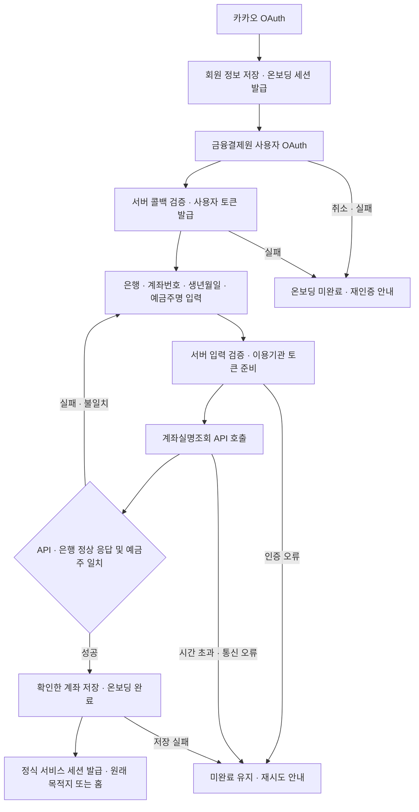

# 계좌 연동 구현 의도

이 문서는 온보딩과 ‘내 계정과 설정’의 계좌 저장을 금융결제원 오픈뱅킹으로 연결하는 흐름을 정리한다. **기획 명세이며 구현 완료를 의미하지 않는다.** 사용자와 확정한 수기 입력·계좌실명조회·연결 유지 정책을 반영하고, 구현 기본값과 남은 기술 확인은 마지막 절에 구분한다.

## 1. 목적과 구현 범위

카카오 OAuth로 서비스 계정을 식별하고 정보를 저장한 뒤, 금융결제원 OAuth를 완료한다. 사용자가 직접 입력한 계좌정보를 금융결제원 계좌실명조회 API로 확인하고 저장한다.

- 회원가입 순서는 **카카오 OAuth → 금융결제원 OAuth → 계좌정보 입력 → 계좌실명조회 API로 유효성·예금주 확인 → 계좌 저장·온보딩 완료**다.
- 계좌 확인은 **가입 온보딩**과 **‘내 계정과 설정’의 계좌 저장**에서 진행한다.
- 사용자는 은행, 전체 계좌번호, 생년월일, 예금주명을 입력한다. 은행은 목록에서 선택하고 서버에서 금융기관 코드로 변환한다.
- API에서 전체 계좌번호를 자동으로 가져오는 것과 등록계좌 목록에서 대표 계좌를 선택하는 것은 이번 가입 완료의 전제 조건이 아니다.
- 카카오 인증은 서비스 계정·로그인에, 금융결제원 사용자 OAuth는 동의받은 계좌 관련 작업의 접근 권한에 사용한다. 입력 계좌의 실명조회에는 서버의 별도 이용기관 인증을 사용한다.
- 이번 범위는 인증, 입력 계좌 확인·저장, 필요한 인증 정보 관리다. 잔액·거래내역 화면, 실제 송금·출금, 입금 자동 확인은 포함하지 않는다.

[정산기능 구현 의도](./정산기능-intent.md)의 ‘계좌를 입력해 저장만 한다’는 정책을 **입력한 계좌를 API로 확인한 후 저장한다**로 대체한다. 정산 계산, 수취 계좌 공개 범위, 실제 이체는 사용자가 수행한다는 정책은 유지한다.

## 2. 인증과 계좌 확인의 역할

| 구분 | 역할 | 결과 |
|---|---|---|
| 카카오 OAuth | 서비스 회원을 식별하고 계정 정보를 저장한다. | 내부 회원 ID, 검증된 카카오 식별자, 프로필, 서비스 세션 |
| 금융결제원 사용자 OAuth | 금융결제원 화면에서 사용자 인증·동의와 해당 절차의 계좌 등록을 진행한다. | 사용자 접근 권한과 인증 정보 |
| 금융결제원 이용기관 인증 | 다모아 서버가 Client Credentials 방식으로 계좌실명조회용 토큰을 확보한다. | 이용기관 토큰, `scope=oob` |
| 계좌실명조회 | 서버가 입력한 계좌번호·인증정보로 예금주 성명을 확인한다. | API·참가기관 처리 결과, 계좌·은행 정보, 예금주명 |
| 온보딩 완료 | 금융결제원 사용자 인증과 입력 계좌 확인·저장, 필수 가입 동의가 충족된 뒤 완료한다. | 가입 완료 상태와 정식 서비스 세션 |

금융결제원 사용자 인증은 Authorization Code 방식이며 계좌 등록은 금융결제원 화면에서 수행한다. 다모아의 수기 입력은 정산에 사용할 계좌를 확인·저장하기 위한 단계다. 입력값을 이용해 금융결제원의 계좌 등록 화면을 대신하지 않는다. [금융결제원 OAuth 안내](https://developers.kftc.or.kr/dev/openapi/open-banking/oauth)

계좌실명조회는 이미 보유한 실계좌번호와 예금주 인증정보를 사용하며, 이용기관의 2-legged 인증 토큰으로 호출한다. **사용자 OAuth 토큰과 계좌실명조회용 이용기관 토큰을 구분한다.** 이용기관 토큰 발급은 서버 내부에서 처리하므로 사용자에게 별도 인증 화면을 추가하지 않는다. [계좌실명조회 안내](https://developers.kftc.or.kr/dev/openapi/open-banking/account)

- 카카오 닉네임·이메일을 예금주 비교 기준으로 사용하지 않는다. 사용자가 입력한 예금주명과 계좌실명조회가 반환한 예금주명을 비교한다.
- 금융결제원 사용자 인증 완료와 입력 계좌 확인 완료를 별도로 기록한다. 실명조회 성공만으로 해당 계좌의 거래내역 조회·출금 권한을 얻었다고 처리하지 않는다.
- **입력 계좌와 OAuth 등록계좌의 동일성 확인은 이번 온보딩 완료 조건에 추가하지 않는다.** 동일성이 확인되지 않은 계좌번호와 핀테크이용번호를 같은 계좌로 연결하지 않는다.
- 이번에 보장하는 것은 조회 시점의 입력 계좌·예금주 정보 확인이다. 로그인한 사람의 계좌 소유권, 모든 이체의 가능 여부, 실제 입금 완료까지 확인한 것으로 표시하지 않는다.

## 3. 회원가입·온보딩 흐름



1. 카카오 인증으로 기존 회원을 찾거나 생성하고 프로필을 저장한다. 신규·미완료·재가입 회원은 온보딩 세션으로 진행한다.
2. 금융결제원 사용자 OAuth를 진행한다. 서버가 해당 회원의 인증 시도와 콜백을 검증하고 사용자 인증 결과를 보관한다.
3. 사용자가 은행·계좌번호·생년월일·예금주명을 입력한다. 금융결제원 인증만 끝난 상태에서는 온보딩을 완료하지 않는다.
4. 서버가 유효한 온보딩 세션, 같은 회원의 금융결제원 인증 완료, 입력 형식을 확인한다.
5. 서버가 유효한 이용기관 토큰으로 `POST /v2.0/inquiry/real_name`을 호출한다. 입력한 예금주명은 서버에서 응답과 비교한다.
6. API와 참가은행의 정상 처리, 요청한 계좌에 대한 응답, 예금주명 일치를 모두 확인한다. 실패하면 계좌를 저장하거나 온보딩을 완료하지 않는다.
7. 필수 가입 동의까지 충족되면 확인한 계좌와 확인 시각을 저장하고 가입을 완료한다. 계좌 저장·가입 완료·정식 세션 발급은 기존 트랜잭션에서 함께 처리한다.
8. 초대·정산 링크로 진입했다면 검증된 기존 목적지로 복귀하고, 별도 목적지가 없으면 홈으로 이동한다. 모임 참여 수락과 조회 권한은 해당 화면에서 별도로 확인한다.

### 중단과 재진입

- 인증 취소·실패, 잘못된 입력, 실명조회 실패, 예금주 불일치, DB 저장 실패는 모두 온보딩 미완료로 유지한다.
- 인증·계좌 확인을 다시 시도해도 같은 카카오 식별자의 회원을 중복 생성하지 않는다.
- 유효한 온보딩 세션과 금융결제원 인증 결과가 남아 있다면 입력 오류 수정·계좌 재확인마다 사용자 OAuth를 반복하지 않는다.
- 현재 온보딩 세션은 10분이고 갱신할 수 없다. 세션이 만료되면 카카오로 같은 회원을 재인증하고 유효한 금융결제원 인증 시도인지 다시 확인해 진행한다.
- 유효하지 않은 인증 결과와 콜백은 재사용하지 않는다. 재시도 과정에서 인증이 필요하면 해당 단계부터 다시 진행한다.

## 4. 입력값과 계좌실명조회

| 입력·정보 | 처리 |
|---|---|
| 은행 | 은행 선택값을 서버가 지원 금융기관 코드 `bank_code_std`로 변환한다. |
| 계좌번호 | 문자열로 취급하고 선행 0을 보존한다. 표시용 공백·하이픈을 제거한 뒤 `account_num`으로 전달한다. |
| 생년월일 | 실제로 존재하는 날짜인지 검증하고, 지원되는 인증정보 유형에 맞춰 `account_holder_info`로 변환한다. |
| 인증정보 유형 | 서버가 확인한 명세에 따라 `account_holder_info_type`을 설정한다. 클라이언트가 임의 유형을 지정하지 않는다. |
| 예금주명 | API 요청에 임의 필드를 추가하지 않고, 응답의 `account_holder_name`과 서버에서 비교한다. |
| 거래고유번호·요청일시 | 서버가 명세에 맞춰 `bank_tran_id`와 `tran_dtime`을 생성한다. |

위 요청·응답 필드와 호출 경로는 [계좌실명조회 명세](https://developers.kftc.or.kr/dev/openapi/open-banking/account)를 기준으로 한다. 생년월일의 정확한 전송 형식과 유형 코드는 마지막 절의 기술 확인 사항이다.

- 필수값, 은행 코드, 계좌번호 형식·길이, 생년월일, 예금주명을 서버에서 검증한다.
- 예금주 비교는 앞뒤 공백 제거와 유니코드 정규화 후 정확히 일치하는 것을 기본값으로 한다. 일부 문자열·유사도·카카오 닉네임으로 통과시키지 않는다.
- HTTP 성공만으로 통과시키지 않는다. `rsp_code`, `bank_rsp_code`와 필수 응답값을 확인하고, 오류·누락·요청 계좌와 다른 응답은 실패로 처리한다.
- 성공 시 확인한 계좌번호, 은행 정보, API가 반환한 예금주명을 저장한다. 검증 뒤 클라이언트가 바꾼 값이나 `verified=true` 같은 주장으로 저장을 허용하지 않는다.
- 입력이 바뀌면 변경된 값으로 다시 확인한다. 별도 확인 버튼을 두더라도 저장 요청의 계좌와 서버의 확인 결과가 정확히 일치해야 한다.
- 생년월일은 이번 확인 요청에만 사용하고 DB·로그·브라우저 영구 저장소에 보관하지 않는 것을 기본값으로 한다. 재확인이 필요하면 다시 입력받는다.
- 계좌실명조회가 실패하면 입력 화면에서 수정·재시도를 제공한다. 지원하지 않는 계좌를 확인 완료로 저장하는 우회 경로는 제공하지 않는다.

## 5. 내 계정과 설정에서 계좌 저장

```text
내 계정과 설정 → 기존 금융결제원 연결 확인 · 미연결/재동의 필요 시 OAuth
→ 은행·계좌번호·생년월일·예금주명 입력 → 계좌실명조회
→ 예금주 일치 확인 → 대표 계좌 저장 완료
```

- 로그인한 회원은 카카오 회원가입을 반복하지 않는다. 유효한 금융결제원 연결을 재사용하며, 대표 계좌 교체만을 이유로 사용자 OAuth를 반복하지 않는다. 미연결·재동의가 필요한 경우에만 OAuth 후 온보딩과 같은 입력·확인 절차를 진행한다.
- 새 계좌의 확인과 저장이 모두 성공하기 전까지 기존 대표 계좌를 지우거나 덮어쓰지 않는다.
- 취소·실패·예금주 불일치 시 기존 계좌를 유지한다. 성공하면 ‘내 계정과 설정’으로 복귀해 저장한 계좌와 확인 완료 상태를 표시한다.
- 같은 계좌를 저장하면 중복 생성하지 않고 확인 정보를 갱신한다. 다른 계좌라면 저장 성공 시점에 대표 계좌를 교체한다.
- **대표 계좌를 교체해도 금융결제원 연결·기존 계좌 등록·동의를 유지한다.** 계좌 교체 성공·실패 어느 경우에도 외부 연결 해제 API를 호출하지 않는다. 사용자 토큰의 정상 갱신은 계속 허용한다.
- 진행 중 정산이 있다는 이유로 대표 계좌 교체를 막지 않는다. 진행 중 정산에 따른 제한과 다모아가 요청하는 외부 연결 해제는 회원탈퇴에만 적용한다.
- 계좌 변경 성공 후 기존 계좌 변경 알림을 발행하고 필요한 화면이 최신 계좌를 다시 조회한다. 정산 금액·참여 이력·수취 확인 상태는 바꾸지 않는다.

## 6. 계좌·회원·인증 정보 관리

- 현재 구조에 맞춰 회원당 정산용 대표 계좌는 한 개로 유지한다.
- 기존 가입 완료 회원에게 일괄 재온보딩을 강제하지 않고, 다음 계좌 저장 시 새 절차를 적용하는 것을 기본값으로 한다. 기존 수기 계좌에는 API 확인 완료 상태를 자동으로 부여하지 않는다.
- 신규 가입·재가입은 사용자 OAuth와 입력 계좌 확인을 모두 거쳐 완료한다. 재가입 시 기존 카카오 식별자·내부 회원을 재사용하되 과거 동의·세션을 자동 복구하지 않는다.
- 정산 화면은 기존 권한 검사에 따라 필요한 수취인의 최신 대표 계좌만 표시한다. 생년월일, 토큰, 다른 사용자의 불필요한 계좌정보는 응답에 포함하지 않는다.
- 금융결제원 인증 시작·실명조회·계좌 저장은 유효한 회원 세션에서만 허용한다. 요청 출처 검증과 서버의 호출 빈도 제한을 적용한다.
- OAuth에는 예측할 수 없는 일회용 `state`, 회원·세션, 진입 위치, 만료 시점과 처리 여부를 연결한다. 콜백과 복귀 경로를 검증하고 다른 회원의 인증 결과를 적용하지 않는다.
- Client Secret, 이용기관 토큰, 사용자 토큰은 서버에서만 사용한다. 보관하는 토큰은 암호화하고, 인증정보·전체 계좌번호·생년월일을 일반 로그에 남기지 않는다.
- 사용자 토큰 갱신과 이용기관 토큰 재발급을 구분한다. 기관 인증 오류는 서버 설정·발급 문제로 처리하고 사용자 OAuth의 반복으로 해결하려 하지 않는다.
- 사용자 OAuth의 권한 만료·철회와 계좌실명조회 성공 이력을 구분한다. 사용자 권한이 없으면 그 권한이 필요한 API 사용을 막되, 이미 가입한 회원을 자동으로 미가입 상태로 돌리지 않는다.
- **다모아가 요청하는 금융결제원 연결 해제는 회원탈퇴 시에만 수행한다.** 기존 진행 중 정산 제한에 걸리면 탈퇴·연결 해제를 모두 진행하지 않는다. 허용된 탈퇴는 일반 금융 API 사용을 즉시 차단하고 외부 연결 해제를 처리한다.
- 외부 해제 실패와 재시도·토큰 폐기 순서는 구현 spec의 기본 설계를 따른다. 재가입 시 이전 연결 해제 작업이 새 동의에 영향을 주지 않도록 처리한다.

## 7. 필요한 데이터와 구현 연결점

아래는 필요한 개념이며 최종 DB 스키마는 아니다.

| 개념 | 필요한 정보 |
|---|---|
| 서비스 회원 | 기존 내부 회원 ID, 검증된 카카오 식별자, 프로필, 가입 완료 여부 |
| 사용자 OAuth | 연결된 내부 회원, 금융결제원 사용자 식별 정보, 사용자 토큰·만료·허용 권한, 인증 상태 |
| 이용기관 인증 | 서비스 단위의 암호화한 이용기관 토큰과 만료 정보. 회원별 계좌 토큰으로 저장하지 않는다. |
| 정산용 대표 계좌 | 은행 코드·이름, 전체 계좌번호, 확인된 예금주명, 저장 시점 |
| 계좌 확인 결과 | 확인한 회원·계좌, 확인 상태·시각, 추적에 필요한 거래 식별 정보. 생년월일이나 응답 원문 전체를 보관하지 않는다. |
| 진행 중인 인증 | 일회용 상태, 회원·세션, 온보딩 또는 설정 진입 구분, 안전한 복귀 경로, 만료·처리 여부 |

핀테크이용번호를 확보하더라도 금융결제원 등록계좌의 식별자로 별도 취급한다. 입력한 정산용 계좌의 필수 저장값으로 요구하거나, 동일성 확인 없이 해당 계좌에 붙이지 않는다.

2026-09-10 코드 검토 기준:

- [카카오 콜백](../src/app/auth/v1/kakao/route.ts)과 [인증 저장소](../src/lib/auth-store.ts)의 회원 식별·세션 구분·가입 완료 트랜잭션을 재사용한다.
- [온보딩 화면](../src/app/onboarding/onboarding-client.tsx)과 [온보딩 API](../src/app/api/me/onboarding/route.ts)에 금융결제원 인증 선행 조건, 생년월일 입력, 서버 계좌실명조회를 연결한다.
- [내 계정 화면](../src/app/home/ui.tsx)과 [계좌 저장 API](../src/app/api/me/bank-account/route.ts)에도 동일한 확인 절차를 적용한다.
- [현재 계좌 스키마](../scripts/migrations/001-auth-lifecycle.sql)의 은행·계좌번호·예금주 저장 구조를 활용하고, 금융기관 코드·확인 결과와 사용자 OAuth 상태를 구분해 추가한다.
- [정산 조회](../src/lib/round-store.ts)의 최신 계좌 공개 범위와 [계좌 변경 알림](../src/lib/realtime-server.ts)을 유지한다. 알림에는 계좌정보·인증정보를 싣지 않는다.
- [API 문서](../src/lib/openapi.ts)와 화면 안내를 ‘직접 입력한 계좌를 실명조회로 확인 후 저장’하는 동작에 맞춰 갱신한다.

## 8. 예외 상황과 검증

| 상황 | 처리 |
|---|---|
| 카카오·금융결제원 인증 취소·실패 | 온보딩을 완료하지 않는다. 설정 변경은 기존 계좌를 유지한다. |
| 인증 미완료 상태에서 실명조회·저장 직접 호출 | 서버가 거부한다. |
| 잘못된 은행·계좌번호·생년월일·누락된 예금주명 | API 호출 전에 검증하고 입력 수정을 안내한다. |
| 이용기관 토큰 만료·발급 실패 | 서버에서 갱신·재발급을 처리하고, 해결되지 않으면 저장하지 않고 재시도를 안내한다. |
| API 오류·은행 오류·계좌 확인 불가 | 계좌 확인 실패로 처리하고 가입·변경을 완료하지 않는다. |
| 예금주명 불일치 | 계좌와 예금주 입력 수정을 안내한다. 불일치한 값을 그대로 저장하지 않는다. |
| 응답 누락·다른 계좌 응답·검증 후 입력 변경 | 저장을 거부하거나 변경된 입력으로 다시 확인한다. |
| API 시간 초과·응답 유실 | 성공을 추정하지 않는다. 확인되지 않은 계좌를 저장하지 않고 재시도를 제공한다. |
| 실명조회 성공 후 DB 저장 실패 | 온보딩은 미완료로, 설정은 기존 계좌로 유지한다. 확인 성공만으로 저장 성공을 안내하지 않는다. |
| 중복 저장·동시 계좌 변경 | 중복 가입·계좌를 생성하지 않는다. 늦게 도착한 이전 시도의 결과가 새로 저장한 계좌를 덮어쓰지 않게 한다. |
| 만료·변조·재사용한 OAuth 콜백, 인증 도중 계정 변경 | 해당 결과를 적용하지 않고 올바른 회원의 새 인증을 요구한다. |
| 사용자 OAuth 권한 철회·만료 | 해당 권한을 사용하는 작업을 차단·재인증 안내한다. 실명조회 결과와 상태를 혼동하지 않는다. |
| 계좌 변경 성공·실패 | 금융결제원 연결·동의를 유지하고 외부 해제를 호출하지 않는다. 성공한 경우에만 최신 대표 계좌를 갱신하며 정산 금액·수취 확인 이력은 유지한다. |
| 진행 중 정산이 있는 회원탈퇴 | 기존 정책대로 거부한다. 금융결제원 연결·동의도 유지한다. |
| 허용된 회원탈퇴 | 일반 금융 API 사용을 차단하고 외부 연결 해제를 처리한다. 대표 계좌 교체에는 이 제한을 적용하지 않는다. |
| 초대·정산 링크에서 가입 시작 | 완료 후 원래의 안전한 목적지로 복귀하고 참여·조회 권한을 다시 확인한다. |

구현 검증에는 두 진입점의 정상 저장, 인증 선행 조건, API·은행 오류, 예금주 불일치, 검증 후 입력 변조, 저장 실패 시 기존 상태 보존, 중복·동시 요청과 최신 계좌 반영을 포함한다. 외부 응답을 통제한 검증과 금융결제원 테스트 환경의 실제 인증·조회 확인은 구분한다.

## 9. 결정 상태와 남은 확인 사항

### 확정·해결된 내용

**온보딩의 핵심 흐름에 추가로 결정할 사항은 없다.** 카카오 OAuth → 금융결제원 사용자 OAuth → 은행·계좌번호·생년월일·예금주 입력 → 계좌실명조회 → 일치 확인·저장 → 온보딩 완료로 확정한다. 설정에서는 유효한 금융결제원 연결을 재사용하고 같은 입력·확인 절차를 적용한다.

- 전체 계좌번호는 사용자가 입력하므로 API의 마스킹 여부가 계좌 저장·정산 안내를 막지 않는다.
- 가입을 위해 등록계좌 목록 조회·선택 기능을 먼저 구현할 필요는 없다.
- OAuth 등록계좌와 입력 계좌의 동일성 확인, 거래내역 조회·입금이체는 이번 가입 완료 조건에 추가하지 않는다.
- 대표 계좌 한 개, 기존 회원의 다음 계좌 저장 시 전환, 생년월일의 요청 중 사용, 보수적인 예금주명 비교는 본문의 기본값으로 진행한다.
- 대표 계좌 교체 시 금융결제원 연결을 유지하고, 진행 중 정산 제한·다모아의 외부 연결 해제는 회원탈퇴 시에만 적용한다.
- 탈퇴 후 외부 연결 해제를 재시도하고, 이전 해제 처리가 끝나기 전 새 금융결제원 OAuth·재가입 완료를 보류하는 것은 spec에서 채택한 구현 기본값이다. 카카오 재로그인은 허용하며 일반 대표 계좌 교체에는 적용하지 않는다.

### 남은 기술 확인·외부 준비

| 항목 | 구체적으로 확인할 내용 | 영향 |
|---|---|---|
| 정확한 인증·API 명세 | 사용자 OAuth의 요청·토큰 발급·갱신 규격과 이번 요청 권한, 이용기관 `oob` 토큰 발급 규격, 계좌실명조회 거래번호·성공 코드·지원 은행·계좌 조건을 확인한다. 특히 생년월일에 사용할 `account_holder_info_type`과 전송 형식을 확인한다. | 가입 순서는 유지한다. 확인한 규격으로 서버 요청·입력 검증·성공 판정을 구현한다. |
| 테스트·운영 환경 | 필요한 API 이용 신청·승인·활성화, 환경별 Client ID·Secret·접속 주소, 등록된 Callback URL, 테스트 데이터와 운영 사용 가능 여부를 확인한다. | 실제 인증·실명조회 연결과 운영 배포의 준비 사항이다. |

공개 계좌실명조회 문서에는 인증정보 유형이 표에서 `1`, JSON 예시에서 공백으로 제시되고 인증정보도 6자리·7자리 예시가 섞여 있다. **생년월일만으로 호출하는 정확한 지원 조합을 상세 명세·테스트로 확인해야 한다.** 이 불일치를 근거로 주민등록번호 추가 자릿수를 임의로 수집하지 않는다. [계좌실명조회 명세](https://developers.kftc.or.kr/dev/openapi/open-banking/account)

서비스 신청·API Key·Callback URL·테스트 데이터 준비는 [금융결제원 시작하기 안내](https://developers.kftc.or.kr/dev/starter/starter)를 따른다. 테스트 성공만으로 운영 이용까지 승인됐다고 판단하지 않는다.

### 연결 유지·탈퇴 정책의 결정 상태

**추가로 결정할 제품 정책은 없다.** 대표 계좌 교체는 금융결제원 연결을 유지하고, 회원탈퇴에서만 기존 탈퇴 제한과 외부 연결 해제를 적용한다. 금융결제원 등록 해제는 은행 계좌 자체의 해지를 의미하지 않는다.

외부 해제 API의 정확한 대상·인증 수단·성공 및 이미 해제된 응답은 위의 상세 명세 확인에 포함한다. 해제 실패의 재시도와 토큰 폐기 순서는 [계좌연동-spec.md](../spec/계좌연동-spec.md)의 구현 기본값으로 구체화한다.

위 기술 확인·환경 준비를 제외하면 현재 요청 범위에서 추가로 발견한 미결 사항은 없다. 향후 정산용 계좌에 거래내역 조회·이체까지 연결할 때 필요한 동일 계좌 식별과 권한 정책은 해당 기능의 범위에서 정한다.
