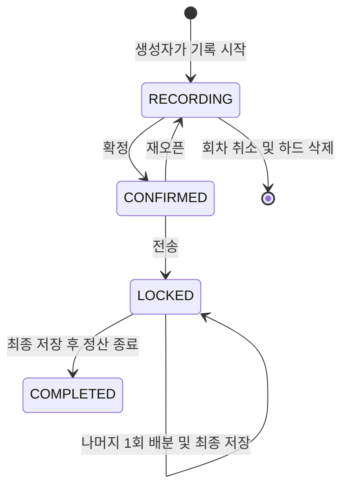

# 모임·정산 요구사항 및 설계 명세

작성 기준: 2026-09-07. [intent.md](intent.md), 이후 대화에서 정한 금액 부호·트랜잭션 정책, 현재 저장소의 실제 구현을 기준으로 한다. **구현을 위한 명세이며 기능 구현 완료를 의미하지 않는다.**

## 1. 적용 기준과 범위

### 1.1 원문과 최신 결정의 차이

`intent.md` 6절의 부호 설명은 최신 대화와 반대다. 구현·API·테스트에는 아래 규칙을 적용한다.

```text
개인 정산 잔액 = 부담액 합계 − 실제 결제액 합계
양수: 보낼 돈 / 음수: 받을 돈 / 0: 순송금 없음
```

금액의 부호는 **조회하는 사람의 관점**이다. 실제 송금 관계는 공통 테이블에 `보내는 사람 → 받는 사람, 양의 금액`으로 한 번 저장한다. 사용자별 물리 테이블이나 A/B 양쪽에 중복된 원장 행을 만들지 않는다. 관련 변경은 DB 트랜잭션으로 함께 성공하거나 함께 취소하며, 응답 유실 후 재시도도 중복 반영하지 않는다.

### 1.2 이번 구현에 포함하는 기능

- 카카오 로그인, 가입 시 계좌 등록·수정, 회원 소프트 삭제, 동일 카카오 계정 재가입.
- 지속되는 모임, 초대 링크 수락, 회차별 참여자 구성, 여러 회차 동시 진행.
- 수동 지출 입력, 결제자 한 명, 전체 또는 선택한 부담자끼리 균등 분배, 선택적 영수증 이미지 저장.
- 생성자의 정산 확정·재오픈·전송 잠금·나머지 1회 추첨·정산 종료·회차 취소.
- 조건부 사용자 제외, 이탈 후 과거 회차 조회, 개인별 지급 안내와 링크 복사.

OCR, 계좌 검증 API, 실제 송금·입금 확인, 외부 메시지 발송, 환불, 복수 결제자, 비율 분배, 환전, 회차 간 이월·상계는 포함하지 않는다. ‘전송’은 앱 안에서 회차를 잠그는 명령이다.

### 1.3 명세에서 채택한 구현 기본값

다음은 별도의 사용자 확정 정책이 아니라 현재 코드에 적용할 구체적인 설계 선택이다.

| 항목 | 기본 설계 |
|---|---|
| 기록 시작 | 생성자가 멤버를 고른 뒤 ‘이 멤버로 기록 시작’을 누르면 회차를 `RECORDING`으로 생성. 준비 화면을 위한 별도 DB 상태는 두지 않음 |
| 추첨 실행자 | 회차를 잠근 모임 생성자. 일반 참여자는 결과 조회만 가능 |
| 정산 종료 시점 | 잠금과 최종 금액 저장이 완료된 회차에서만 가능 |
| 사용자 제외 | 선택한 회차에서 제외하면서 현재 모임 멤버십도 이탈 처리. 다른 회차의 구성은 유지 |
| 탈퇴 차단 관련성 | 제외 여부와 무관하게 참여 이력이 있는 모든 미종료 회차. 수취인으로 남은 제외자도 포함 |
| 모임 통화 수정 | 이번 구현은 모임 기준 통화 수정 기능을 제공하지 않음. 모든 회차는 생성 시 기준 통화를 복사 |
| 영수증 저장 | 기존 PostgreSQL의 `BYTEA`. 파일당 최대 2 MiB, JPEG·PNG·WebP 지원, 여러 파일은 각각 업로드 |
| 초대 | 생성자 발급·폐기, 발급 후 7일 유효한 다회 수락 링크. 원문 토큰은 저장하지 않음 |
| 동시 쓰기 | 초기에는 공통 DB 트랜잭션 잠금 하나로 직렬화. 읽기는 직렬화하지 않음 |

사용자 요구와 구현 기본값을 혼동하지 않는다. 이후 기본값을 바꾸더라도 금액 보존·권한·완료 데이터 불변 조건은 유지한다.

## 2. 현재 코드와 변경 지점

| 현재 파일 | 현재 동작 | 필요한 변경 |
|---|---|---|
| [package.json](package.json) | Next App Router, React, TypeScript, Neon, `node:test`·`tsx` | 기존 의존성 유지. 대화형 DB 트랜잭션용 기본 WebSocket을 위해 실행·배포 Node 기준을 22.18 이상으로 맞춤 |
| [tsconfig.json](tsconfig.json) | `target: ES2017` | BigInt 연산·리터럴 사용에 맞춰 ES2020 이상으로 변경 |
| [scripts/migrate-auth.mjs](scripts/migrate-auth.mjs) | `users`, `refresh_sessions` 생성·확장 | 기존 인증 마이그레이션 유지, 도메인 및 가입 상태 마이그레이션 추가 |
| [src/lib/auth.ts](src/lib/auth.ts) | OIDC state·nonce·PKCE, JWT 검증·발급 | 토큰 암호 검증 재사용, 안전한 로그인 복귀 경로 처리 추가 |
| [src/lib/auth-store.ts](src/lib/auth-store.ts) | 회원 upsert, 세션 회전, 회원 물리 삭제 | 세션 목적·회원 활성 상태 조회, 계좌 등록, 원자적 탈퇴·재가입 처리 |
| [src/app/auth/v1/kakao/route.ts](src/app/auth/v1/kakao/route.ts) | 로그인 후 `/home` 고정 이동 | 가입·재가입 분기, 초대·정산 화면으로 복귀 |
| [src/app/api/auth/withdraw/route.ts](src/app/api/auth/withdraw/route.ts) | 사용자 행 삭제 후 쿠키 제거 | 진행 회차 차단, 소프트 삭제, 모든 세션 폐기, 멤버십 이탈 |
| [src/app/home/authenticated-home.tsx](src/app/home/authenticated-home.tsx) | JWT와 사용자 존재 확인 | 활성 세션·계정·가입 완료 검사 후 안전한 화면 데이터 조회 |
| [src/app/home/refresh-session.tsx](src/app/home/refresh-session.tsx) | 갱신 실패 시 로그인 이동 | 진입 목적지 유지, 인증 장애와 DB 장애 구분 |
| [src/app/home/home-client.tsx](src/app/home/home-client.tsx) | 고정 예시·로컬 계산·파일명 표시 | 실제 목록, 회차 화면 연결, 계좌 관리, 정확한 금액·탈퇴 문구로 교체 |
| [src/lib/split.ts](src/lib/split.ts) | `number`, 앞사람부터 나머지 배분 | 최소 단위 정수의 기본 분배와 잠금 후 추첨 분리 |
| [src/lib/openapi.ts](src/lib/openapi.ts) | 인증 API만 정의 | 신규 계약·상태 오류 추가. OpenAPI 3.0.3과 기존 Swagger 유지 |
| [vercel.json](vercel.json) | 빌드 전에 `npm run db:migrate` | 추가 마이그레이션 실행 경로와 배포 런타임 검증 |

현재 ‘내가 받을 금액’은 1인 부담액이므로 실제 순잔액으로 교체한다. 홈에서 서로 다른 회차의 미입금액을 추정하거나 다른 통화의 금액을 한 숫자로 합치지 않는다.

## 3. 기능 요구사항과 권한

| ID | 요구사항 |
|---|---|
| FR-01 | 가입 완료한 활성 회원만 모임 생성·초대 수락·기록 등 일반 기능을 사용한다. 가입 시 은행·계좌번호·예금주가 필요하다. |
| FR-02 | 모임 생성자는 자동 멤버이며 교체·제외할 수 없다. 초대 링크 열기와 참여 수락은 구분한다. |
| FR-03 | 회차 생성자는 모임 생성자다. 활성 멤버 후보에서 생성자 포함 최소 2명을 선택한다. 미완료 회차 수를 하나로 제한하지 않는다. |
| FR-04 | 회차 참여자와 통화는 생성 시 저장한다. 일반적인 모임 가입·이탈은 다음 회차부터 반영한다. |
| FR-05 | 기록 단계에서 해당 회차의 제외되지 않은 참여자가 지출을 작성한다. 작성자 또는 현재 모임 생성자만 수정·삭제한다. |
| FR-06 | 지출은 양의 정확한 금액, 결제자 한 명, 중복 없는 1명 이상의 부담자와 분배 방식을 가진다. 작성자와 결제자는 별개다. |
| FR-07 | 생성자가 확정한다. 지출 0건이면 ‘지출 내역이 없습니다’와 함께 거부한다. 빈 회차 생성과 마지막 지출 삭제는 허용한다. |
| FR-08 | 미전송·미종료 확정 회차는 생성자가 기록 단계로 재오픈할 수 있다. 전송 확인창만 닫으면 확정 상태를 유지한다. |
| FR-09 | 전송은 원본 잠금이다. 이후 원본 수정·제외·재오픈·취소를 누구에게도 허용하지 않는다. 미완료 나머지 배분만 한 번 수행한다. |
| FR-10 | 생성자가 최종 금액 저장 후 정산 종료를 표시한다. 입금 검증을 의미하지 않으며 종료 데이터는 읽기 전용이다. |
| FR-11 | 생성자가 현재 기록 단계인 회차를 하드 삭제할 수 있다. 이전에 확정했어도 재오픈했다면 취소 가능하다. |
| FR-12 | 사용자 제외는 생성자·결제자 겸 부담자·특정 분배 부담자 제한과 최소 인원을 원자적으로 검사한다. 관련 내역을 하이라이트한다. |
| FR-13 | 최종 안내 링크는 로그인한 본인의 안내를 보여준다. KRW에서 본인이 지급할 수취인의 최신 계좌만 반환한다. USD·JPY는 금액과 상대방만 표시한다. |
| FR-14 | 미종료 참여 회차가 있으면 탈퇴를 차단한다. 탈퇴는 `deletedAt` 설정·세션 폐기·활성 멤버십 이탈이며 과거 자료는 보존한다. |
| FR-15 | 같은 검증된 카카오 식별자로 재가입하면 같은 내부 ID와 과거 조회 권한을 회복한다. 이전 세션·모임 멤버십·관리 권한은 자동 복원하지 않는다. |
| FR-16 | 정산 안내는 금액 안내이며 실제 송금 상태를 관리하지 않는다. 이전 회차의 금액은 그 회차에 남긴다. |

### 3.1 서버 권한 검사

`현재 모임 생성자`는 **활성 계정 + 활성 모임 멤버십 + groups.creator_id 일치**를 모두 만족해야 한다. 클라이언트가 보낸 역할·작성자·계좌 소유자 ID는 권한 근거로 사용하지 않는다.

| 작업 | 추가 조건 |
|---|---|
| 모임 상세·멤버 후보 조회 | 현재 활성 모임 멤버. 과거 참여자에게 모임 전체 자료를 열어 주지 않음 |
| 회차 상세·증빙·본인 정산 조회 | 해당 `round_members` 행 존재. 이탈·회차 제외 후에도 조회 가능 |
| 지출 작성 | `RECORDING`, `round_members.excluded_at IS NULL` |
| 지출 수정·삭제·증빙 변경 | `RECORDING`, 제외되지 않은 원작성자 또는 현재 모임 생성자 |
| 생성·확정·재오픈·제외·취소·잠금·추첨·종료 | 현재 모임 생성자이며 각 상태 조건 충족 |
| 계좌 수정 | 본인 계정만 가능. 완료 회차의 수취 계좌가 최신으로 보이는 것은 원본 변경이 아님 |

다른 회차에서 제외되어 현재 모임을 이탈했더라도, 기존 회차의 제외되지 않은 참여 자격은 유지한다. 그 회차의 기록 권한도 회차 관계로 판정한다. 관리 권한에는 항상 현재 모임 멤버십이 필요하다.

## 4. 회차 상태와 전이

상태는 `RECORDING`, `CONFIRMED`, `LOCKED`, `COMPLETED` 네 개다. `LOCKED`에서 `finalized_at`으로 추첨 대기와 안내 가능을 구분한다. 취소 상태는 저장하지 않고 회차를 삭제한다.



| 명령 | 사전 조건 | 같은 트랜잭션에서 처리할 내용 |
|---|---|---|
| 기록 시작 | 활성 후보 최소 2명, 생성자 포함 | 회차·참여자 이름 스냅샷 생성, 통화 복사, `version=1` |
| 지출 작성·수정·삭제 | `RECORDING`, 작성 권한, 유효한 결제자·부담자 | 지출·분배·증빙 관계 변경, 회차 버전 증가 |
| 확정 | `RECORDING`, 지출 1건 이상, 참여자 최소 2명 | 모든 지출 재검증, 몫·나머지 저장, `CONFIRMED` 전환 |
| 재오픈 | `CONFIRMED`, 잠금·종료 시점 없음 | `RECORDING` 전환, 확정 계산값 제거. 지출 원본·영수증은 유지 |
| 전송 | `CONFIRMED` | `LOCKED`, `locked_at` 저장. 나머지가 없으면 최종 금액·송금 행도 함께 저장 |
| 랜덤 돌리기 | `LOCKED`, `finalized_at IS NULL` | 모든 지출 나머지 배분, 최종 부담액·잔액·송금 행·`finalized_at` 함께 저장 |
| 정산 종료 | `LOCKED`, `finalized_at IS NOT NULL` | `COMPLETED`, `completed_at` 저장 |
| 취소 | `RECORDING`, 잠금·종료 없음 | 회차와 종속 기록·증빙 바이트 하드 삭제 |

확정 후의 금액·참여자 변경은 먼저 재오픈해야 한다. 전송과 재오픈이 경합하면 먼저 성공한 상태를 기준으로 나머지 요청을 거부한다. 날짜는 변경 가능 여부에 영향을 주지 않는다. 이미 완료된 회차는 비정상적인 과거 데이터에 `locked_at`이 없더라도 변경을 거부한다.

최종 결과가 모두 0이어도 사용자가 별도로 종료해야 한다. 나머지 미배분 상태에서 링크 복사·최종 안내·종료를 허용하지 않는다.

## 5. 데이터 모델

### 5.1 공통 규약

- ID는 기존 `users.id`와 같은 `TEXT`에 서버에서 만든 UUID를 저장한다. 시간은 기존 인증 코드와 동일한 UTC epoch seconds `BIGINT`로 저장한다. API는 `deletedAt`처럼 camelCase를 사용한다.
- 금액은 통화 최소 단위의 `NUMERIC` 정수로 저장하고 PostgreSQL 조회 시 문자열로 읽는다. `NUMERIC(p,s)`의 임의 사업상 상한을 설정하지 않는다.
- 금액 컬럼은 정수·유한값 조건을 가진다. `NaN`, `Infinity`, `-Infinity`를 DB에서도 거부한다. 지출·송금은 `> 0`, 부담액·결제액은 `>= 0`, 잔액은 부호를 허용한다.
- 회차 버전은 변경마다 증가하는 정수다. 금액·버전의 JSON 직렬화에서 BigInt를 직접 넘기지 않는다. 금액은 항상 문자열로 전달한다.
- 회원 참조는 물리 삭제를 연쇄시키지 않는다. 회차 취소의 종속 자료에는 `ON DELETE CASCADE`를 사용한다.

### 5.2 테이블과 핵심 컬럼

| 테이블 | 컬럼·제약 |
|---|---|
| `users` 확장 | 기존 ID·`UNIQUE(provider, provider_subject)` 유지. `deleted_at`, `onboarding_completed_at`, `bank_name`, `account_number`, `account_holder`, `bank_updated_at` 추가. 계좌번호는 문자열 |
| `refresh_sessions` 확장 | `purpose TEXT NOT NULL DEFAULT 'app'`, 값은 `app/onboarding`. 기존 만료·폐기·해시 구조 유지 |
| `groups` | `id`, `creator_id → users`, `name`, `base_currency`, `created_at`. 통화 `USD/KRW/JPY` CHECK |
| `group_members` | `(group_id, user_id)` PK, `joined_at`, `left_at`. 활성은 `left_at IS NULL`. 재초대 수락 시 같은 관계 행을 활성화 |
| `group_invites` | `id`, `group_id`, `created_by`, `token_hash UNIQUE`, `created_at`, `expires_at`, `revoked_at`. 만료는 생성 이후 |
| `rounds` | `id`, `group_id`, `name`, `currency`, `status`, `version`, `created_at`, `confirmed_at`, `locked_at`, `finalized_at`, `completed_at` |
| `round_members` | `(round_id, user_id)` PK, `display_name_snapshot`, `joined_at`, `excluded_at`. 제외해도 행 삭제 금지 |
| `expenses` | `id`, `round_id`, `author_id`, `payer_id`, `description`, `amount_minor`, `split_mode`(`ALL/SELECTED`), `base_share_minor` nullable, `remainder_units` nullable, `created_at`, `updated_at`, `updated_by` |
| `expense_shares` | `(expense_id, user_id)` PK, `round_id`, `final_amount_minor` nullable, `received_remainder` nullable. 행 자체가 실제 부담자 목록 |
| `expense_receipts` | `id`, `expense_id`, `uploaded_by`, `mime_type`, `byte_size`, `sha256`, `content BYTEA`, `created_at`. 바이트 크기·지원 MIME CHECK |
| `settlement_balances` | `(round_id, user_id)` PK, `paid_minor`, `burden_minor`, `balance_minor`. `balance_minor = burden_minor - paid_minor` CHECK |
| `settlement_transfers` | `(round_id, sender_id, receiver_id)` PK, `amount_minor > 0`. `sender_id <> receiver_id` CHECK |
| `mutation_requests` | `(actor_id, operation, request_key)` PK, `request_digest`, `resource_id`, `response_metadata JSONB`, `created_at`. 성공한 명령의 최소 결과만 저장 |

`round_members`의 이름은 생성 시 보존하여 탈퇴·닉네임 변경으로 과거 참가자가 사라지지 않게 한다. 은행 계좌를 이 스냅샷이나 송금 행에 복사하지 않는다.

### 5.3 관계 무결성

- `expenses`의 작성자·결제자는 `(round_id, user_id)`로 `round_members`를 참조한다. 작성자는 서버가 로그인 사용자로 결정한다.
- `expenses`에 `UNIQUE(id, round_id)`를 두고, `expense_shares`는 `(expense_id, round_id)`와 `(round_id, user_id)` 복합 FK로 지출과 동일 회차의 참여자를 참조한다.
- 최종 잔액·송금의 사용자도 해당 회차 관계를 참조한다. 제외된 비부담 결제자를 참조하는 것은 허용한다.
- 증빙은 `byte_size = octet_length(content)`와 `0 < byte_size <= 2097152`를 함께 검사한다.
- `finalized_at`은 잠금 뒤에만 설정하며, `COMPLETED`에는 최종 저장·완료 시점이 필요하다. 상태별 시점 조합에 CHECK를 둔다.
- 지출 금액·몫·나머지, 전체 부담액 합계와 송금 합계 같은 여러 행의 조건은 공통 쓰기 함수 안에서 검증한다. FK/CHECK만으로 합계 검증을 대신하지 않는다.
- 회차 삭제는 참여자·지출·분담·증빙·최종 결과를 연쇄 삭제한다. `mutation_requests.resource_id`에는 회차 FK를 두지 않아 취소 응답 유실 후에도 같은 요청 결과를 확인할 수 있게 한다. 여기에 지출 본문·계좌·이미지는 저장하지 않는다.

필요 인덱스는 활성 멤버의 모임 조회 `group_members(user_id) WHERE left_at IS NULL`, 참여 이력 `round_members(user_id, round_id)`, 회차 목록 `rounds(group_id, created_at, id)`, 지출 `expenses(round_id, created_at, id)`, 증빙 `expense_receipts(expense_id)`, 지급 목록 `settlement_transfers(round_id, sender_id)`이다. 기존 PK가 같은 접두사를 제공하면 중복 인덱스를 만들지 않는다.

## 6. 금액 계산과 결과 저장

### 6.1 입력·계산·표시

| 통화 | 입력 예 | 내부 최소 단위 | 거부 예 |
|---|---|---|---|
| KRW | `"6000"` | `6000` | `"0"`, `"-1"`, `"1.5"` |
| JPY | `"6000"` | `6000` | `"0.01"` |
| USD | `"60"`, `"60.0"`, `"60.01"` | `6000`, `6000`, `6001` | `"0.001"` |

API 입력은 쉼표·지수 표기·기호가 없는 십진 문자열이다. KRW·JPY는 소수점 없는 정수, USD는 소수점 이하 최대 2자리만 허용한다. JSON 숫자, 빈 값, NaN/Infinity, 0·음수는 거부한다. UI는 `type="text"`, 적절한 `inputMode`를 사용하여 큰 금액을 `Number()`로 바꾸지 않는다.

소수 부분을 문자열로 보정한 뒤 BigInt 최소 단위로 바꾼다. 분배·합산·비교는 BigInt로 수행하고 DB 파라미터와 JSON에는 문자열을 전달한다. 표시는 정수 부분과 통화 소수 부분을 나누어 구성하고 부동소수점으로 역변환하지 않는다. DB·요청 크기의 물리적 한계에 도달하면 저장을 거부하되 반올림·잘라내기로 다른 금액을 저장하지 않는다.

### 6.2 부담자와 기본 분배

`ALL` 저장 시 서버가 해당 회차의 제외되지 않은 전원을 부담자로 결정한다. 클라이언트의 임의 ALL 목록은 신뢰하지 않는다. `SELECTED`는 유효한 회차 참여자 중 중복 없는 1명 이상을 선택한다. 신규·변경 입력에 제외된 사람을 결제자나 부담자로 추가할 수 없다. 다만 이미 제외된 비부담 결제자를 그대로 유지하는 기존 지출의 수정은 허용한다.

신규 회차 후보에는 탈퇴 계정을 넣지 않는다. 이미 저장된 회차를 확정할 때는 보존된 참여·결제·부담 관계를 기준으로 검증하며, 기존 참여자의 탈퇴 상태만으로 원본 관계를 없애거나 확정을 막지 않는다. 이는 탈퇴 계정의 기록 작성·일반 앱 접근을 허용한다는 뜻은 아니다.

지출 금액을 `T`, 부담자 수를 `N`이라 하면 기본 부담액 `q = T / N`, 나머지 `r = T % N`이다. 기록 중에는 화면용으로 계산하고, 확정 시 서버가 다시 계산해 저장한다. `T < N`이면 기본 부담액이 0인 사람이 생길 수 있으며 유효하다.

결제자도 부담자이면 자신의 부담액을 그대로 적용한다. 결제자가 부담자가 아니면 부담액은 0이고 결제액만 반영한다. 결제자를 부담자에서 자동 제거하거나 강제로 포함하지 않는다.

### 6.3 잠금 후 한 번의 추첨

1. 생성자의 전송을 커밋한 뒤 안내 화면에 진입한다. 나머지가 있는 회차는 ‘랜덤 돌리기’를 제공하고 개인별 최종 송금액·복사 링크를 아직 제공하지 않는다.
2. 추첨 명령의 트랜잭션 안에서 상태와 기존 `finalized_at`을 확인한다. 이미 완료했다면 기존 결과를 반환한다.
3. 지출마다 부담자 중 서로 다른 `r`명을 균등하게 선택한다. Node `crypto.randomInt`와 부분 Fisher–Yates 방식으로 뽑고 각 사람에게 최소 단위 1을 더한다. 클라이언트의 추첨 결과를 받지 않는다.
4. 모든 지출의 최종 부담액, 추가 부담자, 개인별 잔액, 송금 행을 함께 저장하고 `finalized_at`을 설정한다. 한 지출이라도 실패하면 전체 롤백한다.
5. 추첨은 한 회차의 모든 나머지를 한 번에 처리한다. 다른 지출에서 같은 사람이 다시 뽑히는 것은 허용한다. 커밋된 추첨의 재실행은 금지한다.

추첨이 커밋되지 않았다면 다시 시도할 수 있다. 사용자에게 보여 준 최종 결과는 반드시 커밋된 결과여야 한다. 나머지가 없으면 전송 트랜잭션에서 추가 추첨 없이 결과를 완성한다.

### 6.4 최종 잔액과 송금 목록

지출별 결제액과 확정 부담액을 **동일 회차 안에서** 합산한다. 양수 잔액 사용자는 지급자, 음수 잔액 사용자는 수취인이다. 서로 다른 결제자의 지출을 순잔액으로 합산하므로 여러 지출이 있으면 각 원본 지출의 결제자에게 따로 보내는 목록과는 달라질 수 있다.

지급자·수취인을 각각 내부 사용자 ID 순으로 정렬하고 두 목록을 순회한다. 현재 지급 잔액과 수취 필요액 중 작은 금액으로 송금 행을 만들고 소진된 쪽으로 이동한다. 결과는 결정적이며 0원·자기 송금이 없다. 송금 횟수의 절대 최소값은 보장하지 않는다.

예를 들어 B·C·D가 A에게 각각 5,000원을 보내야 한다면 저장은 다음 세 행이다.

| round_id | sender_id | receiver_id | amount_minor |
|---|---|---|---:|
| R1 | B | A | `5000` |
| R1 | C | A | `5000` |
| R1 | D | A | `5000` |

A 화면에서는 B·C·D 각각 `-5000`, 총잔액 `-15000`으로 해석한다. B 화면에서는 A에게 `+5000`이다. B↔C·D의 0원 관계는 저장하지 않는다. 내부 부호와 별개로 화면은 ‘받을 금액 15,000원’, ‘보낼 금액 5,000원’처럼 읽기 쉽게 표시한다.

반드시 검증할 불변식:

- 추첨 전: 지출별 `q × N + r = T`, `0 <= r < N`.
- 추첨 후: 지출별 최종 부담액 합계 = 지출 금액, 개인의 추가 부담은 0 또는 최소 단위 1.
- 전체 개인 잔액 합계 = 0, 전체 지급액 = 전체 수취액.
- 각 사용자의 `송금 행의 지급 합계 − 수취 합계 = balance_minor`.
- 송금액은 양수이며 본인 송금·회차 간 송금이 없다. 결과가 모두 0이면 송금 행이 없어도 정상이다.

## 7. 트랜잭션·동시성·재시도

### 7.1 실제 DB 트랜잭션 경계

현재 `neon()` HTTP 쿼리와 `sql.transaction([...])`는 고정된 쿼리 묶음에 사용한다. 조회 결과를 TypeScript로 계산하고 그 결과를 저장하는 정산 명령은 설치된 `@neondatabase/serverless`의 `Client`를 사용한다.

```text
요청 입력·파일 검증
→ Client.connect
→ BEGIN
→ 공통 pg_advisory_xact_lock 획득
→ 현재 세션·회원 상태 확인
→ 같은 요청의 기존 성공 결과 확인
→ 리소스 권한·회차 상태·version 재검증
→ 필요한 행 조회와 계산
→ 관련 데이터 전체 변경 + version 증가 + 성공 요청 기록
→ COMMIT
→ 성공 응답
실패: ROLLBACK 시도 → 재시도 가능한 오류 응답
항상: 같은 요청 안에서 Client.end
```

`BEGIN`을 한 HTTP 호출에서 실행하고 다른 연결에서 변경하는 구현은 금지한다. 트랜잭션 안의 저장 함수가 내부적으로 별도의 `getSql()` 연결을 열어서도 안 된다. 같은 Client를 전달받아 사용한다. 서버리스 요청 사이에 연결을 재사용하지 않는다.

### 7.2 초기 잠금 전략

모임·멤버십·회차·지출·증빙·계좌·가입·탈퇴와 로그인 세션 발급·회전·폐기 등 **모든 런타임 쓰기**는 같은 DB advisory transaction lock 키를 사용한다. 로그인 외부 API 호출과 업로드 파싱은 잠금 전에 끝내고, 잠금 후 활성 계정·세션·참여 조건을 다시 검사한다.

이 규약으로 탈퇴 확인 직후 새 회차가 생성되거나, 정산 확정과 지출 수정이 동시에 성공하는 경쟁을 막는다. 프로세스 내 mutex로 대체하지 않는다. 대기·쿼리에 제한 시간을 두어 장애 시 요청이 무한 대기하지 않게 한다.

`ponytail: 초기 쓰기를 DB 잠금 하나로 직렬화한다. 쓰기 대기 시간이 문제가 되면 사용자 → 모임 → 회차 순서의 세분화한 잠금으로 변경하되, 탈퇴·가입·회차 생성의 경쟁 테스트를 유지한다.`

회차 변경 요청에는 `expectedVersion`을 요구한다. 서버 버전과 다르면 `409 stale_round`와 현재 버전을 반환한다. 같은 사용자가 두 화면에서 수정하거나 다른 참여자가 먼저 수정한 경우 최신 자료를 다시 읽고 의도한 변경을 재제출한다. 임의로 최신 버전을 붙여 자동 덮어쓰지 않는다.

회차 상태·버전·지출·분배를 여러 SELECT로 읽는 조회는 단일 SQL 또는 읽기 전용 `REPEATABLE READ` 트랜잭션으로 같은 스냅샷을 사용한다. 여러 번의 조회 사이에 쓰기가 커밋되어 서로 다른 버전이 섞이지 않게 한다. 읽기에는 공통 쓰기 잠금을 걸지 않는다. 최신 계좌는 화면 재조회마다 새로운 스냅샷에서 읽는다.

### 7.3 멱등성

- 도메인 생성·수정·삭제·확정·재오픈·제외·전송·추첨·종료 요청은 `Idempotency-Key` UUID를 가진다. 사용자의 한 번의 제출에 한 키를 만들고 네트워크 재시도·세션 갱신 후 재시도에는 같은 키를 쓴다.
- 키는 인증한 사용자·명령으로 범위를 나눈다. `request_digest`는 대상·정규화한 본문·`expectedVersion`·해당되는 파일 해시로 만든다.
- 같은 키·같은 내용의 성공 기록이 있으면 상태·버전을 다시 바꾸지 않고 기존 명령 결과를 반환한다. 같은 키에 다른 내용이면 `409 idempotency_conflict`다.
- 성공 기록은 데이터 변경과 같은 커밋에 포함한다. 실패한 거래가 성공 기록을 남기면 안 된다. 성공 기록 조회는 재시도의 버전 충돌 검사보다 먼저 수행한다.
- 응답 메타데이터에는 ID·결과 상태·버전만 둔다. 최신 계좌는 매번 별도 조회하며 재시도 캐시에 저장하지 않는다.
- 커밋 응답을 받지 못했으면 실패가 확정됐다고 단정하지 않는다. 같은 키로 재요청하여 DB에 성공 기록이 있는지 확인한다.
- 이미 최종 저장된 회차의 추첨을 다른 키로 요청해도 다시 뽑지 않고 기존 결과를 안내한다. 이 경우 현재 생성자 권한 검사 후 `finalized_at`을 `expectedVersion`보다 먼저 확인한다. 취소의 같은 키 재시도는 회차가 없어도 기존 취소 성공 결과를 반환한다.
- 초기에는 성공 키를 임의로 만료시키지 않는다. 보존을 줄일 때도 오래된 요청이 새 지출로 중복 생성되지 않게 별도 기준이 필요하다.

초대 발급은 원문 토큰을 보관하지 않으므로 비밀 링크의 재전달을 별도로 다룬다. 최초 응답에서만 링크를 반환하고, 같은 키 재시도에는 기존 `inviteId`와 `linkUnavailable: true`를 반환한다. 화면의 ‘링크 다시 발급’은 새 요청 키와 `replaceInviteId`를 보내 기존 초대 폐기·새 초대 생성을 원자적으로 수행한다. 응답을 받은 뒤 단순 복사에 실패한 경우에는 화면에 남은 같은 링크를 다시 복사한다.

은행 송금은 이 트랜잭션의 일부가 아니다. DB 롤백·재시도는 앱의 기록에만 적용한다.

## 8. 사용자 제외·이탈·과거 조회

확정 화면에서 제외를 시도하면 서버는 먼저 관련 지출을 검사하여 차단 사유를 반환할 수 있다. 이 검사는 데이터를 변경하지 않는다. 실제 제외 명령은 생성자가 재오픈한 **기록 단계**에서만 성공한다.

1. 생성자 권한, 대상자의 참여 이력·제외 여부, 회차 상태를 검사한다.
2. 생성자 본인은 제외할 수 없다.
3. 대상자가 한 지출에서 결제자이면서 부담자이기도 하면 제외를 차단한다. 결제와 부담 관계를 유지한다.
4. 대상자가 `SELECTED` 부담자이면 제외를 차단한다. 모든 관련 지출 ID·설명·금액·작성자·차단 이유를 반환한다.
5. 화면은 ‘해당 사용자와 연관된 정산이 있습니다.’와 함께 관련 내역을 모두 하이라이트하고 ‘제외 전 수정 필요’를 붙인다. 색상 외 텍스트로도 구분한다.
6. 작성자 또는 생성자가 사실에 맞게 관련 기록을 수정한 후 다시 제외한다. 서버가 선택 분배의 부담자를 자동 제거하지 않는다.
7. 제외 후 활성 회차 참여자가 2명 미만이면 거부한다. 허용되면 대상자의 `excluded_at`, 현재 모임 관계의 `left_at`을 설정하고 해당 회차의 `ALL` 분배에서만 제거한다.
8. 대상자가 부담자에 포함되지 않은 결제자라면 원본 결제액과 최종 수취 관계를 남긴다. 참여 이력·작성자 관계·증빙을 삭제하지 않는다.
9. 남은 부담자로 재계산하고 재확정을 요구한다. 검증 실패 시 멤버십·일부 지출만 바뀐 상태를 남기지 않는다.

모임 이탈은 이 제외 흐름과 회원탈퇴에서 처리한다. 별도 자진 이탈 버튼은 이번 범위에 추가하지 않는다. 이탈 효과는 다른 기존 회차로 전파하지 않는다. 신규 후보는 활성 계정·가입 완료·활성 모임 멤버십을 모두 만족하는 사용자로 조회한다.

회차 이력 조회는 `round_members`를 근거로 한다. 과거 참여자는 자신의 회차의 지출·증빙·참여 내역과 본인 정산을 볼 수 있으며, 이를 통해 다른 회차나 모임의 현재 멤버 목록을 조회할 수는 없다.

## 9. 인증·계좌·탈퇴·재가입

### 9.1 기존 인증 확장

OIDC와 JWT를 새 라이브러리로 교체하지 않는다. `readAccessToken`의 서명·만료 검증 후 공통 서버 인증 조회가 `sessionId`에 해당하는 `refresh_sessions`의 소유자·미폐기·미만료를 확인한다. 일반 기능은 추가로 `purpose='app'`, `users.deleted_at IS NULL`, 가입 완료를 요구한다.

JWT만 유효한 탈퇴·로그아웃 세션을 승인하지 않는다. 재가입으로 `deleted_at`이 해제되더라도 예전 세션은 계속 폐기 상태다. 변경 명령은 트랜잭션 안에서도 이 조건을 확인한다. 현재 세션 회전 CTE는 같은 쓰기 경계 안에서 사용하며 활성 회원 조건을 추가한다.

### 9.2 가입·재가입

카카오 콜백은 검증된 OIDC `sub`와 기존 `UNIQUE(provider, provider_subject)`로 회원을 찾는다. 새로운 프로필 정보를 저장해도 기존 회원 ID를 바꾸지 않으며, 로그인만으로 `deleted_at`을 해제하지 않는다.

신규·가입 미완료·탈퇴 회원에게는 `onboarding` 목적의 10분 세션을 발급하고 `/onboarding`으로 이동한다. 기존 app 쿠키를 제한 세션 쿠키로 교체·제거한다. 이 세션은 가입 화면과 필요한 본인 가입 상태 조회·제출·로그아웃만 가능하다. 일반 앱 세션으로 자동 갱신하지 않으며 만료되면 카카오 인증을 다시 한다. `/api/auth/refresh`는 `purpose='app'`이며 활성 회원·가입 완료 조건을 만족하는 세션만 회전한다. 가입 화면에서 계좌를 입력·확인하고 재가입이면 재가입 완료를 명시적으로 제출한다.

가입 완료 트랜잭션은 제한 세션 검증 → 은행·계좌번호·예금주 저장 → `deleted_at` 해제·가입 완료 기록 → 기존 세션 모두 폐기 → 새 app 세션 생성을 처리한다. DB 커밋 후 새 쿠키를 발급한다. 쿠키 전달이 실패해도 다음 카카오 인증으로 같은 활성 회원에게 새 세션을 발급할 수 있어야 한다.

멤버십은 가입 완료 시 복구하지 않는다. 과거 조회는 같은 ID로 가능하고 모임 재참여는 생성자가 제공한 유효한 초대로 새로 수락해야 한다. 생성자도 동일하게 적용한다. 관리 권한 이전·생성자 부재 시 자동 복구 기능은 없다.

이 정책 조합의 결과로, 생성자가 탈퇴한 모임은 과거 조회만 유지되고 새 초대·새 회차를 만들 관리자가 없어진다. 원생성자도 재가입만으로 그 모임의 관리 권한을 되찾지 않는다. 현재 범위에 해당 모임의 관리 복구 경로는 없으며 새 모임을 만들 수 있다. 이 제한을 탈퇴 안내에 표시한다.

계좌는 본인 한 개를 현재값으로 관리한다. 문자열 길이·공백·허용 형식은 검사하되 실제 계좌·본인 소유라고 표시하지 않는다. 계좌번호의 선행 0을 보존한다. USD·JPY 모임 사용자도 가입 시 계좌 등록 요건은 동일하다.

### 9.3 탈퇴

같은 쓰기 트랜잭션에서 해당 사용자의 `round_members`와 미종료 회차를 조회한다. 하나라도 있으면 `409 unfinished_rounds` 및 관련 모임·회차 목록을 반환하고 아무것도 변경하지 않는다. 제외된 참여자도 회차가 종료될 때까지 관련성이 남는다.

탈퇴 가능하면 `deleted_at` 설정, 모든 세션 폐기, 모든 활성 모임 멤버십 이탈을 함께 처리한다. 사용자 식별자·계좌·과거 참가자 이름·작성·결제·부담·정산 관계는 유지한다. 수취인의 탈퇴를 이유로 과거 정산 조회에서 그 사람을 JOIN으로 누락시키지 않는다. 탈퇴된 사용자에게 일반 앱 접근이나 신규 회차 참여는 허용하지 않는다.

### 9.4 로그인 복귀 경로

초대·정산 링크 → `/login?returnTo=...` → 카카오 시작·콜백 → 필요하면 가입 → 원래 경로의 흐름을 유지한다. 로그인 실패·세션 갱신 실패 후에도 안전한 목적지를 유지한다.

`returnTo`는 같은 서비스의 허용된 `/home/...`, `/invites/...`, `/settlements/...` 경로만 받는다. 절대 URL·`//`·역슬래시·인코딩 우회·인증 루프 경로를 거부하고 `/home`으로 대체한다. OIDC state와 연결된 서명한 HttpOnly 단기 쿠키에 저장하고 가입 완료까지 유지한 뒤 지운다. 콜백의 OIDC 쿠키 정리로 목적지를 먼저 삭제하지 않는다.

초대 토큰은 암호학적 난수로 만들고 SHA-256 해시만 DB에 보관한다. 수락 시 만료·폐기·모임 생성자의 활성 관리 자격을 검사한다. 활성 멤버의 중복 수락은 같은 결과다. 이탈자는 유효한 초대에서 다시 명시적으로 수락해야 하며, 회원탈퇴·재가입이나 과거 링크 조회만으로 멤버십을 자동 복원하지 않는다.

## 10. 화면·API 계약

### 10.1 화면

| 경로 | 표시·동작 |
|---|---|
| `/home` | 본인의 실제 진행 회차와 본인 금액 상태. 추첨 전에는 미확정 표시 |
| `/home/groups` | 활성 모임 목록·모임 생성 |
| `/home/groups/[groupId]` | 현재 멤버·초대 링크 관리·회차 목록·생성자의 기록 시작 |
| `/home/rounds/[roundId]` | 기록 목록·작성·증빙, 권한별 수정·삭제·제외, 확정·재오픈·취소·전송 |
| `/home/history` | 참여 이력으로 조회한 회차 목록. 현재 멤버십 없는 과거 회차도 포함 |
| `/home/all` 및 계정 대화상자 | 기존 내비게이션·계좌 수정·로그아웃·탈퇴 유지 |
| `/onboarding` | 은행·계좌번호·예금주 등록, 재가입 안내 |
| `/invites/[token]` | 인증 후 모임 정보·명시적 참여 수락. 열기만 해서는 가입하지 않음 |
| `/settlements/[roundId]` | 로그인한 본인의 안내. 잠금 후 추첨 대기 또는 최종 금액·필요한 최신 계좌·링크 복사 |

전송 버튼 앞에는 ‘이대로 사용자들에게 메시지를 전송할까요?’를 표시하고, ‘전송하면 기록이 잠기며 다음 화면에서 링크를 복사해 직접 공유합니다’를 함께 안내한다. 실제 메시지 발송 성공이라고 표시하지 않는다.

버튼 비활성화만으로 권한을 구현하지 않는다. 서버 거부 메시지를 표시하고 중복 클릭을 억제한다. 입력 저장 실패 시 입력과 요청 키를 유지하고 재시도한다. 상태 충돌 시 현재 자료를 갱신하고 변경 내용을 자동 덮어쓰지 않는다.

### 10.2 공통 API 규약

- 기존 `/api/.../route.ts`, Node runtime, HttpOnly 쿠키 인증을 유지한다. 동적 `params`, `cookies()`, `searchParams`는 현재 Next의 비동기 방식으로 사용한다.
- 변경 요청은 같은 origin 검사를 수행한다. OAuth callback은 기존 state·nonce·PKCE 검증을 사용한다.
- 일반 JSON 성공은 `{ data: ... }`, 오류는 `{ error: "code", message: "...", details?: ... }`이다. 기존 인증 API의 `{ ok: true }`는 유지할 수 있다.
- 금액 필드는 통화와 단위가 명확한 문자열이다. 지출 입력은 `amount`, 응답 최소 단위는 `amountMinor`, `balanceMinor`처럼 구분한다.
- 변경 API는 도메인 데이터 전체 대신 리소스 ID·상태·버전의 작은 결과를 반환하고 화면은 최신 GET을 수행한다. 개인 계좌를 변경 응답에 함께 넣지 않는다.
- 목록은 `limit` 기본 20·최대 100과 안정된 `(created_at, id)` 커서를 사용한다. 정산 계산은 화면 페이지가 아닌 해당 회차 전체 지출을 대상으로 한다.

### 10.3 엔드포인트

| 메서드·경로 | 요청·결과 요약 |
|---|---|
| `GET /api/me` | 세션 목적에 맞는 본인 프로필·가입 상태. 일반 회원은 본인 계좌 조회 가능 |
| `POST /api/me/onboarding` | 제한 세션으로 은행·계좌번호·예금주, 재가입 확인 제출. 새 app 쿠키 발급 |
| `PUT /api/me/bank-account` | 본인의 현재 계좌 갱신 |
| `POST /api/auth/withdraw` | 기존 경로 유지. 미종료 회차 409 또는 소프트 삭제 |
| `GET /api/groups` / `POST /api/groups` | 활성 모임 목록 / `{ name, currency }`로 모임·생성자 멤버십 생성 |
| `GET /api/groups/[groupId]` | 권한 있는 현재 멤버용 모임·멤버 후보 |
| `GET /api/groups/[groupId]/rounds` | 본인 조회 권한이 있는 모임 회차 목록 |
| `POST /api/groups/[groupId]/invites` | 생성자에게 초대 원문 링크를 한 번 반환. 재발급 시 `{ replaceInviteId }`의 기존 초대 폐기와 새 발급을 함께 처리 |
| `DELETE /api/groups/[groupId]/invites/[inviteId]` | 생성자가 초대 폐기 |
| `GET /api/invites/[token]` / `POST /api/invites/[token]/accept` | 인증 후 안전한 모임 미리보기 / 명시적 참여 수락 |
| `POST /api/groups/[groupId]/rounds` | `{ name, participantIds }`. 생성자 포함 최소 2명, 서버에서 통화 복사 |
| `GET /api/rounds` | 본인 참여 회차 목록. 상태 필터로 진행·과거 화면 구성 |
| `GET /api/rounds/[roundId]` | 회차·참여자·지출·기본 분배·상태·version. 타인 계좌 없음 |
| `POST /api/rounds/[roundId]/expenses` | `{ description, amount, payerId, splitMode, participantIds?, expectedVersion }` |
| `PATCH /api/rounds/[roundId]/expenses/[expenseId]` | 편집 가능한 지출 필드와 expectedVersion. 작성자·회차·통화 변경 필드는 없음 |
| `DELETE /api/rounds/[roundId]/expenses/[expenseId]` | expectedVersion. 지출·부담자·증빙 삭제 |
| `POST /api/rounds/[roundId]/expenses/[expenseId]/receipts` | multipart 파일 1개와 expectedVersion |
| `GET /api/receipts/[receiptId]` | 참여 이력 검증 후 이미지 바이트 |
| `DELETE /api/rounds/[roundId]/expenses/[expenseId]/receipts/[receiptId]` | 기록 수정 권한과 expectedVersion 검사 |
| `GET /api/rounds/[roundId]/members/[userId]/exclusion-check` | 생성자에게 차단 사유·관련 내역 반환. 실제 제외 시 다시 검증 |
| `POST /api/rounds/[roundId]/members/[userId]/exclude` | 기록 단계의 실제 제외·멤버십 이탈·ALL 재분배 |
| `POST /api/rounds/[roundId]/confirm` | 지출 존재·입력 검증 후 확정 |
| `POST /api/rounds/[roundId]/reopen` | 미전송 확정 회차 재오픈 |
| `POST /api/rounds/[roundId]/send` | 잠금. 나머지가 없으면 결과도 저장 |
| `POST /api/rounds/[roundId]/draw` | 생성자의 회차 전체 나머지 1회 배분 |
| `POST /api/rounds/[roundId]/complete` | 생성자의 업무상 정산 종료 |
| `DELETE /api/rounds/[roundId]` | 기록 단계 회차 하드 삭제 |
| `GET /api/rounds/[roundId]/settlement` | 본인 지급·수취 금액과 상태. 최종 저장 전에는 대기 응답만 제공 |

모든 회차 변경·명령은 별도 표시가 없어도 `expectedVersion`과 `Idempotency-Key`를 요구한다. 계좌 변경·모임 생성·초대 생성/수락도 멱등 키를 사용한다. 인증 프로토콜은 기존 세션 회전 방식과 가입용 세션 검증으로 처리하며 원문 토큰을 명령 결과 테이블에 저장하지 않는다.

### 10.4 개인 안내 응답

최종 송금 행에서 `sender_id = 로그인 사용자`인 수취인만 최신 계좌를 조회한다. 수취 내역에는 지급자 이름·금액만 있으며 지급자 계좌는 필요하지 않다. 생성자도 같은 공개 범위를 적용한다.

```json
{
  "data": {
    "roundId": "R1",
    "status": "LOCKED",
    "finalized": true,
    "currency": "KRW",
    "balanceMinor": "5000",
    "outgoing": [{
      "receiverId": "A",
      "displayName": "참여자 A",
      "amountMinor": "5000",
      "account": {
        "bankName": "등록 은행",
        "accountNumber": "00123456789",
        "accountHolder": "등록 예금주"
      }
    }],
    "incoming": [],
    "sharePath": "/settlements/R1"
  }
}
```

USD·JPY 응답은 `account` 필드를 포함하지 않는다. 계좌 일부가 없거나 조회에 실패해도 저장된 금액을 바꾸지 않는다. 이미 읽은 금액은 유지하고 계좌 영역에 재조회 오류를 표시하며 성공한 계좌라고 안내하지 않는다.

공유 URL은 회차 ID만 포함한다. 복사 버튼은 앱 URL과 `sharePath`를 조합한 링크만 복사한다. 링크의 사용자 ID·쿼리·공유자가 개인 안내의 주체를 바꾸지 못한다. 회차 ID를 알아도 비참여자는 조회할 수 없다.

### 10.5 오류 계약

| 상태 | 코드 예 | 화면 처리 |
|---|---|---|
| 400 | `invalid_amount`, `invalid_participants`, `unsupported_currency` | 해당 입력과 이유 표시 |
| 401 | `unauthorized` | 세션 갱신 또는 안전한 목적지를 보존해 로그인 |
| 403 | `forbidden`, `onboarding_required` | 권한 부족 또는 가입 등록 안내 |
| 404 | `not_found` | 존재하지 않거나 조회 권한 없는 회차·증빙·초대. 존재 여부를 구분해 노출하지 않음 |
| 409 | `stale_round`, `invalid_round_state`, `idempotency_conflict` | 최신 상태 확인. 자동 덮어쓰기 금지 |
| 409 | `empty_expenses` | ‘지출 내역이 없습니다’ |
| 409 | `member_exclusion_blocked`, `minimum_participants` | 관련 지출 하이라이트 또는 최소 2명 안내 |
| 409 | `unfinished_rounds` | 탈퇴를 막는 회차 목록 표시 |
| 413 / 415 | `receipt_too_large` / `unsupported_receipt_type` | 파일 교체 안내, 지출 원본 유지 |
| 503 | `storage_unavailable`, `transaction_retry` | 같은 요청 키로 재시도. 저장 여부가 불확실하면 먼저 기존 성공 결과 확인 |

## 11. 영수증·개인정보·화면 데이터

증빙은 지출 저장 후 별도 업로드한다. 업로드 실패가 정상 저장된 지출을 지우지 않는다. 파일 선택만으로 업로드 완료라고 표시하지 않으며, 서버에 저장한 증빙 ID가 있어야 완료다.

JPEG·PNG·WebP만 받고 파일명·클라이언트 MIME 외 실제 바이트의 포맷도 검사한다. SVG·HTML·임의 실행 파일을 받지 않는다. 최대 2 MiB는 이미지 업로드 기술 제한이며 금액 상한과 무관하다. 서버는 요청 바디를 제한하여 무제한 메모리 버퍼링을 피한다.

증빙은 `public/`, 로컬 임시 파일, 브라우저 상태를 영구 저장소로 사용하지 않는다. `BYTEA`와 지출 FK를 같은 DB에 저장하므로 지출 삭제·회차 취소 시 증빙 바이트도 원자적으로 삭제된다. 여러 지출이 같은 파일 행을 공유하는 기능은 두지 않는다. 목록 쿼리에는 바이트 본문을 포함하지 않는다.

`ponytail: 초기에는 작은 증빙을 기존 PostgreSQL에 저장한다. 이미지 저장량·전송 비용·DB 읽기 지연이 문제가 되면 비공개 객체 저장소로 옮기고 업로드 완료·파일 정리 재시도를 설계한다.`

계좌·정산·증빙 API는 `Cache-Control: private, no-store`를 사용한다. 이미지에는 검증된 Content-Type과 `X-Content-Type-Options: nosniff`를 지정한다. 계좌 조회에 공유 서버 캐시를 쓰지 않으며, 안내 화면 진입·새로고침 시 서버에서 현재값을 읽는다. 클라이언트 라우터의 사전 로드된 화면만으로 최신 계좌를 확정하지 않는다.

Server Component도 같은 인증·권한 함수를 거쳐 최소 데이터만 전달한다. 타인 계좌를 전체 객체로 조회한 뒤 클라이언트 CSS로 숨기지 않는다. 링크 URL·로그·분석 이벤트·공유 미리보기·오류 본문에 계좌번호·인증 토큰·영수증 내용을 넣지 않는다. 계좌 없는 참여 내역과 필요한 수취 계좌 응답을 분리한다.

## 12. 구현 구조와 이행 순서

### 12.1 파일 배치

현재 `src/lib`와 App Router 구조를 확장한다. 별도 백엔드 서비스·ORM·범용 저장소 인터페이스·상태관리 라이브러리는 추가하지 않는다.

| 파일·위치 | 책임 |
|---|---|
| `src/lib/db.ts` 신규 | 기존 Neon 연결 설정 재사용, 같은 Client의 트랜잭션·공통 쓰기 잠금·정리 |
| `src/lib/auth-store.ts` 변경 | 계정·계좌·세션 조회와 가입·탈퇴. 변경 함수는 같은 트랜잭션 Client 사용 |
| `src/lib/authorization.ts` 신규 | 서버 세션·활성 회원·모임·회차·작성 권한의 공통 검사 |
| `src/lib/group-store.ts` 신규 | 모임·초대·멤버십·회차 생성·조회 |
| `src/lib/round-store.ts` 신규 | 지출·증빙·제외·회차 명령·최종 안내 조회·멱등성 적용 |
| `src/lib/money.ts` 신규 | 통화별 문자열 파싱·최소 단위 변환·표시 |
| `src/lib/split.ts` 변경 | 몫·나머지, 최종 부담액과 잔액·송금 계산의 순수 함수 |
| `src/app/api/.../route.ts` | 요청 파싱·origin 확인·공통 저장 함수 호출·오류 HTTP 매핑 |
| `src/app/home/...`, `src/app/invites/...`, `src/app/settlements/...`, `src/app/onboarding/...` | 위 화면 계약에 필요한 페이지와 입력·복사용 Client Component |
| `src/lib/*.test.ts` | 기존 node:test 실행 경로를 이용한 계산·권한·명령 검증 |

서버 페이지의 읽기는 공통 조회 함수를 직접 호출한다. 브라우저의 변경·재조회는 Route Handler를 사용한다. 두 경로가 같은 서버 권한·데이터 함수를 사용하게 하며 별도의 중복 계산을 만들지 않는다.

구현 시 [로컬 Route Handler 가이드](node_modules/next/dist/docs/01-app/01-getting-started/15-route-handlers.md), [서버·클라이언트 컴포넌트 가이드](node_modules/next/dist/docs/01-app/01-getting-started/05-server-and-client-components.md), [데이터 보안 가이드](node_modules/next/dist/docs/01-app/02-guides/data-security.md), [Neon 설치 문서](node_modules/@neondatabase/serverless/README.md)를 기준으로 확인한다.

### 12.2 마이그레이션·배포

1. `scripts/migrate-auth.mjs`의 기존 스키마를 유지하고 버전별 추가 마이그레이션을 `npm run db:migrate`에 연결한다. 인증 확장 컬럼과 도메인 스키마를 구분하여 이행한다. 기존 사용자 ID·카카오 식별자 고유키는 변경하지 않는다.
2. 마이그레이션 이력 테이블과 버전 키로 데이터 이행을 한 번만 수행한다. 이미 실행된 배포에서 세션 폐기가 반복되지 않아야 한다. 동시 빌드 실행도 DB migration 잠금으로 보호한다.
3. 기존 회원에게 계좌가 없으므로 `onboarding_completed_at`을 임의로 채우지 않는다. 이행 시 기존 세션을 한 번 폐기하고 다음 로그인에서 계좌 등록을 요구한다. 배포 영향은 **기존 회원 1회 재로그인·계좌 등록**이다.
4. 실행 순서는 **인증 확장 컬럼 추가 → soft-delete·활성 세션 검사·가입 호환 코드 배포 및 세션 이행 → 도메인 스키마·기능 배포**다. 새 컬럼을 읽는 코드를 컬럼보다 먼저 배포하지 않는다. 구버전의 물리 삭제·가입 미완료 승인 경로가 도메인 자료와 동시에 동작하지 않도록 한다. 스키마 롤백으로 과거 자료를 삭제하지 않는다.
5. 로컬·CI·Vercel의 Node 실행 기준을 일치시키고 네이티브 WebSocket 사용을 확인한다. Node 20을 그대로 지원하는 것처럼 `engines`를 남기지 않는다. 이번 안은 Node 상향으로 추가 WebSocket 패키지를 피한다.
6. 개발·프리뷰·운영 DB를 분리하고 배포 플랫폼 요청 크기·실행 시간 안에서 증빙 업로드와 Neon 트랜잭션을 검증한다. 운영 데이터로 경합·삭제 테스트를 하지 않는다.
7. 문서·OpenAPI·README의 ‘물리 탈퇴’, 고정 원화 계산기, OCR 동작처럼 읽히는 문구를 실제 구현에 맞게 고친다.

### 12.3 구현 순서와 각 완료 조건

| 단계 | 작업 | 완료 조건 |
|---|---|---|
| 1 | DB 공통 쓰기 경계, 가입 상태·계좌·soft-delete·세션, 마이그레이션 | 활성/탈퇴/재가입 및 세션 폐기 검증 통과 |
| 2 | 모임·초대·회차·과거 조회, 로그인 목적지 | 명시적 수락, 최소 인원, 여러 회차, 이탈 후 조회 검증 통과 |
| 3 | 정확한 금액·지출·분배·증빙·작성 권한·제외 | 원본 저장과 실패 시 보존, 관련 지출 하이라이트 검증 통과 |
| 4 | 확정·재오픈·잠금·추첨·잔액·송금·취소·종료 | 아래 계산 및 실제 DB 원자성·경합 검증 통과 |
| 5 | 사용자별 안내·최신 계좌·링크 복사·화면 교체·OpenAPI | 수취 계좌 노출 범위·새로고침·전체 사용자 흐름 검증 통과 |

## 13. 인수 기준과 검증 방법

### 13.1 계산

| ID | 입력·상황 | 기대 결과 |
|---|---|---|
| AC-01 | B가 KRW 6,000 결제, A·B·C 부담 | 부담 각 2,000. 잔액 A `+2000`, B `-4000`, C `+2000`. A·C → B 각 2,000 |
| AC-02 | B가 KRW 6,000 결제, A·C 부담 | A·C → B 각 3,000. B 부담 0, 잔액 `-6000` |
| AC-03 | A 60,000 결제·ABC 부담, B 30,000 결제·AB 부담 | A `-25000`, B `+5000`, C `+20000`. B → A 5,000, C → A 20,000 |
| AC-04 | KRW 10,000 / 3명 | 확정 전 기본 각 3,333·미배분 1. 잠금 후 한 명만 3,334, 총합 보존 |
| AC-05 | KRW 10,001 / 3명, KRW 1 / 3명 | 각각 서로 다른 2명에 +1, 한 명만 1·나머지 0. 0원 송금 없음 |
| AC-06 | USD 10.00 / 3명 | 내부 1,000센트, 최종 334·333·333. 표시 3.34·3.33·3.33 |
| AC-07 | KRW `"9007199254740993"` 등 Number 안전 범위 초과 | 입력·DB·계산·응답·화면에서 자릿수 손실 없음 |
| AC-08 | 0·음수·과도한 소수·NaN·Infinity·지수표기·비지원 통화 | 서버 거부. 유효한 다른 값으로 자동 변환해 저장하지 않음 |
| AC-09 | 모든 개인 잔액 0 | 송금 행 없음, ‘송금할 금액 없음’. 자동 종료하지 않음 |
| AC-10 | 여러 회차·통화 | 이전 회차 금액을 다음 회차와 합산·상계하지 않음 |

추첨 테스트는 특정 사용자가 항상 당첨된다고 가정하지 않는다. 고정된 난수 입력으로 알고리즘 경계값을 확인하고 실제 결과에서는 서로 다른 당첨자 수·배분 합계·중복 요청 결과의 동일성을 확인한다.

### 13.2 상태·권한·이탈

- 작성자는 본인 지출을, 생성자는 모든 지출을 기록 단계에서 수정·삭제할 수 있다. 다른 일반 참여자·회차 외 사용자는 거부한다. 생성자 수정 후 원작성자·결제자 정보는 보존한다.
- 지출 없는 회차 생성·기록은 가능하고 확정만 거부한다. 마지막 지출 삭제로 회차가 자동 삭제되지 않는다.
- 과거 날짜의 미전송 회차 재오픈·재확정, 재오픈 후 취소는 가능하다. 전송 후 재오픈·원본 변경·취소, 완료 후 모든 변경은 거부한다.
- 생성자 제외, 결제자 겸 부담자 제외, 선택 분배 부담자 제외, 제외 후 최소 2명 위반을 차단한다. 차단 응답에 모든 관련 내역이 있고 DB 변경은 없다.
- 제외 가능한 일반 ALL 부담자는 재분배한다. 부담자가 아닌 결제자를 제외해도 원본 결제·수취 관계가 남는다. 다른 기존 회차의 지출은 그대로다.
- 이탈자는 다음 회차 후보에서 빠지지만 기존 참여 이력 조회는 가능하다. 모임 재가입으로 이미 만들어진 회차에 자동 추가되지 않는다.
- 회차 취소는 지출·분담·증빙 바이트를 삭제하고 회원·다른 회차를 보존한다. 취소한 회차의 같은 요청 재시도는 중복 처리하지 않는다.

### 13.3 실제 DB 원자성·경합

- 최종 부담액 저장 후 송금 행 저장 전 강제 실패: 최종 결과·`finalized_at`·성공 키가 전부 롤백되고 회차는 잠금 상태로 재시도 가능하다.
- 커밋 성공 후 응답 유실을 가정한 재시도: 같은 지출·추첨·송금 행만 존재하고 같은 결과를 반환한다. 서로 다른 키로 추첨을 반복해도 결과가 바뀌지 않는다.
- 초대 발급 커밋 후 응답 유실: 같은 키 재시도는 기존 초대 ID·재발급 필요를 반환한다. 새 키로 재발급하면 이전 초대 폐기와 새 링크 발급이 함께 성공한다.
- 지출 수정 ↔ 확정, 재오픈 ↔ 전송, 취소 ↔ 확정 동시 요청: 모순되는 작업이 모두 성공하지 않는다. stale version은 409다.
- 두 장치의 동시 추첨: 최종 배분은 한 번이며 사용자별 송금 결과가 일치한다.
- 탈퇴 ↔ 회차 생성·초대 수락·로그인 세션 발급 동시 요청: 탈퇴 상태로 새 진행 회차에 추가되거나 유효한 일반 세션이 남지 않는다.
- 업로드 검증 후 저장 직전에 회차 잠금: 증빙 추가는 거부되고 저장되지 않는다.

### 13.4 인증·개인정보·사용자 흐름

- 탈퇴 직후 access/refresh 접근 거부, 같은 카카오 재가입 후에도 예전 토큰 거부. 내부 ID·과거 기록은 유지하고 활성 모임·관리 권한은 자동 복구하지 않는다.
- 카카오 인증만 마친 탈퇴 계정은 일반 기능 접근 불가. 계좌 등록·명시적 재가입을 완료해야 한다.
- 진행 회차가 여러 모임에 있으면 모두 종료·취소될 때까지 탈퇴를 차단한다. 회차에서 제외된 비부담 결제자도 종료 전 차단 대상이다.
- 초대·정산 목적지가 로그인·가입·갱신을 거쳐 유지된다. 악성 `returnTo`, 만료·폐기된 초대와 활성 생성자가 없는 모임의 초대 수락은 거부한다. 조회 링크로 멤버십이 생기지 않는다.
- B가 A·C에게 지급할 때 B의 HTML·RSC·API에 D·E 계좌가 없다. 생성자도 예외가 없다. USD·JPY에는 계좌가 없다.
- 계좌 변경 후 링크 재진입·새로고침에서 최신값, 원본 금액·추첨 결과는 동일하다. DB 조회 장애는 재시도 가능하고 계좌 조회 성공으로 표시하지 않는다.
- 링크 복사 실패는 잠금·추첨을 되돌리지 않는다. 같은 링크를 다시 복사하며 문구·계좌번호를 복사 대상으로 넣지 않는다.
- 키보드로 입력·확인·취소·복사가 가능하고 오류·제외 하이라이트는 색상 외 문구와 적절한 알림으로 전달한다.

기존 `npm test` 실행 경로의 `node:test`·`tsx`로 금액·분배·권한 검증을 작성한다. DB 경합·롤백은 목 객체만으로 증명하지 않고 격리된 테스트 DB에 최소 통합 테스트를 둔다. 예를 들어 `TEST_DATABASE_URL`을 명시적으로 요구하는 별도 `test:integration` 명령으로 운영 DB 접근을 막는다. 구현 후 `npm test`, 해당 통합 테스트, `npm run build`와 전체 흐름의 브라우저 확인을 완료해야 한다.

이 문서 작성 자체는 애플리케이션 코드·DB·실행 설정을 변경하지 않는다. 위 검증은 기능 구현의 완료 조건이다.
