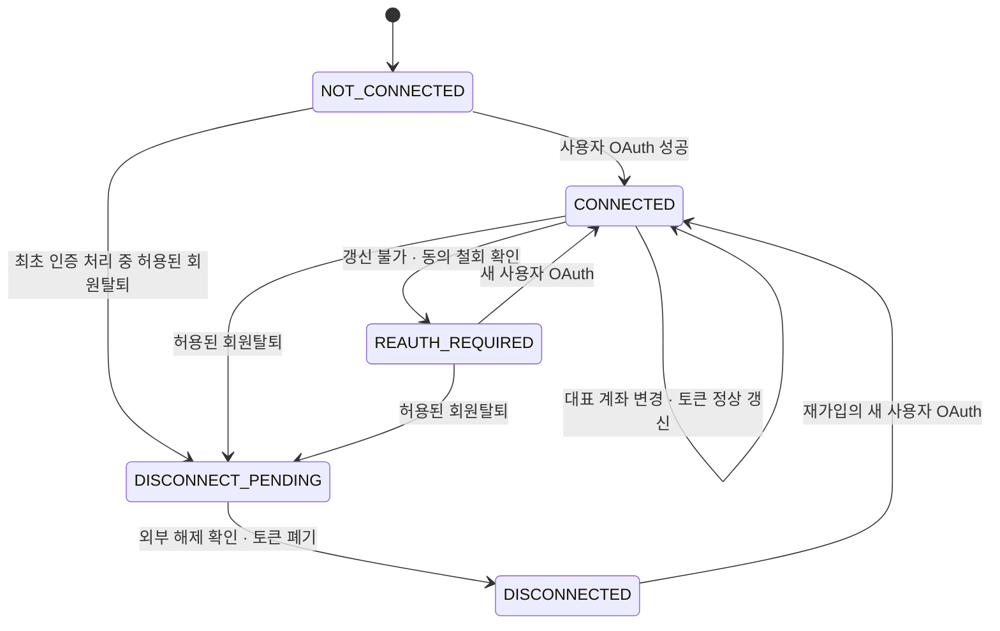

# 계좌 연동 요구사항 및 설계 명세

작성 기준: 2026-09-10. [계좌연동-intent.md](../intent/계좌연동-intent.md), 수동 계좌 저장·온보딩 완료 허용, 선택적 금융결제원 확인, 대표 계좌 교체 시 연결 유지·회원탈퇴 시에만 연결 해제를 적용한다는 최신 결정, 현재 저장소의 구현을 기준으로 한다. **구현을 위한 명세이며 기능 구현 완료를 의미하지 않는다.**

2026-09-11 구현 확인: [금융결제원 이용기관 API 명세서 v3.3.6](https://openapi.kftc.or.kr/support/mtrlDetail?bltn_seq_no=129)으로 아래 외부 규격을 구체화했다. 실제 환경의 승인·키·사용자 인증·조회 검증은 별도 완료 조건으로 유지한다.

## 1. 적용 기준과 범위

### 1.1 확정 흐름

```text
신규 가입·재가입 기본 흐름:
카카오 OAuth → 은행·전체 계좌번호·예금주 입력 → 확인 전 계좌 저장·온보딩 완료

온보딩·설정의 선택적 확인:
금융결제원 사용자 OAuth 또는 기존 연결 재사용 → 등록계좌 자동 입력·선택
→ 부족한 정보와 생년월일 입력 → 계좌실명조회·예금주 일치 → 확인한 계좌 저장

기존 회원의 대표 계좌 변경:
수동 저장 또는 선택적 실명조회 후 저장 → 기존 금융결제원 연결 유지
```

- 수동 저장은 금융결제원 동의·연결·생년월일 없이 가능하다. 기존 탈퇴 해제 대기 중에는 수동 경로도 재가입 완료를 보류한다.
- 확인 경로의 등록계좌가 하나면 자동 선택하고 여러 개일 때만 고른다. 은행·예금주·제공된 전체 번호는 자동으로 채우며, 마스킹 번호만 있으면 전체 번호와 생년월일을 입력받는다.
- **계좌번호 안내 시 `verifiedAt`이 없으면 정확히 ‘확인되지 않은 계좌입니다.’를 표시한다.** OAuth 성공·목록 선택은 계좌 확인이 아니며, 해당 계좌의 실명조회와 저장이 성공해야 문구를 제거한다.
- 다른 은행·정규화 전체 번호·예금주를 수동 저장하면 확인 이력을 초기화한다. 동일한 정보 재저장은 기존 확인을 보존할 수 있다. 대표 계좌 변경으로 금융결제원 연결·동의를 해제하거나 사용자 OAuth를 반복하지 않는다.
- **다모아가 요청하는 외부 연결 해제는 회원탈퇴에서만 수행한다.** 기존 미종료 참여 회차에 따른 탈퇴 제한은 유지하며 대표 계좌 변경에는 적용하지 않는다.
- 동의 철회·갱신 불가에 따른 재인증은 확인 경로에만 적용한다. 이미 가입한 회원을 미가입으로 되돌리거나 일반 수동 계좌 저장을 차단하지 않는다.
- 실명조회는 조회 시점의 계좌·인증정보·예금주 일치를 확인한다. OAuth 등록계좌와의 동일성, 로그인한 사람의 소유권, 실제 송금·입금 성공을 보장하지 않는다.
- 등록계좌 목록은 입력을 줄이기 위한 기능이다. 잔액·거래내역·실제 이체·입금 자동 확인은 범위 밖이며 정산 계산·계좌 공개 범위·실시간 반영은 유지한다.

[정산기능-spec.md](./정산기능-spec.md)의 수동 계좌 저장을 유지하며 선택적 확인과 확인 상태 안내를 추가한다. 금융결제원 확인을 필수로 두었던 이전 계좌연동 명세는 이 흐름으로 대체한다.

### 1.2 구현 기본값

아래는 사용자 요구를 구체화하기 위한 설계 선택이다.

| 항목 | 기본 설계 |
|---|---|
| 정산용 계좌 | 기존 `users`의 대표 계좌 한 개를 유지 |
| 계좌 확인·저장 | 기본 화면은 수동 저장. 선택적 확인은 기존 저장 요청 안에서 실명조회 후 저장. 별도 확인 완료 토큰 API 없음 |
| 입력 최소화 | 등록계좌 1개 자동 선택, 은행·예금주 자동 입력, 전체 번호도 제공될 때 자동 사용. 생년월일은 확인 경로에서만 직접 입력 |
| 기존 회원 전환 | 다음 계좌 저장 때 적용. 기존 계좌를 확인 완료로 일괄 전환하지 않음 |
| 생년월일 | 수동 저장에서는 수집·전송하지 않음. 확인 요청·화면 메모리에서만 사용. DB·로그·브라우저 영구 저장소에 원문 보관하지 않음 |
| 예금주명 비교 | NFC 정규화·앞뒤 공백 제거 후 정확히 비교. 내부 공백·문자·이름 순서를 임의로 바꾸지 않음 |
| 계좌 동시 변경 | 정수 `bank_version`과 `expectedBankVersion`으로 이전 입력의 늦은 저장 차단 |
| 외부 API 호출 | 짧은 DB 트랜잭션 사이에서 수행. 전역 쓰기 잠금을 잡고 네트워크 응답을 기다리지 않음 |
| 탈퇴·외부 해제 | 로컬 탈퇴와 해제 대기 상태를 먼저 원자적으로 저장하고 외부 해제 재시도. 성공 후 사용자 토큰 폐기 |
| 탈퇴 정리 중 재가입 | 카카오 로그인은 허용. 이전 외부 인증·해제의 처리가 끝나기 전 새 금융결제원 OAuth·재가입 완료를 보류하는 구현 기본값 |
| 구현 도구 | 기존 Next Route Handler, PostgreSQL, Node `fetch`·`crypto`, 기존 테스트·실시간 알림 재사용 |
| 외부 규격 반영 | OAuth state 32문자, 생년월일 유형 ASCII 공백·YYMMDD, `/v2.0/user/close` 사용자탈퇴 적용 |

## 2. 현재 코드와 변경 지점

| 현재 파일 | 현재 동작 | 필요한 변경 |
|---|---|---|
| [auth-store.ts](../src/lib/auth-store.ts) | 수기 계좌 저장, 가입 완료·세션 발급, 조건부 소프트 탈퇴 | 수동/확인 저장 분기, 검증 이력 초기화·보존, 버전 검사, 탈퇴 해제 대기 상태 연결 |
| [auth.ts](../src/lib/auth.ts) | 카카오 인증·서비스 쿠키·안전한 복귀 경로 | 기존 서비스 인증 재사용. 금융결제원 state와 카카오 state·쿠키는 분리 |
| [onboarding-client.tsx](../src/app/onboarding/onboarding-client.tsx) | 계좌 세 필드로 바로 가입 완료 | 수동 기본 폼, 선택적 금융결제원 연결·생년월일, 확인 중·실패·완료 상태 |
| [ui.tsx](../src/app/home/ui.tsx) | `BankFields`, `AccountPanel`, 계좌 저장·탈퇴·계정 모달 | 수동 저장·선택적 확인, 연결 재사용, OAuth 복귀 시 계정 모달 재개 |
| [온보딩 API](../src/app/api/me/onboarding/route.ts) | POST, Origin 검사, 16 KiB JSON, `{data:{id,returnTo}}` 및 세션 쿠키 | 수동 또는 외부 확인 후 가입 트랜잭션, 성공 응답 유실 복구 |
| [계좌 API](../src/app/api/me/bank-account/route.ts) | PUT, UUID 멱등 키, `{data:{id}}` | 입력 계약 확장, 연결·버전 검사, 실명조회, 개인정보를 보호하는 요청 지문 |
| [내 정보 API](../src/app/api/me/route.ts) | 회원·세션 목적·현재 계좌 반환 | 연결 상태, 계좌 확인 시각·은행 코드·버전 추가 |
| [탈퇴 API](../src/app/api/auth/withdraw/route.ts) | POST, 미종료 회차 검사, 쿠키 삭제, `{ok:true}` | 금융결제원 일반 API 차단·외부 해제 대기·재시도 연결 |
| [mutations.ts](../src/lib/mutations.ts) | 정규 JSON의 SHA-256과 성공 응답 메타데이터 저장 | 계좌 저장 경로만 생년월일을 평문 해시 입력으로 넘기지 않도록 처리 |
| [api-client.ts](../src/lib/api-client.ts) | 응답 유실·5xx 때 원래 본문·키를 메모리에 유지 | 생년월일 포함 요청의 완료·포기·화면 종료 시 메모리 정리 |
| [db.ts](../src/lib/db.ts)·[마이그레이션](../scripts/migrations/001-auth-lifecycle.sql) | 공통 advisory lock과 회원 계좌 컬럼 | 신규 순번 마이그레이션, 인증 상태와 대표 계좌 데이터 분리 |
| [realtime-server.ts](../src/lib/realtime-server.ts) | 저장 후 계좌·탈퇴 화면 무효화 | 기존 `publishBankInvalidation`·`publishDepartureInvalidation` 유지 |
| [openapi.ts](../src/lib/openapi.ts)·[환경 예시](../.env.example) | 기존 API와 환경 설정 문서 | 신규 계약·오류·인증 설정 추가 |

신규 금융결제원 통신은 `src/lib/openbanking.ts`, 인증 상태 저장·작업 조정은 `src/lib/openbanking-store.ts`에 모은다. 은행 목록과 순수 입력 검증은 `src/lib/bank-account.ts`에서 공유한다. 하나의 공급자를 위한 범용 OAuth·은행 어댑터 프레임워크는 만들지 않는다.

## 3. 기능 요구사항

| ID | 요구사항 |
|---|---|
| OB-01 | 신규·재가입은 카카오 인증·계좌 저장·가입 동의로 일반 서비스 세션을 받는다. 금융결제원 확인은 선택이며 이전 탈퇴 해제 대기는 재가입 완료를 계속 차단한다. |
| OB-02 | 유효한 기존 금융결제원 연결은 대표 계좌 교체 때 재사용하며 외부 해제 요청을 전혀 보내지 않는다. |
| OB-03 | 확인을 선택한 사용자의 미연결·재동의 필요 상태만 금융결제원 사용자 OAuth를 시작한다. 접근 토큰만 만료됐고 갱신 가능하면 서버에서 갱신한다. |
| OB-04 | 두 저장 경로 모두 은행·계좌번호·예금주 형식을 검사한다. 확인 경로에서만 생년월일·연결을 요구하고 실명조회 응답과 예금주를 비교한다. |
| OB-05 | API·참가은행 정상 응답, 요청 계좌·예금주 일치를 모두 통과한 경우만 확인 이력을 부여한다. 수동 저장의 새 계좌는 확인 전으로 저장한다. |
| OB-06 | 실패한 요청은 기존 계좌·가입 상태를 보존한다. 금융결제원 취소·실명조회 실패 뒤 별도의 수동 저장을 명시적으로 선택할 수 있다. |
| OB-07 | 저장 직전에 세션·회원·계좌 버전을 다시 검사하고 확인 경로는 연결도 재검사한다. 탈퇴·다른 계좌 변경에 뒤늦은 요청이 적용되지 않는다. |
| OB-08 | 대표 계좌 변경 후 필요한 지급자의 정산 화면에서 최신 계좌를 조회한다. 정산 금액·수취 확인은 변경하지 않는다. |
| OB-09 | 기존 회원의 계좌는 확인 이력이 없는 상태로 유지하고 다음 저장 때 새 절차를 적용한다. |
| OB-10 | 미종료 참여 회차가 있으면 회원탈퇴와 금융결제원 연결 해제를 모두 거부한다. 대표 계좌 변경에는 이 검사를 적용하지 않는다. |
| OB-11 | 허용된 탈퇴는 서비스 세션·일반 금융 API 사용을 즉시 차단하고 외부 연결을 해제한다. 실패는 해제 대기로 보존한다. |
| OB-12 | 과거 연결 해제 대기 작업이 재가입 후의 새 동의를 해제하지 않도록 재가입과 해제 실행을 조정한다. |
| OB-13 | 생년월일·토큰은 계정·정산 응답이나 일반 로그에 포함하지 않는다. 클라이언트가 보낸 검증 완료 표시는 신뢰하지 않는다. |
| OB-14 | 계좌번호 안내에서 verifiedAt이 없으면 정확히 ‘확인되지 않은 계좌입니다.’를 표시한다. OAuth만 성공해도 문구를 유지한다. |
| OB-15 | 계좌 식별 정보 변경 시 이전 확인을 초기화한다. 동일 은행·정규화 번호·예금주 재저장은 기존 확인 이력을 보존할 수 있다. |

## 4. 상태와 데이터

### 4.1 서로 독립적인 상태

| 대상 | 상태·판정 |
|---|---|
| 서비스 가입 | 기존 `onboarding_completed_at`, `deleted_at`, 세션 `purpose`를 유지 |
| 금융결제원 연결 | `NOT_CONNECTED`(행 없음), `CONNECTED`, `REAUTH_REQUIRED`, `DISCONNECT_PENDING`, `DISCONNECTED` |
| 대표 계좌 확인 | `bank_verified_at IS NULL`이면 미확인, 값이 있으면 해당 저장 계좌의 실명조회 성공 이력 |
| 진행 중 OAuth | 만료되지 않은 미사용 state만 처리 가능. 사용한 state는 재사용 불가 |

`CONNECTED`는 사용자 인증 연결의 상태이며 정산용 계좌와 OAuth 등록계좌의 동일성을 뜻하지 않는다. 대표 계좌를 A에서 B로 바꿔도 연결 상태·연결 ID는 그대로다. 수동 교체 시 계좌 확인은 초기화되며, OAuth 성공만으로 bank_verified_at을 채우지 않는다. 정상 토큰 갱신은 연결 해제가 아니다.



일시적인 통신 장애만으로 `REAUTH_REQUIRED`나 `DISCONNECTED`를 확정하지 않는다. 해제 대기 중 카카오 재로그인은 허용하지만 이전 연결 해제 완료 전 새 금융결제원 OAuth·재가입 완료는 보류한다.

### 4.2 저장 구조

**동일 계좌 확인 이력 보존은 활성 회원의 설정 변경에만 적용한다. 탈퇴 후 수동 재가입은 같은 은행·계좌번호·예금주여도 확인 시각·거래 식별자를 초기화하며 ‘확인되지 않은 계좌입니다.’를 표시한다. 새 실명조회에 성공해야 다시 확인 이력을 부여한다.**

기존 마이그레이션을 수정하지 않고 다음 순번 SQL을 추가한다. 시각은 기존 저장소의 초 단위 BIGINT 관례를 따르며, 동시성은 시각 비교 대신 버전으로 판정한다.

| 테이블 | 추가·신규 데이터 |
|---|---|
| `users` | 기존 계좌 컬럼 유지. `bank_code` TEXT NULL, `bank_verified_at` BIGINT NULL, `bank_verification_tran_id` TEXT NULL, `bank_version` INTEGER NOT NULL DEFAULT 0 추가 |
| `openbanking_connections` | `user_id` PK/FK, `connection_id` UUID UNIQUE, 환경, 사용자 식별자, 상태, 암호화한 사용자 토큰·만료·scope, 인증 시각, 버전 |
| 같은 연결 행의 외부 작업·해제 정보 | 진행 중 갱신·해제 작업 ID·임대 소유자·시작/종료·결과 불명 상태, `disconnect_requested_at`, `disconnect_attempts`, `disconnect_next_attempt_at`, `disconnect_lease_until`, 마지막 안전한 오류 코드, 완료 시각 |
| 같은 연결 행의 호출 제한 | 실명조회 제한 구간 시작 시각·호출 수. 입력값·생년월일 없이 회원별 횟수만 저장 |
| `openbanking_oauth_states` | state 해시 PK, 회원·시작 세션 ID, 목적 `onboarding/settings`, 안전한 복귀 경로, 생성·만료·사용·무효화 시각, 코드 교환 시작/종료·결과 불명 상태. 실제 규격이 요구하는 인증 부가 정보만 추가 |
| `openbanking_service_tokens` | 환경별 한 행. 암호화한 이용기관 토큰·만료, 발급 중 임대 시각·버전. 사용자 토큰과 분리 |
| 기존 `mutation_requests` | 계좌 PUT의 요청 지문과 성공 메타데이터에 사용. 계좌 원문·생년월일·토큰을 응답 메타데이터에 넣지 않음 |

- 기존 계좌는 `bank_code=NULL`, `bank_verified_at=NULL`, `bank_version=0`으로 시작한다. 이름만으로 은행 코드를 추측해 확인 완료로 만들지 않는다.
- 계좌 저장 때 `bank_version`을 1 증가시킨다. 확인 경로 성공은 계좌·확인 시각·거래 식별자를 함께 저장한다. 수동 저장은 다른 은행·정규화 번호·예금주이면 확인 시각·거래 식별자를 NULL로 초기화하고, 동일 정보이면 기존 확인 이력을 보존할 수 있다.
- 사용자 토큰 갱신·대표 계좌 변경은 `connection_id`를 유지한다. 연결 해제 후 새 OAuth에서는 새 ID를 발급한다.
- 탈퇴 시 아직 연결 행이 없어도 외부 인증이 진행 중이면 해제 대기 행을 만든다. 이 경우에 한해 사용자 식별자·토큰은 확인될 때까지 NULL을 허용하며, 진행 중 작업의 결과를 정리 대상으로 연결한다.
- 생년월일, OAuth 코드, state 원문, API 응답 원문 전체는 영구 저장하지 않는다. 처리에 필요한 토큰만 인증 암호화로 보관한다.
- 회원 탈퇴의 과거 계좌·정산 보존은 기존 정책을 따른다. 이용기관 토큰은 서비스 공용이므로 한 회원이 탈퇴했다고 폐기하지 않는다.

## 5. 내부 API 계약

신규 경로는 다모아 내부 API의 설계이며 금융결제원 엔드포인트가 아니다. 기존 `nodejs` Route Handler와 `private, no-store` 응답을 사용한다. 변경 요청은 같은 Origin과 서버 세션을 검사하고 JSON 본문은 기존 16 KiB 제한을 유지한다.

| 메서드·경로 | 인증·요청 | 응답·동작 |
|---|---|---|
| GET `/api/me` | 기존 app/onboarding 세션 | 기존 응답에 `bankVersion`, 계좌 `bankCode/verifiedAt`, `openBanking:{status,authenticatedAt,environment}` 추가 |
| POST `/api/me/openbanking` | app/onboarding 세션. `{context:"onboarding"|"settings",returnTo?}` | 미연결·재동의 시 `{data:{authorizationUrl}}`. 유효 연결이면 `{data:{returnTo}}`로 입력 단계 복귀 |
| GET `/api/me/openbanking/accounts` | 활성 app/onboarding 세션과 유효한 본인 연결. 사용자 ID를 입력받지 않음 | `{data:{accounts:[{fintechUseNum,bankCode,bankName,accountHolder,accountNumber,accountNumberMasked}]}}`. 전체 번호가 제공되지 않으면 `accountNumber:null` |
| GET `/auth/v1/openbanking` | 공급자 콜백 파라미터, 서버 state, 시작 세션 검증 | 사용자 토큰 교환·저장 후 안전한 앱 경로로 303 이동. 토큰을 URL에 넣지 않음 |
| POST `/api/me/onboarding` | onboarding 세션, 아래 계좌 입력과 재가입 동의 | 기존 `{data:{id,returnTo}}` 및 새 앱 세션 쿠키 |
| PUT `/api/me/bank-account` | 활성 app 세션, UUID `Idempotency-Key`, 아래 계좌 입력 | `{data:{id,bankVersion}}` |
| POST `/api/auth/withdraw` | 활성 app 세션, 기존 빈 본문 | 기존 `{ok:true}`에 `openBankingDisconnect:"completed"|"pending"` 추가. 쿠키 삭제 |

계좌 입력 계약:

```json
{
  "bankCode": "금융기관 코드",
  "accountNumber": "전체 계좌번호",
  "verifyWithOpenBanking": true,
  "birthDate": "YYYY-MM-DD",
  "accountHolder": "입력한 예금주명",
  "expectedBankVersion": 0,
  "confirmRejoin": false
}
```

- `verifyWithOpenBanking`은 선택 boolean이며 **생략 시 true**로 기존 API 동작을 유지한다. 기본 화면의 수동 저장은 명시적으로 false를 전송한다. false는 `birthDate`를 제외하고 사용자 금융결제원 연결·토큰·실명조회 없이 저장한다. true는 기존처럼 생년월일·같은 회원의 유효한 연결과 실명조회 성공이 필요하다. 이 값은 확인 완료 주장이 아니라 서버 처리 방식 선택이다.
- `confirmRejoin`은 온보딩에서만 사용한다. 기존처럼 탈퇴 계정의 명시적 재가입 동의를 확인한다.
- `bankName`은 서버의 지원 은행 목록에서 결정한다. 자유 입력 은행명만으로 저장하던 이전 요청은 허용하지 않는다.
- `birthDate`는 확인 경로에서만 받는 내부 API의 날짜 형식이다. 금융결제원 전송 형식은 확인된 인증정보 유형에 따라 서버에서 변환한다.
- 알 수 없는 필드·계좌 소유자 ID·`verified`·`fintechUseNum`으로 검증이나 연결 대상을 바꿀 수 없다.
- API 응답은 생년월일, 금융결제원 사용자 식별자, 토큰을 반환하지 않는다. 등록계좌 목록은 현재 회원의 계좌 선택 화면에만 제공하고 정산 응답·알림에는 포함하지 않는다.
- 시작 API는 `/api/me/` 아래에 두어 기존 `apiRequest`의 app 세션 갱신·재시도를 재사용한다. onboarding 세션은 기존처럼 갱신 불가이며, 콜백 전에 시작 세션이 폐기·교체됐으면 새 인증을 안내한다.

### 5.1 오류 계약

기존 `{error,message,details?}` 형식을 유지하고 공급자 원문 오류를 그대로 사용자에게 전달하지 않는다.

| HTTP·코드 | 의미·복구 |
|---|---|
| 400 `invalid_input` | 필드 형식 오류. 안전한 필드명과 수정 안내 |
| 401 `unauthorized` | 세션 만료·폐기. 기존 카카오 재로그인 경로 사용 |
| 403 `forbidden` | Origin·회원·세션 목적 불일치 |
| 409 `openbanking_required` | 확인 경로에 필요한 금융결제원 연결 없음. 수동 저장 선택 가능 |
| 409 `openbanking_reauth_required` | 확인 경로의 사용자 재동의 필요. 금융결제원 인증 또는 수동 저장 선택 |
| 409 `openbanking_disconnect_pending` | 이전 탈퇴 연결 해제 중. 새 OAuth·재가입 완료 보류 |
| 409·콜백 `openbanking_provider_pending` | 참가은행의 후행 탈퇴 처리 중. 익영업일 처리 후 재시도 안내 |
| 409 `bank_account_conflict` | 계좌 버전 변경. 최신 계좌 확인 후 새 키로 재제출 |
| 409 `account_holder_mismatch` | 입력 예금주와 응답 불일치. 입력 수정 |
| 422 `bank_account_unverified` | 은행이 계좌 확인 실패·지원 불가를 명확히 반환 |
| 424 `openbanking_test_data_missing` | 테스트 환경의 `A0002/818`: 요청과 일치하는 계좌실명조회 시뮬레이터 응답 없음. 확인 요청은 저장하지 않음. 테스트 응답 등록·수정 후 재시도하거나 사용자가 별도의 수동 저장을 명시적으로 선택할 수 있음 |
| 429 `bank_verification_rate_limited` | 호출 제한. 재시도 가능 시점 안내 |
| 503 `openbanking_unavailable` | 토큰 발급·공급자 일시 장애·시간 초과·잘못된 응답 |
| 기존 409 `unfinished_rounds` | 탈퇴 제한. `details.rounds`로 관련 회차 안내 |
| 기존 `invalid_request_key/idempotency_conflict` | 계좌 PUT의 멱등 키 오류 |

공급자 오류가 인증정보 불일치인지 장애인지 구분되지 않으면 확인 성공으로 처리하지 않는다. 실패를 수동 저장으로 자동 전환하지 않으며, 사용자가 수동 저장을 선택하면 새 요청으로 처리하고 확인 이력을 부여하지 않는다. 내부 설정 오류를 사용자 생년월일 오류로 표시하지 않는다.

## 6. 금융결제원 호출과 검증

### 6.1 인증 분리

금융결제원 사용자 OAuth는 회원의 동의·계좌 등록에 사용한다. 계좌실명조회는 이용기관 인증 토큰의 `oob` 권한을 사용한다. 기존 카카오 OIDC ID Token 검증 함수를 금융결제원 토큰에 그대로 적용하지 않는다. [공식 OAuth 안내](https://developers.kftc.or.kr/dev/openapi/open-banking/oauth)

- 사용자 인증은 환경별 공식 호스트의 `/oauth/2.0/authorize`, 토큰 발급·갱신은 `/oauth/2.0/token`을 사용한다. 사용자 scope는 기본 `login inquiry`, 기관 scope는 `oob`다. 사용자 인증 요청에는 `auth_type=0`, `register_info=A`를 적용하며 카카오의 PKCE·nonce 설정을 복사하지 않는다.
- 서버는 동일 회원의 갱신·이용기관 토큰 발급을 중복 실행하지 않도록 짧은 DB 임대로 작업을 선점한다. 네트워크 요청 뒤 연결 ID·버전을 다시 확인하고 결과를 적용한다.
- 실명조회용 기관 토큰 발급은 30초 임대가 끝나면 새 작업 ID로 재발급할 수 있다. 이전 작업의 늦은 응답은 캐시를 덮어쓰지 못한다. 이는 사용자 동의·계좌를 변경하지 않는 자격증명 복구이며, 사용자 OAuth·갱신·탈퇴의 결과 불명 상태를 해제하는 근거로 사용하지 않는다. 반복 기관 발급의 실제 동작은 외부 환경 검증에 포함한다.
- 갱신 시 교체된 refresh token이 반환되면 함께 저장한다. 정상 갱신으로 대표 계좌나 연결 ID를 바꾸지 않는다.
- 토큰 만료와 동의 철회는 별개다. 갱신 가능한 만료는 서버에서 처리하고, 재동의가 필요한 경우에만 사용자 OAuth를 요구한다.

### 6.2 등록계좌 조회

`GET /v2.0/account/list`를 사용자 토큰의 `login` 권한으로 호출한다. `user_seq_no`는 서버에 저장된 본인의 식별자를 사용하고, `include_cancel_yn=N`, `sort_order=D`로 요청한다. API 정상 코드와 목록 형식을 검사하고 `account_state=01`, `inquiry_agree_yn=Y`, `account_holder_type=P`인 지원 은행 계좌만 반환한다.

외부 조회는 DB 잠금 밖에서 수행한다. 반환 직전에 원래 세션·회원·연결 ID·버전·상태·환경을 다시 검사해 조회 중 로그아웃·탈퇴한 세션에 목록을 반환하지 않는다. 사용자 토큰의 인증 거절은 같은 연결 버전에서만 재동의 필요 상태로 전환한다.

전체 번호 `account_num`은 자격요건이 있는 기관에만 선별 제공되는 항목이다. 마스킹 번호를 전체 번호로 복원하거나 기존 대표 번호와 같다고 추정하지 않는다. 목록은 요청·화면 메모리에서 사용하며 DB에 별도 계좌 목록을 저장하지 않는다. 선택한 `fintechUseNum`은 UI 식별에만 사용하고 검증되지 않은 전체 번호에 연결해 저장하지 않는다. 목록 선택으로 확인을 완료하지 않는다. 저장 API는 선택한 수동/확인 방식과 멱등 계약을 따른다. [공식 명세 §2.2.3](https://openapi.kftc.or.kr/support/mtrlDetail?bltn_seq_no=129)

### 6.3 실명조회 요청

`verifyWithOpenBanking:true` 또는 생략 시에만 호출한다. 대상은 `POST /v2.0/inquiry/real_name`이며, 환경별 승인된 API 호스트를 사용한다. 주요 매핑은 다음과 같다. [계좌실명조회 명세](https://developers.kftc.or.kr/dev/openapi/open-banking/account)

| 다모아 입력·서버 값 | 금융결제원 요청 |
|---|---|
| 지원 목록에서 확인한 `bankCode` | `bank_code_std` |
| 정규화한 `accountNumber` | `account_num` |
| `birthDate`에서 변환한 YYMMDD 6자리 | `account_holder_info` |
| ASCII 공백 한 문자 | `account_holder_info_type` |
| 명세에 맞는 서버 거래번호·시각 | `bank_tran_id`, `tran_dtime` |
| 서비스 이용기관 토큰 | `Authorization: Bearer …` |

- 계좌번호는 숫자 문자열로 유지하고 ASCII 공백·하이픈만 제거한다. 선행 0을 보존하며 글자를 무작정 제거해 숫자로 만들지 않는다. 확인한 API 한도·은행별 조건을 적용한다.
- 생년월일은 ISO 날짜 문자열을 구성요소로 검증한다. 존재하지 않는 날짜·미래 날짜를 거부하며 JS Date의 자동 보정으로 통과시키지 않는다.
- 계좌번호는 정규화 후 1~16자리, 예금주명은 NFC와 앞뒤 공백 정리 후 1~40자로 제한한다. 생년월일은 1900-01-01부터 한국 날짜 기준 오늘까지 허용한다. 테스트 금융기관 코드는 `test` 환경에서만 허용한다.
- 거래번호는 발급받은 이용기관코드 10자리 + `U` + DB의 비순환 시퀀스에서 만든 영숫자 9자리다. 시퀀스를 초기화하거나 같은 기관코드를 사용하는 여러 DB에서 범위를 중복 사용하지 않는다. 외부 재호출은 새 거래번호를 사용한다.
- 지원 은행 코드·인증정보 유형·추가 회차번호 필요 여부는 공식 명세로 확정한다. 승인되지 않은 유형을 임의로 생성하지 않는다.
- HTTP, API 응답 코드, 참가은행 응답 코드, 응답의 은행·계좌 일치, 필수 예금주명과 입력 일치를 모두 확인한다. 정상 코드의 정확한 적용 조건은 테스트 응답으로 검증한다.
- 외부 HTTP 호출은 요청당 10초 제한을 기본값으로 한다. 무한 재시도하지 않고 확인 실패를 반환한다. 토큰 만료가 명확한 경우에만 재발급 후 한 번 재시도한다.
- 기본 호출 제한은 회원당 5분 동안 10회다. 외부 요청 시작 전에 별도 짧은 트랜잭션으로 횟수를 기록하며 성공·실패 모두 집계한다. 유효한 연결이 없는 요청은 먼저 거부한다.

## 7. 처리 순서·원자성·멱등성

### 7.1 사용자 OAuth

1. 시작 API에서 세션 목적과 요청 context를 맞춰 검사하고, 탈퇴 연결 해제 대기 여부를 확인한다.
2. 유효한 연결이 있으면 이를 재사용한다. 새 인증이 필요하면 24바이트 난수를 base64url로 변환한 32문자 state를 만들고 SHA-256 해시와 회원·시작 세션·복귀 경로를 저장한다. 수명은 10분이며 세션 만료를 넘기지 않는다.
3. 같은 회원의 새 인증을 시작하면 처리 중인 것을 포함해 이전 state에 무효화 시각을 기록한다. 콜백은 state와 시작 세션, 만료 여부를 확인하고 한 번만 선점하며 코드 교환 시작을 저장한다. 외부 결과가 아직 불명확한 이전 작업은 먼저 정리한다.
4. 잠금 밖에서 코드로 토큰을 교환한다. 확정 실패면 새 인증을 안내하고, 시간 초과·프로세스 중단으로 발급 여부가 불명확하면 해당 작업의 결과 불명 상태를 보존한다. 사용한 코드를 반복 교환해 해결됐다고 가정하지 않는다.
5. 다시 트랜잭션을 열어 회원·세션·탈퇴 상태·state 무효화 여부를 검사하고 현재 시도의 결과만 연결에 적용한다. 그사이 탈퇴했다면 늦게 받은 토큰은 일반 연결로 활성화하지 않고 같은 탈퇴 정리 대상으로 넘긴다. 재가입용 onboarding 세션은 허용하되 이전 해제 대기 작업과 겹치지 않게 한다.
6. 콜백은 앱 내부 복귀 경로로 이동한다. 완료 응답 유실은 `/api/me` 재조회로 확인하며 성공한 코드를 재사용하지 않는다.

설정의 앱 access 쿠키는 5분이므로 OAuth가 그보다 길어져도 10분 state 안에서 완료할 수 있도록 콜백 전용 증빙 쿠키를 사용한다. 시작 세션 정보를 state에 묶어 인증 암호화하고 `HttpOnly`, `SameSite=Lax`, 콜백 경로, 수명 600초로 제한한다. 현재 유효한 access가 있으면 우선하며, 없을 때만 증빙에서 시작 세션을 읽어 기존 DB 세션·state 검사를 거친다. 일반 API 인증이나 세션 회전에 사용하지 않고, 처리한 state의 쿠키·로그아웃·탈퇴에서 제거한다.

설정 복귀는 검증된 현재 홈 경로에 `account=1`을 붙여 계정 모달을 다시 여는 방식을 기본값으로 한다. 앱셸은 모달을 연 뒤 해당 표시 파라미터만 제거한다. 온보딩의 원래 초대·정산 목적지는 기존 서버 검증 경로로 보존한다.

### 7.2 계좌 PUT

1. Origin·세션·입력·저장 방식을 검증하고 멱등 키의 기존 성공 결과를 확인한다. 같은 성공 요청은 외부 조회나 저장을 반복하지 않는다.
2. 수동(false) 경로는 생년월일을 제외하고 금융결제원 토큰 준비·연결 요구·목록 조회·실명조회 없이 최종 저장으로 진행한다. 계좌 저장의 멱등 지문·입력 검사·버전 검사는 유지한다.
3. 확인(true 또는 생략) 경로는 연결을 확인·갱신하고 짧은 트랜잭션에서 회원·세션·연결 ID·계좌 버전·호출 제한을 검사한다. 잠금 밖에서 기관 토큰으로 실명조회하며 요청 입력은 고정한다.
4. 최종 쓰기 트랜잭션에서 멱등 키·회원·세션·계좌 버전을 재검사한다. 확인 경로는 연결도 재검사한다.
5. 계좌·새 버전·멱등 성공 메타데이터를 함께 저장한다. 확인 성공은 확인 시각·거래 식별자를 저장하고, 수동 교체는 이 값을 초기화한다. 동일 은행·정규화 번호·예금주의 수동 재저장만 기존 이력을 보존할 수 있다. 금융결제원 연결·토큰·동의는 변경하지 않는다.
6. 커밋 후 기존 계좌 변경 알림을 발행한다. 실시간 발행 실패가 저장 성공을 되돌리지 않는다.

초 단위 `bank_updated_at` 대신 `bank_version`으로 동시 변경을 구분하며 충돌은 409로 최신 계좌 확인을 요구한다.

멱등 지문에는 저장 방식과 정규 입력·메서드·사용자 ID를 포함한다. 동일 키로 수동/확인 방식을 바꾸면 충돌한다. 생년월일이 포함된 확인 요청은 **서버 비밀키 기반 HMAC**으로 지문을 만들고 생년월일 원문·복호화 가능한 사본을 저장하지 않는다. 수동 요청에도 멱등 보호를 적용하며 저장 방식 선택만으로 검증 이력을 만들 수 없다. 성공 메타데이터는 회원 ID와 저장 버전만 보관한다.

### 7.3 온보딩 POST

- 수동/확인 분기와 최종 검증 순서는 계좌 PUT과 같다. 수동 경로도 필수 재가입 동의와 이전 탈퇴의 외부 해제 대기를 검사한다. 최종 트랜잭션은 기존 `completeOnboarding`의 회원 복구·가입 완료·세션 교체를 재사용한다.
- 서비스 가입 완료와 계좌 저장은 원자적이다. 금융결제원의 OAuth·실명조회까지 같은 DB 트랜잭션으로 롤백할 수 있다고 가정하지 않는다.
- 저장된 가입 완료의 응답이 유실돼 옛 onboarding 세션으로 재전송되면 새 가입을 만들지 않는다. 유효한 app 세션을 이미 받았다면 `/api/me`로 완료를 확인한다.
- 쿠키 교체 응답까지 유실됐다면 카카오 재로그인으로 완료한 기존 회원을 찾아 app 세션을 발급한다. 이 복구에서 계좌실명조회·온보딩을 반복하지 않는다.
- JWT·refresh token을 멱등 응답 테이블에 저장하거나 폐기된 onboarding 세션만으로 새 앱 세션을 발급하지 않는다.

## 8. 회원탈퇴와 외부 연결 해제

### 8.1 탈퇴 처리

1. 기존 쓰기 트랜잭션에서 활성 회원·세션과 미종료 참여 회차를 확인한다. 제한이 있으면 기존 409를 반환하고 회원·연결을 바꾸지 않는다.
2. 허용되면 기존 소프트 탈퇴·세션 폐기·멤버십 이탈과 함께 OAuth state를 무효화한다. 연결 또는 진행 중·결과 불명의 OAuth/갱신 작업이 있으면 `DISCONNECT_PENDING`과 작업 시각을 저장한다. 연결이 없거나 이미 해제됐고 미정리 외부 작업도 없을 때만 완료로 처리한다.
3. 커밋 즉시 일반 금융 API 사용을 차단한다. 이후 외부 해제 실패가 로컬 탈퇴를 되돌리거나 세션을 복구하지 않는다.
4. 탈퇴 전에 시작한 OAuth·갱신 결과를 먼저 정리하고, 트랜잭션 밖에서 해당 연결의 금융결제원 해제를 시도한다. 늦게 받은 인증정보는 해제 작업에만 사용한다. 외부 호출은 다모아 서비스에 대한 동의·등록 해제 범위로 한정한다.
5. 성공 또는 공식적으로 이미 해제된 결과와 이전 외부 작업의 종료를 확인하면 같은 연결 ID·대기 상태를 확인한 뒤 토큰을 제거하고 `DISCONNECTED`로 전환한다. 연결 행이나 토큰이 없다는 이유만으로 진행 중 외부 동의까지 없다고 판단하지 않는다.
6. 실패·시간 초과·응답 유실이면 대기 상태를 보존한다. 응답에는 로컬 탈퇴 완료와 외부 해제 대기 여부만 안내한다.

실제 해제는 사용자 토큰으로 `POST /v2.0/user/close`에 이용기관코드·사용자 일련번호를 전달한다. 명세의 정상 또는 이미 탈퇴한 응답을 확인하면 센터 해제를 완료한 것으로 처리한다. 참가은행의 후행 정리는 익영업일 중 완료될 수 있으며, 이 기간의 `A0019` 응답은 처리 중 안내 후 재시도한다. 센터 성공을 모든 참가은행의 즉시 처리 완료로 표시하지 않는다.

### 8.2 재시도·토큰 폐기

- 해제 대기 상태는 DB에 남긴다. 요청 처리 후 일회성 실행만으로 외부 해제 완료를 보장하지 않는다.
- 작은 운영 스크립트 `scripts/retry-openbanking-disconnect.mjs`가 처리 시각이 지난 대기 연결을 조회해 같은 해제 함수를 호출하도록 한다. 운영 스케줄러에서 주기적으로 실행하며 별도 큐 프레임워크를 도입하지 않는다. 반환값의 `needsOperator`는 해제 대기 중 다음 재시도 시각이 없거나, 결과가 불명확하거나, 진행 중 작업의 임대가 만료된 연결을 별도로 집계한다. 미래 시각의 일시 실패 재시도는 운영 확인 대상으로 집계하지 않는다. 자동 재시도 대상에서 빠진 작업도 이 집계에 남으며, `pending` 또는 `needsOperator`가 1 이상이면 CLI는 종료 코드 1을 반환한다.
- 짧은 DB 임대로 연결 하나의 해제 실행을 선점하고, 외부 요청 뒤 같은 연결 ID·상태·임대 소유를 검사한다. 실행 중 종료된 작업은 임대 만료 후 복구 대상으로 회수하되, 외부 재호출 여부는 아래 결과 확인 규칙으로 판단한다.
- 확정된 일시 실패는 1·2·4·8·16분, 이후 최대 30분 간격을 기본값으로 재시도한다. 시간 초과처럼 결과가 불명확하면 공급자 상태 조회 또는 공식적으로 안전한 중복 요청 규격에 따라 복구한다. 이 수단이 확인되지 않으면 무조건 재발송하지 않고 대기 상태에서 운영 확인한다. 영구 설정·권한 오류도 자동 반복을 멈추고 원인 해결 후 재시도한다.
- 사용자 토큰이 해제에 필요하면 일반 작업에서 접근할 수 없게 제한해 암호화 보관하고, 외부 해제 확인 후 폐기한다. 토큰 만료 자체를 외부 동의 해제 성공으로 간주하지 않는다.
- 외부 해제가 이미 됐는데 DB 저장만 실패한 경우에는 재호출의 ‘이미 해제됨’을 정상 완료로 받아들일 수 있는지 공식 명세로 확인한다.
- 실제 구현에서는 공식 `A0014`(기탈퇴)를 센터 해제 완료로 처리한다. 확정된 설정·권한 거절은 원인 해결 후 `--retry-rejected`로 재개할 수 있지만, 결과 불명 요청은 이 옵션으로도 재발송하지 않는다.
- 인증 화면에 진입했지만 콜백을 받지 못한 state도 탈퇴 정리 대상으로 유지한다. state 만료는 외부 동의가 없다는 증거가 아니므로, 늦은 코드/취소 콜백 또는 공급자 확인 전에는 해제 완료로 추정하지 않는다. 늦은 코드는 서버에 저장한 회원·시작 state에 묶어 해제 정리용으로만 교환한다.
- 대표 계좌 변경 경로에서는 이 함수·대기 상태·재시도 작업을 호출하지 않는다.

### 8.3 재가입과 경합

탈퇴 계정의 카카오 재로그인은 기존처럼 onboarding 세션을 발급한다. 이전 연결이 `DISCONNECT_PENDING`이면 정리 중 상태를 안내하고 새 금융결제원 OAuth와 재가입 완료를 보류한다. 상태 재조회로 해제 완료를 확인한 뒤 수동 가입 또는 선택적 새 OAuth를 진행한다. 수동 저장으로 이전 해제 대기 제한을 우회하지 않는다.

이전 연결을 해제하는 외부 요청이 새 동의까지 취소할 수 있으므로 로컬 연결 ID·임대 만료 검사만으로 해결됐다고 가정하지 않는다. 시간 초과한 외부 요청이 나중에 완료될 가능성까지 공식 해제 대상·멱등성·상태 조회 규격으로 해소한 뒤 새 연결을 허용한다. 이를 확인할 수 없으면 해제 대기로 유지한다. 과거 세션·모임·관리 권한은 기존 재가입 정책대로 복구하지 않는다.

## 9. 화면 동작

- 온보딩·설정은 은행·전체 계좌번호·예금주를 입력해 수동 저장할 수 있다. 금융결제원 동의와 생년월일 없이 가입을 완료할 수 있으며, 금융결제원으로 계좌를 확인하는 선택지를 별도로 제공한다.
- 확인을 선택한 경우 미연결·재동의 상태에서만 OAuth를 진행한다. 정상 연결은 재사용하고 등록계좌가 하나면 자동 선택, 복수면 native select를 제공한다.
- 등록계좌의 은행·예금주는 자동 입력한다. 전체 번호가 제공되면 재입력을 없애고 마스킹만 있으면 전체 번호를 받는다. 확인 경로에서만 native date 생년월일 입력을 제공한다.
- 확인 경로의 ‘다른 계좌 직접 입력’은 은행·번호·예금주·생년월일을 받아 같은 실명조회로 검증한다. 목록 실패·빈 목록에서도 수동 저장을 선택할 수 있으며 불완전한 값을 제출하지 않는다.
- 수동/확인 방식 전환과 계좌 선택 변경 시 이전 생년월일·미완료 요청을 정리한다. 마스킹 번호로 전체 번호를 추정하지 않는다. 수동 요청에서 생년월일을 제외한다.
- 새 저장 전에는 기존 계좌·확인 상태를 유지한다. 수동은 저장 중, 확인 경로는 계좌 확인 중 상태를 표시하고 중복 제출을 막는다.
- 설정 저장 성공 뒤 최신 `/api/me` 조회가 실패하면 저장 폼·방식 전환을 잠근다. 과거 계좌에 새 버전을 붙여 재제출하지 않으며, 명시적 재조회 성공 뒤 최신 값·버전으로 폼을 다시 연다.
- 확인 실패·예금주 불일치·테스트 응답 누락 `818`에서는 수정·재시도와 수동 저장 선택을 제공한다. 사용자의 선택 없이 자동 저장하거나 확인 완료로 처리하지 않는다. 공급자가 반환한 다른 예금주·인증정보를 오류에 노출하지 않는다.
- 페이지 이동·로그아웃·모달 닫기·명시적 포기 시 생년월일·미완료 요청 메모리를 정리한다. 동일 요청 재전송에만 현재 화면 메모리를 재사용한다.
- 계정·정산 등 계좌번호 안내에서 `verifiedAt`이 없으면 정확히 **‘확인되지 않은 계좌입니다.’**를 표시한다. OAuth 성공·등록계좌 선택만으로 지우지 않으며 해당 계좌 실명조회·저장 성공 후 제거한다. 다른 계좌를 수동 저장하면 다시 표시하고, 동일 정보의 기존 확인을 보존한 경우 유지하지 않는다.
- 이전 탈퇴 해제 대기 중에는 수동 경로도 재가입 완료를 막고 정리 상태를 안내한다. 내부 토큰·DB·작업 큐 정보를 화면에 노출하지 않는다.

## 10. 보안·개인정보·복귀 경로

- 토큰 암호화는 Node crypto의 인증 암호화 방식과 서버 전용 키를 사용하고, 키 버전·nonce·인증 태그를 함께 관리한다. 키를 잃었거나 복호화에 실패하면 평문 대체 저장을 하지 않는다.
- 계좌 검증 요청 지문의 비밀키는 토큰 암호화 키와 별도로 관리한다. 키·토큰을 `NEXT_PUBLIC_` 환경변수로 두지 않는다.
- 외부 API 호스트와 콜백 주소는 서버 설정으로 고정한다. 사용자 입력 URL을 공급자 요청 대상으로 사용하지 않는다.
- OAuth 복귀는 기존 안전한 내부 경로 검증을 재사용하고 원래 초대·정산 목적지를 유지한다. 생년월일·계좌번호·코드를 복귀 URL에 붙이지 않는다.
- 계정 API는 본인의 상태만, 정산 API는 기존 정책의 필요한 수취 계좌만 반환한다. Ably 이벤트에는 기존 리소스 키만 싣는다.
- 처리 중 코드·생년월일과 상세 공급자 응답은 로깅하지 않는다. 운영에는 작업 종류·내부 회원/연결 ID·안전한 오류 코드·시각만 남긴다.
- 외부 HTTP 요청은 DB 잠금 밖에 있으므로, 탈퇴 전에 발송된 요청의 응답이 뒤늦게 도착할 수 있다. 탈퇴 이후 새 일반 요청을 금지하고 뒤늦은 결과의 저장을 거부한다.

## 11. 설정·마이그레이션·외부 명세 확인

### 11.1 서버 설정

`.env.example`에는 값 없이 용도만 문서화한다.

| 설정 | 용도 |
|---|---|
| `OPENBANKING_ENV` | 테스트·운영 환경 구분 |
| `OPENBANKING_CLIENT_ID/CLIENT_SECRET` | 승인된 다모아 이용기관 인증 |
| `OPENBANKING_CLIENT_USE_CODE` | 발급받은 이용기관코드 10자리, 거래번호 및 사용자탈퇴에 사용 |
| `OPENBANKING_API_BASE_URL` | 승인된 API 서버 주소 |
| `OPENBANKING_AUTHORIZE_URL/TOKEN_URL` | 사용자 인증·토큰 발급 주소. 실제 규격에 맞춰 이용기관 발급 주소 구분 |
| `OPENBANKING_REDIRECT_URI` | 사전 등록한 `/auth/v1/openbanking` 절대 URL |
| `OPENBANKING_SCOPES` | 이번 사용자 인증에 승인된 권한 |
| `OPENBANKING_TOKEN_ENCRYPTION_KEY` | 저장 토큰 암호화용 서버 비밀키 |
| `OPENBANKING_REQUEST_HMAC_KEY` | 계좌 저장 요청의 멱등 지문용 서버 비밀키 |

환경별 공식 API·인증·토큰 URL은 코드로 고정하며 위 URL 환경변수를 지정했다면 공식 주소와 일치하는지 검사한다. 암호화·HMAC 키는 서로 다른 32바이트 base64 값이다. 빈 인증 설정을 임의의 테스트 값으로 대체하거나 실제 API 오류를 성공으로 처리하지 않는다.

### 11.2 남은 기술 확인

제품 흐름과 연결 유지·탈퇴 정책의 추가 결정은 없다. 아래는 공급자 상세 규격과 운영 준비 확인이다.

| ID | 확인할 내용 | 완료 근거 |
|---|---|---|
| EXT-01 | 사용자 OAuth·토큰 발급·갱신과 이용기관 토큰의 정확한 주소·필수값·scope·유효기간·동시 발급 조건 | 승인된 명세와 테스트 환경의 인증·갱신 성공 |
| EXT-02 | 생년월일만 사용하는 `account_holder_info_type`·전송 형식, 지원 은행·계좌·추가 필드, 정상·실패 코드·거래번호 규칙 | 해당 입력으로 성공·불일치·미지원 사례 확인 |
| EXT-03 | 회원탈퇴용 서비스 연결 해제의 대상·인증 수단·이미 해제된 응답·만료 토큰 처리, 진행 중 인증·시간 초과 요청의 상태 조회와 안전한 재시도·종료 판정 | 실제 테스트에서 연결 해제·중복·응답 유실·늦은 인증 결과·재가입 경합 확인 |
| EXT-04 | API 이용 승인·활성화, 환경별 키·콜백·테스트 데이터, 운영 해제 재시도 스케줄 | 환경 설정 확인과 전체 흐름 점검 |

공개 웹 예시의 인증정보 유형·자리 수 혼재는 v3.3.6 상세 명세의 ASCII 공백·생년월일 6자리 규격으로 해소했다. 사용자 인증·기관 인증·갱신·사용자탈퇴의 엔드포인트와 파라미터도 해당 명세로 확인했다. EXT-01~03의 남은 완료 근거는 실제 승인된 환경의 응답과 경합 검증이며, 외부 결과가 불명확한 요청의 종료는 추정하지 않는다. 주민등록번호 추가 자릿수를 수집하지 않는다.

선택적 확인 경로의 서비스·API Key·콜백·테스트 데이터는 [금융결제원 시작하기](https://developers.kftc.or.kr/dev/starter)에 따라 준비한다. 검증되지 않은 외부 URL·필드를 확정된 API 계약으로 구현하지 않는다.

### 11.3 적용 순서

1. 추가 마이그레이션으로 nullable 확인 필드·계좌 버전·인증 상태 저장소를 만든다. 기존 계좌·정산 데이터는 유지한다.
2. 외부 상세 명세·테스트 키를 확인하고 사용자 인증·기관 인증·실명조회·연결 해제 함수를 구현한다.
3. 기존 저장 API에 수동/확인 분기와 최종 트랜잭션 검사를 적용하고 `/api/me`·OpenAPI 계약을 확장한다.
4. 온보딩·설정 UI를 수동 기본 흐름과 선택적 확인 계약으로 함께 전환한다. 생략된 verifyWithOpenBanking은 true로 해석하며 수동 저장은 false를 명시한다. 검증 이력을 클라이언트 주장으로 생성하는 경로는 허용하지 않는다.
5. 탈퇴 해제 대기 처리와 운영 재시도 실행을 연결하고 실제 테스트 환경의 전체 흐름을 확인한다.

## 12. 검증과 완료 조건

기존 `node:test`·`assert/strict`·`tsx`를 사용한다. 순수 검증은 작은 단위 테스트로, 저장·세션·경합은 격리된 테스트 DB와 통제한 공급자 응답으로 검증한다.

| ID | 검증 | 기대 결과 |
|---|---|---|
| AT-01 | 신규 카카오 → 금융결제원 인증 → 정상 입력·실명조회 | 계좌·확인 시각·가입·앱 세션이 함께 저장 |
| AT-02 | 금융결제원 미연결에서 수동(false)·확인(true/생략) 저장 | 수동은 생년월일·외부 호출 없이 저장·가입 가능. 확인 요청은 연결 선행 검사로 차단 |
| AT-03 | 기관 토큰으로 실명조회, 사용자 토큰으로 회원 인증 | 토큰이 섞이지 않고 기관 발급 오류로 사용자 OAuth를 반복하지 않음 |
| AT-04 | 선행 0, 표시 공백·하이픈, 잘못된 날짜·은행 코드 | 올바른 정규화, 잘못된 입력의 API 호출 전 거부 |
| AT-05 | HTTP 200이지만 API/은행 실패, 예금주 불일치·누락·다른 계좌 응답 | 확인·저장 실패. 기존 계좌·가입 상태 보존 |
| AT-06 | 실명조회 성공 후 저장 트랜잭션 강제 실패 | 계좌·버전·가입 완료·성공 멱등 정보 모두 미반영 |
| AT-07 | 같은 키 성공 재시도, 같은 키 다른 입력·수동/확인 방식 변경 | 외부 재조회 없이 기존 결과 반환 또는 멱등 충돌 |
| AT-08 | 서로 다른 키·같은 계좌 버전으로 동시 변경 | 하나만 저장. 다른 요청은 최신 계좌 확인 요구 |
| AT-09 | 정상 연결에서 A → B 계좌 변경·실패 | OAuth·외부 해제 호출 0회, 연결 ID·동의 유지 |
| AT-10 | 진행 중 정산 상태의 계좌 변경과 회원탈퇴 | 변경은 허용, 탈퇴·외부 해제는 모두 차단 |
| AT-11 | 외부 실명조회 중 탈퇴·세션 폐기 | 뒤늦은 검증 결과가 계좌·가입을 저장하지 못함 |
| AT-12 | 허용된 탈퇴와 외부 해제 실패·프로세스 종료 | 일반 API 즉시 차단, DB 대기 상태 보존, 재실행으로 복구 |
| AT-13 | 외부 해제 성공 후 DB 저장 실패·중복 실행 | 새 연결에 영향 없이 같은 해제 결과로 수렴 |
| AT-14 | 해제 대기 중 카카오 재로그인·금융결제원 OAuth·수동 재가입 | 카카오 로그인은 가능, 이전 해제 완료까지 새 외부 연결·수동 재가입 완료 보류 |
| AT-15 | 과거 해제 요청 시간 초과·늦은 종료와 재가입 | 외부 종료 불명확 시 새 동의 보류. 종료 확인 뒤에는 로컬 ID·상태·임대 검사로 과거 작업 재실행 차단 |
| AT-16 | 온보딩 완료 응답·쿠키 유실 | 카카오 재로그인으로 완료 회원 복구, 중복 가입·재검증 없음 |
| AT-17 | 생년월일 포함 요청의 성공·실패·화면 종료 | DB·로그·영구 저장소에 원문 없음, 폼·미완료 요청 메모리 정리 |
| AT-18 | 초대·정산 진입 후 OAuth, 설정 OAuth 복귀 | 원래 목적지 보존, 설정 모달 재개, 권한 검사 유지 |
| AT-19 | 대표 계좌 변경 후 정산·실시간 재조회 | 필요한 사용자에게 새 계좌 표시, 정산 금액·확인 상태 동일 |
| AT-20 | 호출 제한·외부 시간 초과·갱신 경합 | 무한 호출·전역 DB 잠금 대기 없이 안전한 오류·복구 |
| AT-21 | 회원 A의 state를 B가 사용, 만료·재사용 state | 다른 회원 연결·계좌 저장 불가 |
| AT-22 | 새 OAuth 시작 후 이전 콜백의 늦은 토큰 응답 | 무효화된 state의 결과가 현재 연결을 덮어쓰지 못함 |
| AT-23 | 최초 OAuth·사용자 토큰 갱신 도중 탈퇴 | 아직 연결 행이 없어도 해제 대기. 늦은 발급 결과를 해제 대상으로 정리한 뒤에만 완료·새 연결 허용 |
| AT-24 | 등록계좌 1개·복수·전체 번호 제공·마스킹만 제공 | 단일 자동 선택, 복수만 선택, 제공된 은행·예금주·전체 번호 재입력 없음 |
| AT-25 | 계좌 목록 조회 중 로그아웃·탈퇴·연결 교체 | 조회 결과를 폐기하고 개인 계좌정보를 반환하지 않음 |
| AT-26 | 목록 실패·빈 목록·선택 변경·직접 입력 전환 | 불완전한 제출 차단, 재조회·수동 저장 선택 제공, 생년월일·미완료 요청 정리 |
| AT-27 | 수동 신규 가입·대표 계좌 교체 | OAuth·실명조회 호출 없이 저장, 확인 이력 NULL, 번호 안내에 정확히 ‘확인되지 않은 계좌입니다.’ 표시 |
| AT-28 | OAuth만 성공·목록 선택 후 해당 계좌 실명조회 성공 | OAuth·선택만으로 미확인 문구 유지. 실명조회·저장 성공 후 제거 |
| AT-29 | 활성 회원의 확인된 계좌 변경·동일 정보 재저장·수동 재가입 | 설정의 다른 계좌는 확인 초기화, 동일 정규화 정보만 기존 확인 보존 가능. 탈퇴 후 수동 재가입은 동일 계좌도 초기화. 대표 교체 시 금융결제원 연결 유지 |
| AT-30 | 실명조회 818 후 수동 저장 선택 | 실패 요청은 미저장. 명시적인 새 수동 요청으로 저장 가능하며 거짓 확인 이력 없음 |
| AT-31 | 설정 저장 성공 후 내 정보 조회 실패·재조회 성공 | 실패 중 제출 잠금, 이전 값의 새 버전 재제출 금지. 재조회 성공 뒤 최신 계좌·버전으로 복원 |

기능 구현 후 `npm test`, `npm run test:integration`, `npm run build`와 두 진입점의 브라우저 흐름을 확인한다. 통합 검증은 기존 테스트 스크립트처럼 명시적인 로컬 `TEST_DATABASE_URL`을 사용한다. 금융결제원 테스트 환경에서 인증·실명조회·탈퇴 해제까지 확인해야 외부 연동 완료로 판단한다.

이 문서 작성은 애플리케이션 코드·DB·외부 금융결제원 상태를 변경하지 않는다. 위 검증은 후속 구현의 완료 조건이다.
